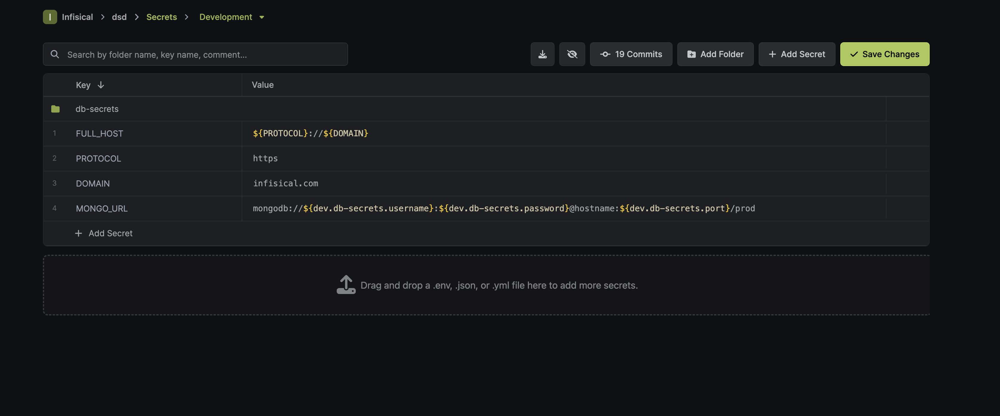
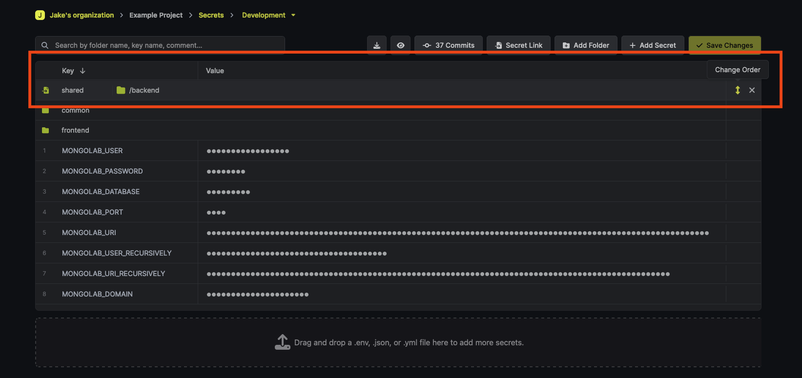

Secret referencing is a powerful feature that allows you to create a secret whose value is linked to one or more other secrets. 
This is useful when you need to use a single secret's value across multiple other secrets. 

Consider a scenario where you have a database password. In order to utilize this password, you may need to incorporate it into a database connection string. 
With secret referencing, you can easily construct these more intricate secrets by directly referencing the base secret.
This centralizes the management of your base secret, as any updates made to it will automatically propagate to all the secrets that depend on it. 

## Referencing syntax

Secret referencing relies on interpolation syntax. This syntax allows you to reference a secret in any environment or [folder](./folder). 

To reference a secret named 'mysecret' in the same [folder](./folder) and environment, you'd use `${mysecret}`.
However, to reference the same secret at the root of a different environment, for instance `dev` environment, you'd use `${dev.mysecret}`.

Here are a few more examples to help you understand how to reference secrets in different contexts:

| Reference syntax                | Environment | Folder       | Secret Key |
| --------------------- | ----------- | ------------ | ---------- |
| `${KEY1}`               | same env    | same folder | KEY1       |
| `${dev.KEY2}`           | `dev`         | `/` (root of dev environment)            | KEY2       |
| `${prod.frontend.KEY2}` | `prod`        | `/frontend`    | KEY2       |

## Fetching fully constructed values

Secret referencing combines multiple secrets into one unified value, reconstructed only on the client side. To retrieve this value, you need access to read the environment and [folder](./folder) from where the secrets originate. 
For instance, to access a secret 'A' composed of secrets 'B' and 'C' from different environments, you must have read access to both 'A' and 'B' 

When using [service tokens](./token) to fetch referenced secrets, ensure the service token has read access to all referenced environments and folders. 
Without proper permissions, the final secret value may be incomplete.

## Import entire folders 

While secret referencing effectively minimizes duplication, there might be instances where you need to import or replicate an entire folder's secrets into another. This can be achieved using the 'Import' feature.

This feature allows you to link secrets from one environment/folder into another environment/folder. It proves beneficial when you have common secrets that need to be available across multiple environments/folders.

To add an import, simply click on the `Add import` button and provide the environment and secret path from where the secrets should be imported.

The hierarchy of importing secrets is governed by a "last-one-wins" rule. This means the sequence in which you import matters - the final folder imported will override secrets from any prior folders. 
Additionally, any secrets you define directly in your environment will override any secrets that are imported with the same name.

You can modify the order of folders to control overrides using the `Change Order` drag handle.

