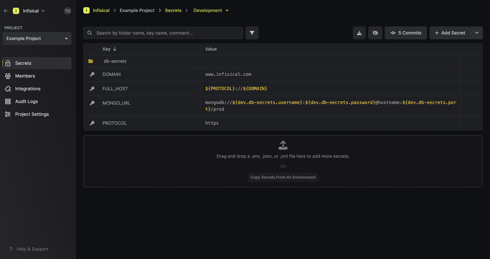
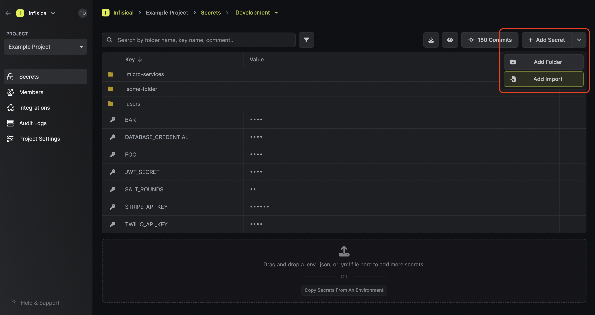
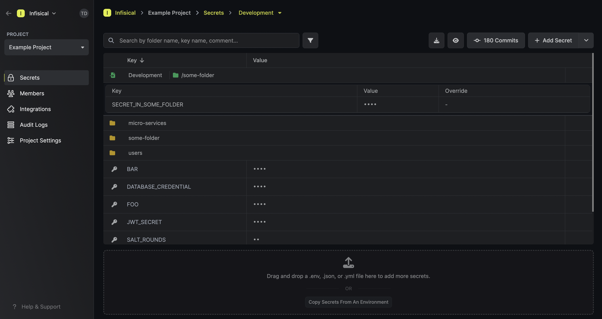
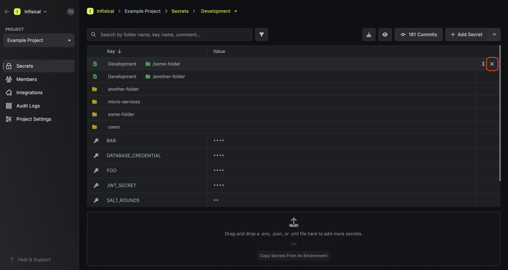
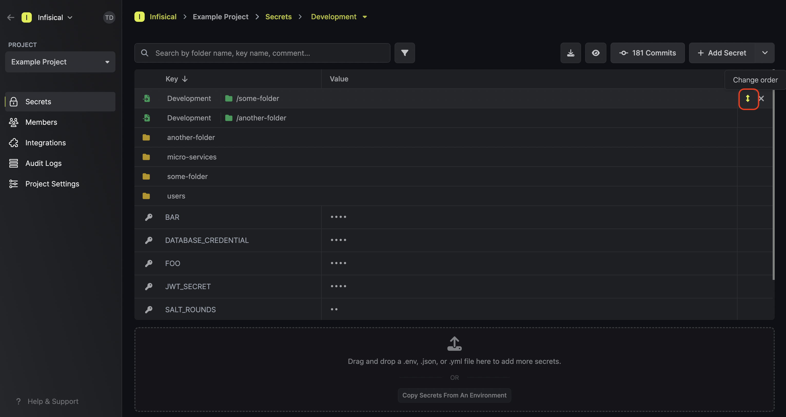

## Secret Referencing

Infisical's secret referencing feature lets you reference the value of a "base" secret when defining the value of another secret.
This means that updating the value of a base secret propagates directly to other secrets whose values depend on the base secret.

<Note>
    Currently, the secret referencing feature is only supported by the 
    [Infisical CLI](/cli/overview) and [native integrations](/integrations/overview).

    We intend to add support for it to the [Node SDK](https://github.com/Infisical/infisical-node)
    and [Python SDK](https://github.com/Infisical/infisical-python) this quarter.
</Note>

Since secret referencing works by reconstructing values back on the client side, the client, be it a user or service token, fetching back secrets 
must be permissioned access to all base and dependent secrets.

For example, to access some secret `A` whose values depend on secrets `B` and `C` from different scopes, a client must have `read` access to the scopes of secrets `A`, `B`, and `C`.

### Syntax

When defining a secret reference, interpolation syntax is used to define references to secrets in other environments and [folders](./folder).

Suppose you have some secret `MY_SECRET` at the root of some environment and want to reference part of its value from another base secret `BASE_SECRET` located elsewhere.
Then consider the following scenarios:

- If `BASE_SECRET` is in the same environment and folder as `MY_SECRET`, then you'd reference it using `${BASE_SECRET}`.
- If `BASE_SECRET` is at the root of another environment with the slug `dev`, then you'd reference it using `${dev.MY_SECRET}`.

Here are a few more helpful examples for how to reference secrets in different contexts:

| Reference syntax                | Environment | Folder       | Secret Key |
| --------------------- | ----------- | ------------ | ---------- |
| `${KEY1}`               | same env    | same folder | KEY1       |
| `${dev.KEY2}`           | `dev`         | `/` (root of dev environment)            | KEY2       |
| `${prod.frontend.KEY2}` | `prod`        | `/frontend`    | KEY2       |

## Secret Imports

Infisical's secret imports feature lets you import the items of another environment or folder into the current folder context.
This can be useful if you have common secrets that need to be available across multiple environments/folders.

To add a secret import, press the downward chevron to the right of the **Add Secret** button; then press on the **Add Import** button.

Once added, a secret import will show up with a green import icon on the secrets dashboard.
In the example below, you can see that the items in the path `/some-folder` are being imported into
the current folder context.

To delete a secret import, hover over it and press the **X** button that appears on the right side.

Lastly, note that the order of secret imports matters. If two secret imports contain secrets with the same name, then the secret value from the bottom-most secret import is taken — "the last one wins."

To reorder a secret import, hover over it and drag the arrows handle to the position you want.

<iframe width="560" height="315" src="https://www.youtube.com/embed/o11bMU0pXRs?si=dCprt3xLWPrSOJxy" title="YouTube video player" frameborder="0" allow="accelerometer; autoplay; clipboard-write; encrypted-media; gyroscope; picture-in-picture; web-share" allowfullscreen></iframe>
