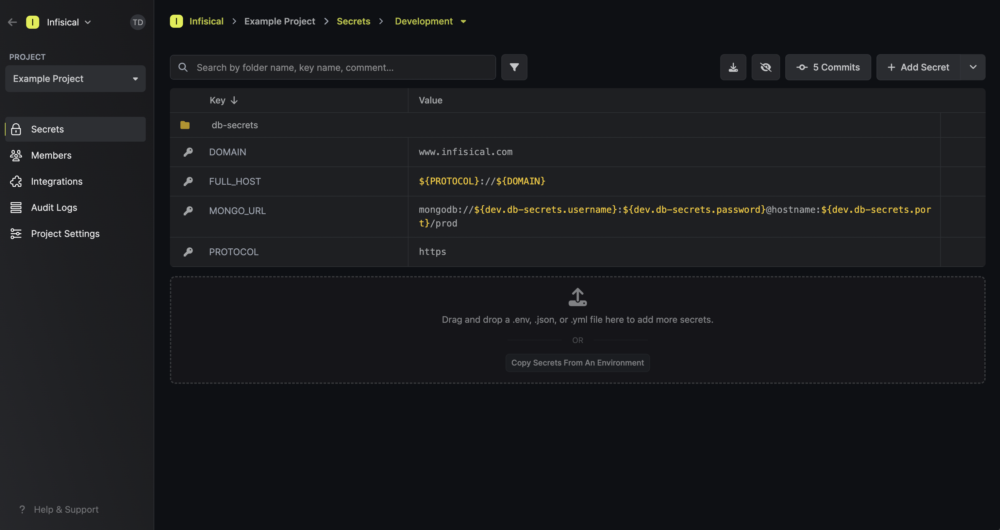
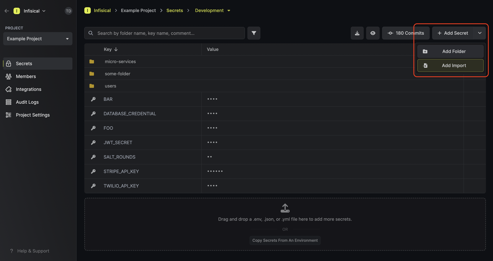
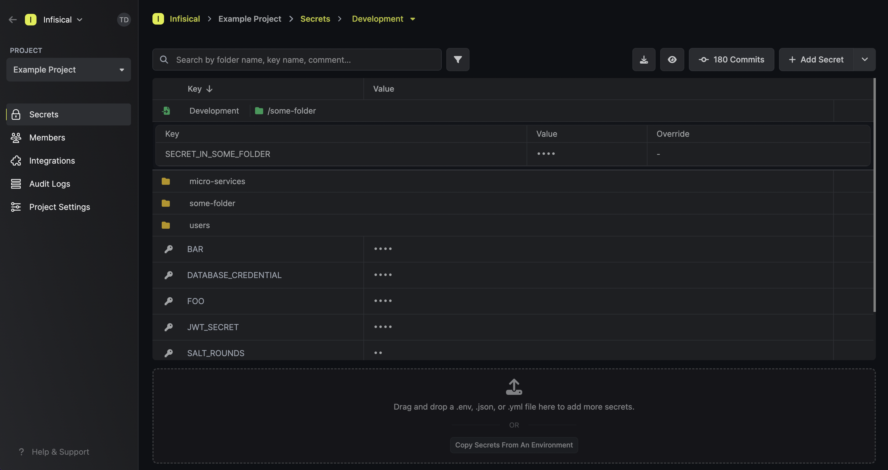
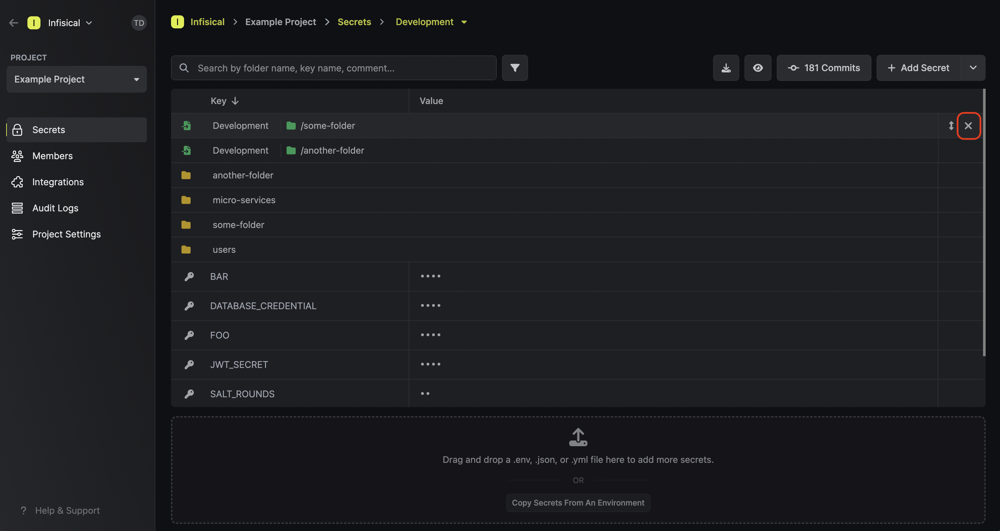
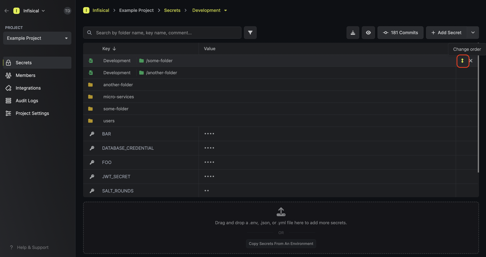

## Secret Referencing

Infisical's secret referencing functionality makes it possible to reference the value of a "base" secret when defining the value of another secret.
This means that updating the value of a base secret propagates directly to other secrets whose values depend on the base secret.



Since secret referencing reconstructs values on the client side, any client (user, service token, or machine identity) fetching secrets must have proper permissions to access all base and dependent secrets. Without sufficient permissions, secret references will not resolve to their appropriate values.

For example, if secret A references values from secrets B and C located in different scopes, the client must have read access to all three scopes containing secrets A, B, and C. If permission to any referenced secret is missing, the reference will remain unresolved, potentially causing application errors or unexpected behavior.

This is an important security consideration when planning your secret access strategy, especially when working with cross-environment or cross-folder references.

<Tip>
  You can hold the `Cmd` (Mac) or `Ctrl` (Windows/Linux) key and click the secret reference to be redirected to it. 
</Tip>

### Syntax

When defining a secret reference, interpolation syntax is used to define references to secrets in other environments and [folders](./folder).

Suppose you have some secret `MY_SECRET` at the root of some environment and want to reference part of its value from another base secret `BASE_SECRET` located elsewhere.
Then consider the following scenarios:

- If `BASE_SECRET` is in the same environment and folder as `MY_SECRET`, then you'd reference it using `${BASE_SECRET}`.
- If `BASE_SECRET` is at the root of another environment with the slug `dev`, then you'd reference it using `${dev.MY_SECRET}`.

Here are a few more helpful examples for how to reference secrets in different contexts:

| Reference syntax        | Environment | Folder                        | Secret Key |
| ----------------------- | ----------- | ----------------------------- | ---------- |
| `${KEY1}`               | same env    | same folder                   | KEY1       |
| `${dev.KEY2}`           | `dev`       | `/` (root of dev environment) | KEY2       |
| `${prod.frontend.KEY2}` | `prod`      | `/frontend`                   | KEY2       |

## Secret Imports

Infisical's Secret Imports functionality makes it possible to import the secrets from another environment or folder into the current folder context.
This can be useful if you have common secrets that need to be available across multiple environments/folders.

To add a secret import, press the downward chevron to the right of the **Add Secret** button; then press on the **Add Import** button.



Once added, a secret import will show up with a green import icon on the secrets dashboard.
In the example below, you can see that the items in the path `/some-folder` are being imported into
the current folder context.



To delete a secret import, hover over it and press the **X** button that appears on the right side.



Lastly, note that the order of secret imports matters. If two secret imports contain secrets with the same name, then the secret value from the bottom-most secret import is taken — "the last one wins."

To reorder a secret import, hover over it and drag the arrows handle to the position you want.



<iframe
  width="560"
  height="315"
  src="https://www.youtube.com/embed/o11bMU0pXRs?si=dCprt3xLWPrSOJxy"
  title="YouTube video player"
  frameborder="0"
  allow="accelerometer; autoplay; clipboard-write; encrypted-media; gyroscope; picture-in-picture; web-share"
  allowfullscreen
></iframe>


## Relative Reference Resolution in Imported Secrets

<Note>
  Only available on the **V4 Secrets API** (`/api/v4/secrets`). v3 and below always resolve local references against the source environment.
</Note>

When you import secrets from one environment into another, the imported secrets may contain references like `${KEY}` that point to other secrets. **Relative resolution** changes how those local references are looked up:

| Reference type | Behavior |
|---|---|
| `${KEY}` (local) | Current env first, source env as fallback |
| `${env.path.KEY}` (absolute) | Always resolves against the specified env |

Resolution order for `${KEY}` inside an imported secret _(e.g. staging imports from dev)_:
1. Look in `staging` (current environment)
2. If not found, look in `dev` (source environment)
3. If still not found, expand to empty string

This lets you override any imported key simply by defining it in the destination environment.

### Example

```
dev:
  DB_HOST = "dev-db.internal"
  DB_URL  = "postgres://${DB_HOST}/myapp"

staging imports from dev:
  DB_HOST = "stg-db.internal"
```

Fetching staging's imported `DB_URL` via v4 → `postgres://stg-db.internal/myapp`

The `${DB_HOST}` local reference resolves to staging's value. Without relative resolution (v3), it would resolve to dev's `DB_HOST` instead.

### Behavior notes

- **The current-env-first rule applies at every depth of recursive expansion**, not just the top level. If an imported secret references another secret that references another, each `${KEY}` at every level checks the current environment first.
- **Import-chain lookup**: when looking for a key in an environment, Infisical also searches that environment's one-level-deep imports. If prod imports from `/shared` and `/shared` has `KEY`, a `${KEY}` reference in a prod context will find it.
- **Permissions**: read access is enforced at every step. If the calling identity lacks access to any secret in the chain, the request returns `403`.

<Warning>
  Only one level of imports is searched during reference expansion. If prod imports `/shared`, and `/shared` imports `/base`, secrets in `/base` are not visible.
</Warning>