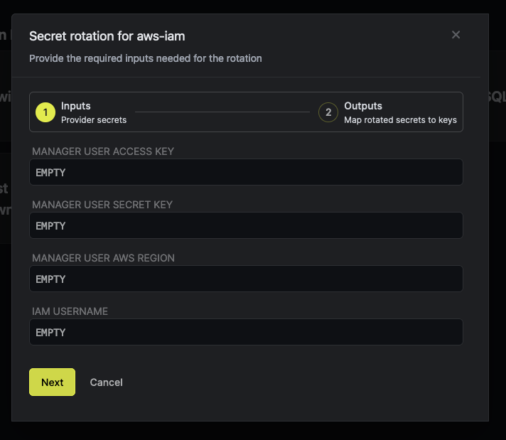
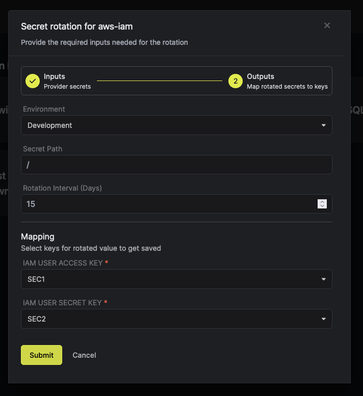

Infisical AWS IAM User rotation enables the periodic updating of AWS IAM User access keys. Each user can maintain up to two keys simultaneously.

## Prerequisite

<Steps>
  <Step title="Create IAM Manager User">
	This AWS IAM User is the one that Infisical uses to get into your AWS account and handle the access keys for the IAM users underneath.
	
	Create the manager user IAM Policy

	1. Open [AWS Policy Builder](https://console.aws.amazon.com/iam/home#/policies$new?step=edit)
	2. Use JSON tab to paste the JSON policy
	3. Paste the following scope
	```json
	{
	    "Version": "2012-10-17",
	    "Statement": [
			{
			    "Sid": "VisualEditor0",
			    "Effect": "Allow",
			    "Action": [
				"iam:DeleteAccessKey",
				"iam:GetAccessKeyLastUsed",
				"iam:CreateAccessKey"
			    ],
			    "Resource": "arn:aws:iam::*:user/infisical/rotate/*"
			}
	    ]
	}
	```
	<Info>
	   The IAM policy mentioned above is configured with an IAM path of **/infisical/rotate**. 

	   This implies that managing users must be positioned within this specified path.<br/>
	   If modifying this path, ensure that corresponding adjustments are made in the subsequent steps when creating managed users. 

	   During testing, you have the option to utilize the wildcard option **Resource: "*"**. However, it's crucial to refrain from using * in production environments.
	</Info>

	Create the managed user IAM

	1. Create the IAM user in AWS with the above policy.
	2. Then create the [AWS IAM User access key.](https://docs.aws.amazon.com/IAM/latest/UserGuide/id_credentials_access-keys.html#Using_CreateAccessKey)
  </Step>
  <Step title="Create IAM Managed User">
	This AWS IAM User is designated to manage credential rotations for infisical.
	<Warning>
		If this user already exists, ensure all other access keys associated with it are removed. AWS enforces a strict limit of 2 access keys per IAM User.
	</Warning>

	1. Go to the AWS IAM Section.
	2. Select Users and then click on Create User.
	3. Attach policies as required.

	As mentioned in the previous step, if you've specified a path to control access for the manager user, you must also provide the path when creating the user here. 
	
	However, the AWS console does not support the path option for this purpose. You'll need to use either the CLI or AWS API to create a user with a specified path. 
	
	[Please refer to the AWS documentation for further guidance](https://aws.amazon.com/blogs/security/optimize-aws-administration-with-iam-paths/).
  </Step>
</Steps>

## Working

1. Infisical connects your provided `manager aws iam` user.
2. It will then create the new access key id and secret key for the `managed iam user`.
3. Save the new credentials  to the mapped outputs in your secret board, so that rest of the systems can access it.
4. The retired credentials gets deleted on each cycle.

## Rotation Configuration

<Steps>
  <Step title="Open Secret Rotation Page">
	Head over to Secret Rotation configuration page of your project by clicking on `Secret Rotation` in the left side bar 
  </Step>
  <Step title="Click on AWS IAM Card" />
  <Step title="Provide the inputs">

  	These are inputs required by AWS IAM Rotation Providers

	- Manager User Access Key

		AWS IAM Rotator user access key

	- Manager User Secret Key 

		AWS IAM Rotator user secret key

	- Manager User AWS Region 
		
		IAM policies are global. But AWS needs to know a region to send requests to a partition.

	- IAM Username 

		AWS IAM User's username whose credentials are rotated
  </Step>
  <Step title="Configure the output secret mapping">



  	The secret keys to be replaced in the provided board after successful secret rotation

	- Select `Environment`, `Secret Path` and `Interval` to rotate the secrets
	- Finally select the secrets in your provided board to replace with new secret after each rotation

		- IAM User Access Key

			The rotated AWS IAM User access key id

		- IAM User Secret Key

			The rotated AWS IAM User secret key

	- Your done and good to go.
  </Step>
</Steps>

Congratulations. You have improved your AWS IAM User security.
