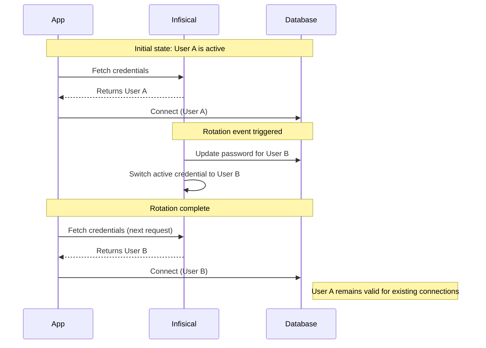
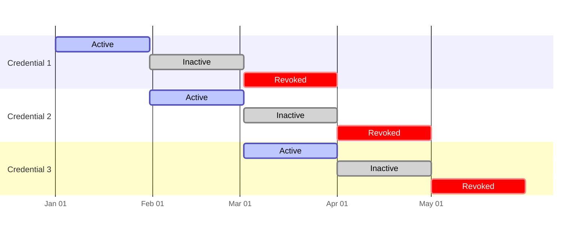

Secret rotation is the practice of automatically updating authentication credentials (such as database passwords and API keys) on a regular schedule. By changing your secrets frequently, you limit the lifespan of any leaked credential, significantly reducing the risk of unauthorized access to your infrastructure.

Infisical Secret Rotation automates the entire secret rotation process. To get started with Secret Rotation, refer to the list of [supported integrations](/integrations/secret-rotations) and follow the instructions for your specific service.

## Rotation strategy

Before configuring rotation, determine which strategy fits your infrastructure. Infisical supports both secret rotation (swapping static users) and [dynamic secrets](/documentation/platform/dynamic-secrets/overview) (generating temporary users). The rotation strategy you choose depends on your use case:

| Feature      | Secret rotation                            | Dynamic secrets (issuer pattern)           |
| ------------ | ------------------------------------------ | ------------------------------------------ |
| **Method**   | Swaps between two static users             | Generates a new, unique user on-demand     |
| **Duration** | Long-lived (for example, 30 days)          | Short-lived (for example, one hour)        |
| **Best for** | Legacy databases and static infrastructure | CI/CD, microservices, and temporary access |

<Warning>
  Some rotation providers use a single credential set due to technical
  constraints. As a result, inactive credentials for these providers will
  immediately become invalid once rotated. To avoid service interruptions, we
  recommend manually rotating these credentials to prevent downtime.
</Warning>

### Two-user rotation

Infisical uses a two-user rotation strategy by default for many services to ensure zero application downtime. Changing the password for a single user would immediately break active connections. Instead, Infisical manages two separate database users and toggles between them. Using this method, applications can update without breaking, lowering attack risk.

Two-rotation strategy works in the following way:

1.  User A is active. Applications use User A's credentials.
2.  When rotation occurs, Infisical updates the password for User B and switches the secret in Infisical to point to User B.
3.  Applications fetch the new secret and start connecting as User B.
4.  User A remains valid for a grace period (exactly one full rotation cycle) to allow ongoing connections to close without interruption.

### Single-user rotation

Certain services, such as [Unix/Linux local accounts](/documentation/platform/secret-rotation/unix-linux-local-account) and [LDAP](/documentation/platform/secret-rotation/ldap-password), rely on a single set of credentials. In these cases, Infisical updates the password for the existing user directly.

Because there is no secondary user to toggle to, there is no rotation grace period. Once the rotation occurs, any service still using the old password will fail to authenticate until it fetches the updated secret. To avoid downtime with single-user rotation, we recommend scheduling rotations during low-traffic maintenance windows and configuring [Dynamic Secrets](/documentation/platform/dynamic-secrets/overview).

### Credential lifecycle

When you set a rotation interval, Infisical will rotate your secrets at that interval. However, the secrets will be valid for a period equal to twice the rotation interval. This ensures that applications that are still using the old secret will continue to work while Infisical deploys the secret to the new user.

For example, if you set a 30 day rotation interval, your secrets will be valid for 60 days:

| State    | Description                                                                |
| -------- | -------------------------------------------------------------------------- |
| Active   | The primary credential that your application will use for new connections. |
| Inactive | The credential is still valid but is no longer issued for new connections. |
| Revoked  | The credentials is permanently invalidated and deleted from the system.    |

## Best practices

To ensure Secret Rotation works as expected, follow these best practices:

- Choose a rotation interval that balances security with your team's operational capacity.
- Ensure your apps either re-fetch secrets or restart when credentials change.
- Set up alerts for rotation failures to catch and fix permission issues early.

## Common issues

<AccordionGroup>
<Accordion title="Missing database permissions">
The most common reason for failure is insufficient permissions. The user you provide to Infisical to perform the rotation must have the authority to `ALTER USER` or change passwords for the target users. Required permissions vary by service. For specific requirements, refer to the individual integration documentation.
</Accordion>

<Accordion title="Application restarts">
  Infisical updates the secret value, but your application must read that new
  value. If you inject secrets at build time (e.g., in a CI/CD pipeline), you
  must re-deploy your application to pick up the rotated secret. If you use the
  Infisical SDK or Agent, your app can fetch the new secret dynamically without
  a full redeploy.
</Accordion>

<Accordion title="Integration not supported">
Infisical supports many services out of the box. If you need to rotate a secret for a service not currently listed, request a new integration with a [feature request](https://github.com/Infisical/infisical/discussions/categories/feature-request).
</Accordion>
</AccordionGroup>
