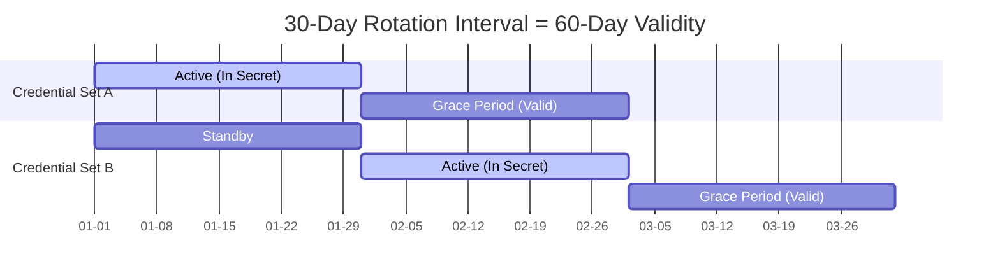

Secret rotation is the practice of automatically updating authentication credentials (such as database passwords and API keys) on a regular schedule. By changing your secrets frequently, you limit the lifespan of any leaked credential, significantly reducing the risk of unauthorized access to your infrastructure.

Infisical Secret Rotation automates the entire secret rotation process. This ensures that your applications always have valid credentials without downtime.

## Core concepts

Understanding how Infisical handles rotation is key to configuring it correctly. The most common pattern used is **Dual User Rotation**.

### Dual user rotation

To ensure zero downtime, Infisical often utilizes a "Dual User" strategy. Instead of changing the password for a single user (which would immediately break active connections), Infisical manages **two separate database users** and toggles between them.

1.  **User A** is active. Applications use User A's credentials.
2.  When rotation occurs, Infisical updates the password for **User B** and switches the secret in Infisical to point to User B.
3.  Applications fetch the new secret and start connecting as User B.
4.  User A remains valid for a grace period (or until the next rotation) to allow ongoing connections to close gracefully.

### Comparison: Rotation vs. Dynamic Secrets (Issuer Pattern)

While "Rotation" focuses on updating existing long-lived credentials, you may also encounter the **Issuer Pattern** (often called **Dynamic Secrets**).

| Feature      | Secret Rotation (Dual User)    | Dynamic Secrets (Issuer Pattern)       |
| :----------- | :----------------------------- | :------------------------------------- |
| **Method**   | Swaps between two static users | Generates a new, unique user on-demand |
| **Duration** | Long-lived (e.g., 30 days)     | Short-lived (e.g., 1 hour)             |
| **Best For** | Legacy databases, static infra | Microservices, temporary access        |

Infisical supports both. If your environment supports creating/deleting users on the fly, consider looking at our [Dynamic Secrets](/documentation/platform/dynamic-secrets/overview) documentation.

### The credential lifecycle

A common point of confusion is the difference between the **Rotation Interval** and the **Credential Validity**.

If you set a **30-day rotation interval**, your secrets are actually valid for **60 days**.

<Frame caption="The overlap ensures that even if an application deploys at the last second of a cycle, it has valid credentials for the next cycle.">

</Frame>

- **Active Phase (Days 0-30)**: The credential is the "current" secret. Applications fetching secrets will get this one.
- **Grace Phase (Days 30-60)**: The credential is no longer served to new requests, but it **still works**. This ensures that an application that started a long-running job on Day 29 isn't cut off on Day 30.

### Common issues

<AccordionGroup>
<Accordion title="Missing database permissions">
The most common failure reason is insufficient permissions. The user you provide to Infisical (to perform the rotation) must have the authority to `ALTER USER` or change passwords for the target users. Always verify permissions before enabling rotation.
</Accordion>

<Accordion title="Application restarts">
  Infisical updates the secret value, but your application must *read* that new
  value. - If you inject secrets at build time (e.g., in a CI/CD pipeline), you
  must **re-deploy** your application to pick up the rotated secret. - If you
  use the Infisical SDK or Agent, your app can fetch the new secret dynamically
  without a full redeploy.
</Accordion>

<Accordion title="Requesting New Integrations">
Infisical supports many services out of the box. If you need to rotate a secret for a service not currently listed, please [request a new integration](https://github.com/Infisical/infisical/issues) or check our [Integrations](/integrations/overview) page.
</Accordion>
</AccordionGroup>
