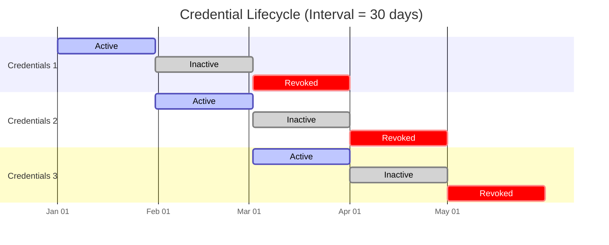

## Introduction

Secret rotation is a security best practice that involves systematically updating credentials and access tokens at regular intervals to minimize the risk of compromise. By proactively replacing existing secrets with new ones, organizations reduce the potential impact of credential theft or leakage.

Examples of rotated secrets include:

- API keys and authentication tokens for cloud services and third-party integrations
- Database credentials across production, staging, and development environments

## How Rotation Works

Secret Rotation systematically replaces secrets at regular intervals while ensuring zero downtime for your applications. This overlapping lifecycle approach maintains continuous availability while enhancing your security posture.

### Visual Timeline

### Credential States

Each set of credentials transitions through three distinct states:

- **Active**: The primary credentials that will be used for new connections
- **Inactive**: These credentials are still valid but are no longer issued for new connections
    <Note>
        Some rotation providers utilize a single credential set due to technical constraints. As a result, inactive credentials for these providers will immediately become invalid once rotated.

        To avoid service interruptions, Infisical recommends manually rotating these credentials to prevent downtime.
    </Note>
- **Revoked**: Permanently invalidated and deleted from the system

### Rotation Cycle Example (30-Day Interval)

Using a __30-Day__ rotation interval as an example, here's how the process unfolds:

1. __Day 0__
    - `Credential set 1` is issued and set to **Active**
    - Applications begin using this set for authentication

2. __Day 30__
    - `Credential set 2` is issued and set to **Active**
    - `Credential set 1` transitions to **Inactive** but remains valid
    - New connections utilize set 2 while existing connections with set 1 continue to work

    <Note>
        This overlapping validity period ensures that at any point during the active period of a credential set, you are guaranteed that retrieved credentials will be valid for the specified rotation period.
    </Note>

3. __Day 60__
    - `Credential set 3` is issued and set to **Active**
    - `Credential set 2` transitions to **Inactive** but remains valid
    - `Credential set 1` is **Revoked** and securely deleted
    - By now, all applications should have transitioned to using set 2 or 3

4. __Day 90__
    - `Credential set 4` is issued and set to **Active**
    - `Credential set 3` transitions to **Inactive** but remains valid
    - `Credential set 2` is **Revoked** and securely deleted
    - The cycle continues...

### Benefits of This Approach

- **Zero Downtime**: Applications always have valid credentials
- **Grace Period**: The inactive period gives applications time to update to new credentials
- **Reduced Risk**: Credentials are regularly cycled, limiting the impact of potential compromise
- **Predictable Schedule**: Makes credential management more systematic and easier to automate

### Implementation Considerations

- Choose a rotation interval appropriate for your security requirements and operational needs
- Ensure your applications can handle credential updates gracefully
- Monitor for applications still using credentials nearing revocation

## Infisical Secret Rotation Strategies

- [PostgreSQL Credentials](./postgres-credentials)
- [Microsoft SQL Server Credentials](./mssql-credentials)
- [OpenRouter API Key](./open-router-api-key)

## FAQ

<AccordionGroup>
    <Accordion title="Why do certain rotations only use a single credential set?">
        Some credential providers have limitations that affect rotation patterns:

        - The third-party provider's API only supports managing one active credential set at a time
        - The specific use-case (such as personal login accounts) is inherently limited to a single active credential

        In either scenario, when service continuity is critical, Infisical recommends disabling auto-rotation and performing manual credential rotation during scheduled maintenance windows.
    </Accordion>
</AccordionGroup>
