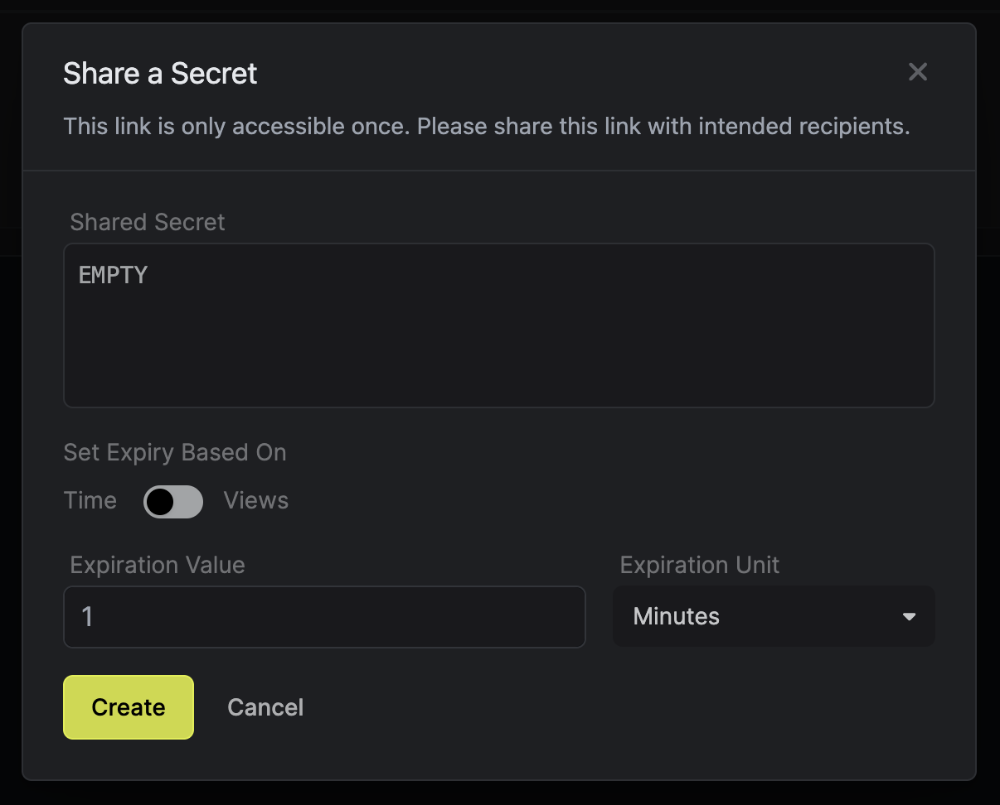

Developers often need to share secrets with their team members, contractors, or other third parties. This can be a risky process, as secrets can be easily leaked or misused. Infisical provides a secure way to share secrets with anybody on the internet in a time-bound manner.

## Share a Secret

1. Navigate to the **Projects** page.
2. Click on the **Secret Sharing** tab from the sidebar.

3. Click on the **Share Secret** button.

<Note>
  Infisical does not store the secret you share. This is a part of our Zero
  Knowledge Architecture.
</Note>

4. Enter the secret you want to share and set the expiration time. Click on the **Share Secret** button.

<Note>
  Secret once set cannot be changed. This is to ensure that the secret is not
  tampered with.
</Note>

5. Copy the link and share it with the intended recipient. Anybody with the link can access the secret before its expiration time. Hence, it is recommended to share the link only with the intended recipient.

## Access a Shared Secret

Just click on the link you received to access the secret. The secret will be displayed on the screen & for how long it is valid.

## Delete a Shared Secret

In the **Secret Sharing** tab, click on the **Delete** button next to the secret you want to delete. This will delete the secret immediately & the link will no longer be accessible.
