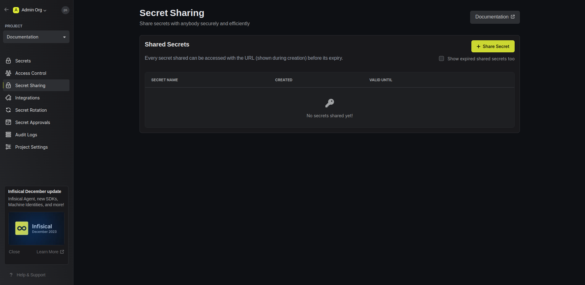
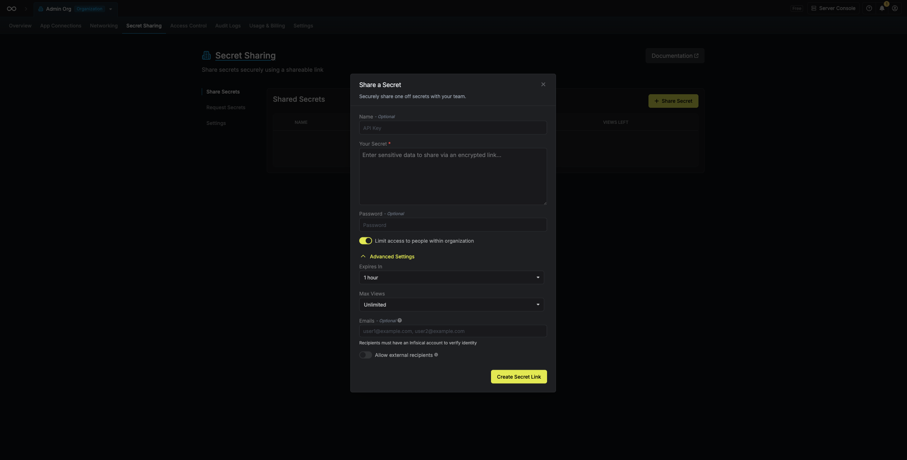
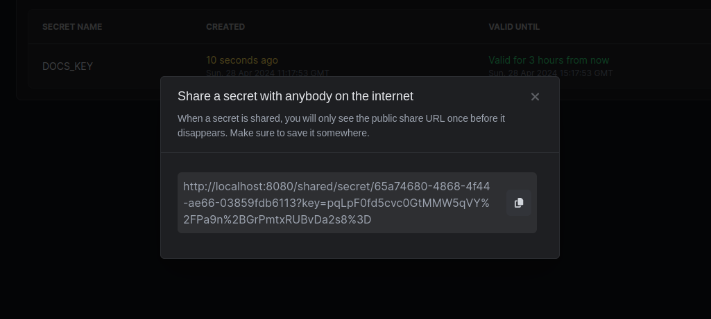
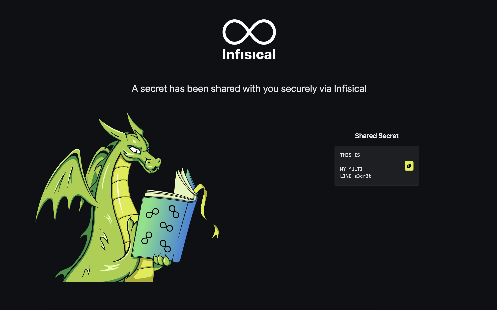
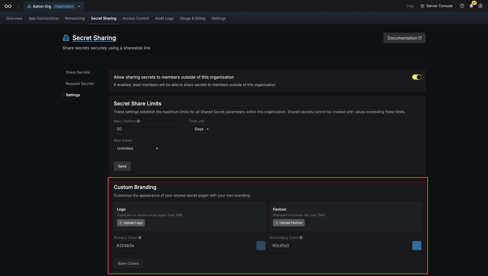
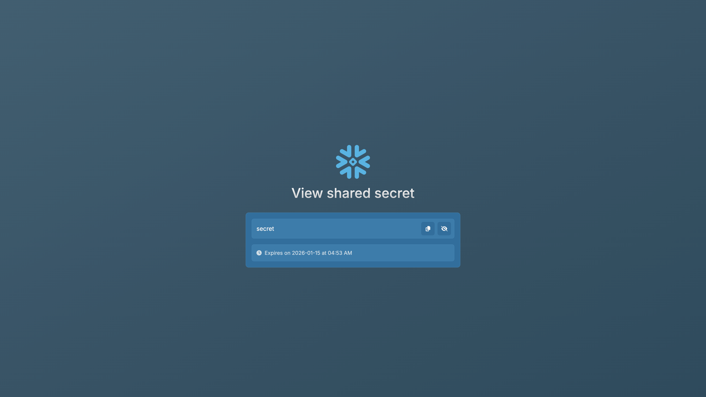
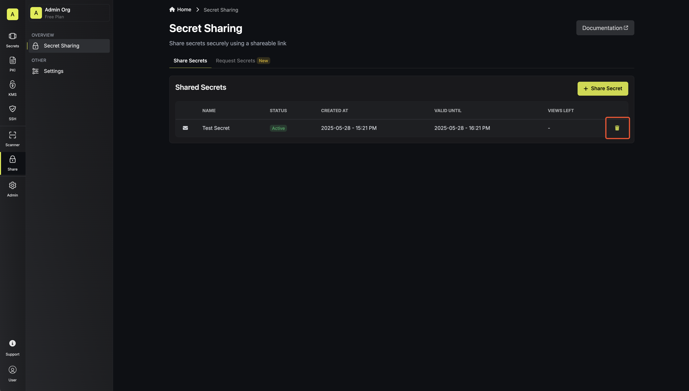
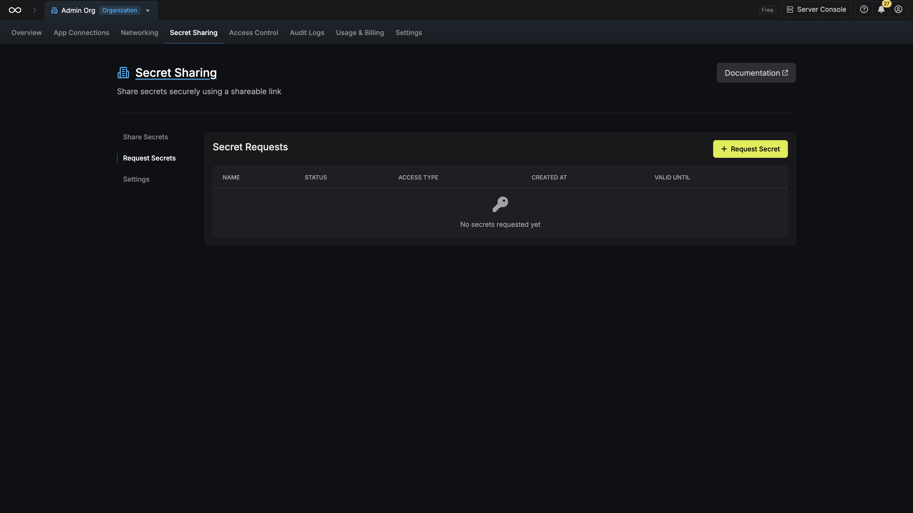
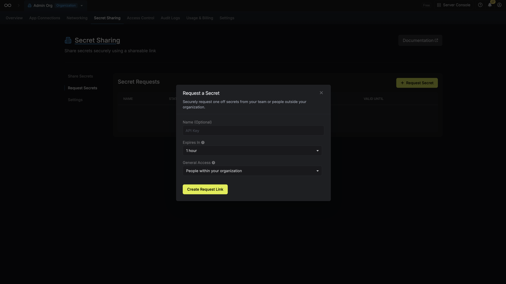
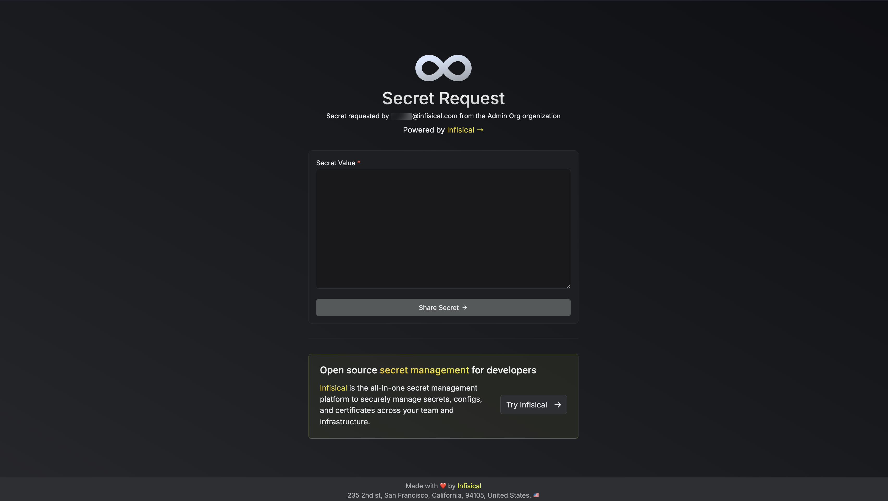

Developers frequently need to share secrets with team members, contractors, or other third parties, which can be risky due to potential leaks or misuse.
Infisical offers a secure solution for sharing secrets over the internet in a time and view-count bound manner. It is possible to share secrets without signing up via [share.infisical.com](https://share.infisical.com) or via Infisical Dashboard (which has more advanced functionality).

## Sharing a Secret

<Steps>
    <Step title="Navigate to the 'Secret Sharing' page and click 'Share Secret'">
        
    </Step>
    <Step title="Configure Secret Share">
        

        - **Name (optional):** A friendly name for the shared secret.
        - **Your Secret:** The secret content.
        - **Password (optional):** A password which will be required when viewing the secret.

        - **Limit access to people within organization:** Only lets people within your organization view the secret. Enabling this feature requires secret viewers to log into Infisical.
        - **Expires In:** The time it'll take for the secret to expire.
        - **Max Views:** How many times the secret can be viewed before it's destroyed.

        - **Authorized Emails (optional):** Emails which are authorized to view this secret. Enabling this feature requires secret viewers to log into Infisical. Each email will receive the shared secret link in their inbox after creation.
    </Step>
    <Step title="Copy Link and Share Secret">
        After creating the shared secret, its link will be displayed. Share this with the intended recipients.

        <Info>
            If no organization or email restrictions are set, anyone with this link can view the secret before it expires.
        </Info>

        
    </Step>
    <Step title="Access Shared Secret">
        Visiting the secret link will display its contents.

        
    </Step>
</Steps>

## Custom Branding

<Info>
    Custom branding for shared secret pages is a paid feature.

    If you're using Infisical Cloud, then it is available under the **Enterprise Tier**. If you're self-hosting Infisical, then you should contact team@infisical.com to purchase an enterprise license to use it.
</Info>

You can customize the branding of your shared secret pages and secret request pages by providing your own logo and colors.

If custom branding is added, the shared secret page will display your custom logo and colors without any information about Infisical.

## Deleting a Shared Secret

To delete a shared secret, click the **Trash Can** icon on the relevant shared secret row in the [**Secret Sharing**](https://app.infisical.com/organization/secret-sharing?selectedTab=share-secret) page.

## Requesting a Secret

<Steps>
    <Step title="Navigate to the 'Secret Sharing' page under the 'Request Secrets' tab and click 'Request Secret'">
        
    </Step>
    <Step title="Configure Secret Request">
        

        - **Name (optional):** A friendly name for the secret request.
        - **Expires In:** The time it'll take for the request to expire.
        - **General Access:** Who can see the request. (e.g., Everyone, Organization Members)
    </Step>
    <Step title="Copy Link and Share Request">
        After creating the secret request, its link will be displayed. Share this with the intended recipients.

        <Info>
            If no access restrictions are set, anyone with this link can view the request before it expires.
        </Info>

        
    </Step>
    <Step title="Access Secret Request">
        Visiting the secret request link will display a page for secret input.

        
    </Step>
</Steps>

## FAQ

<AccordionGroup>
    <Accordion title="Can secrets be changed after they are shared?">
        No, secrets cannot be changed after they've been created. This is to ensure that secrets are not tampered with.
    </Accordion>
</AccordionGroup>
