Developers frequently need to share secrets with team members, contractors, or other third parties, which can be risky due to potential leaks or misuse.
Infisical offers a secure solution for sharing secrets over the internet in a time and view-count bound manner. It is possible to share secrets without signing up via [share.infisical.com](https://share.infisical.com) or via Infisical Dashboard (which has more advanced functionality).

## Sharing a secret

<Steps>
    <Step title="Navigate to the Secrets Management product">
        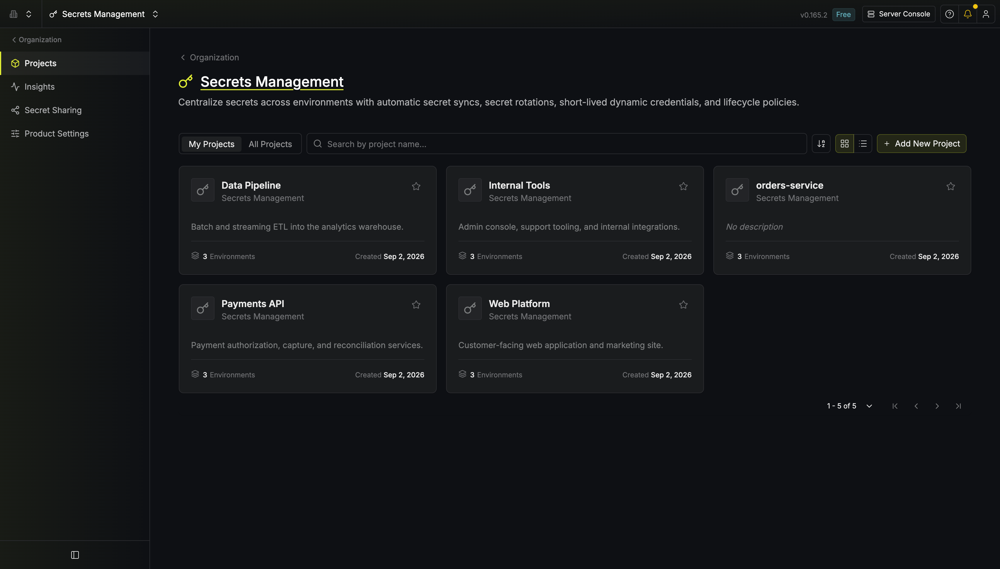
    </Step>

    <Step title="Navigate to the Secret Sharing tab">
        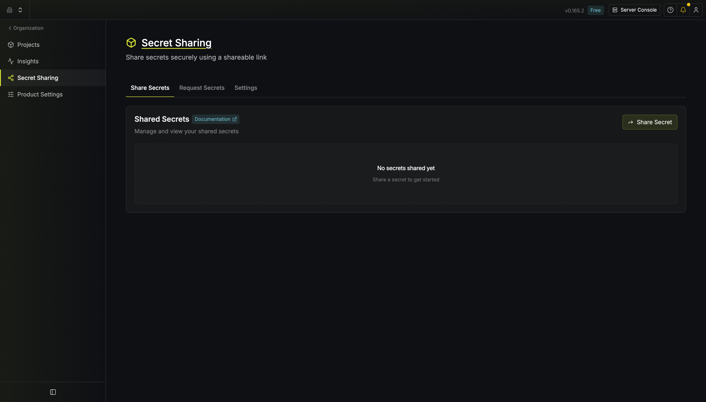
    </Step>
    <Step title="Configure Secret Share">
        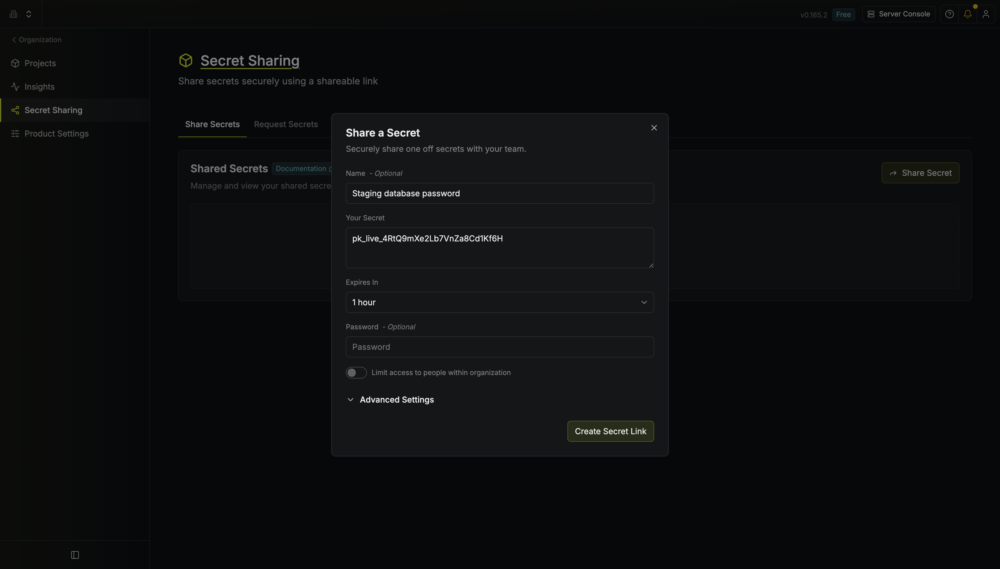

        - **Name (optional):** A friendly name for the shared secret.
        - **Your Secret:** The secret content.
        - **Expires In:** How long the link stays valid.
        - **Password (optional):** A password the viewer has to enter before the secret is shown.
        - **Limit access to people within organization:** On by default. Only people in your organization can open the link, and they have to sign in to Infisical first. Turn it off to share with anyone who has the link.

        Select **Advanced Settings** for the rest:

        - **Max Views:** How many times the secret can be viewed before it's destroyed.
        - **Emails (optional):** Who to send the link to. Each recipient gets it in their inbox once you create the secret. With **Allow external recipients** off, a recipient needs an Infisical account to prove who they are, though they don't have to be in your organization.
        - **Allow external recipients (optional):** Lets you add any email address, including people with no Infisical account. A password is required when this is on, and every recipient needs that password to open the secret. Turning on **Limit access to people within organization** turns this off.
    </Step>
    <Step title="Copy Link and Share Secret">
        After creating the shared secret, its link will be displayed. Share this with the intended recipients.

        <Info>
            If no organization or email restrictions are set, anyone with this link can view the secret before it expires.
        </Info>

        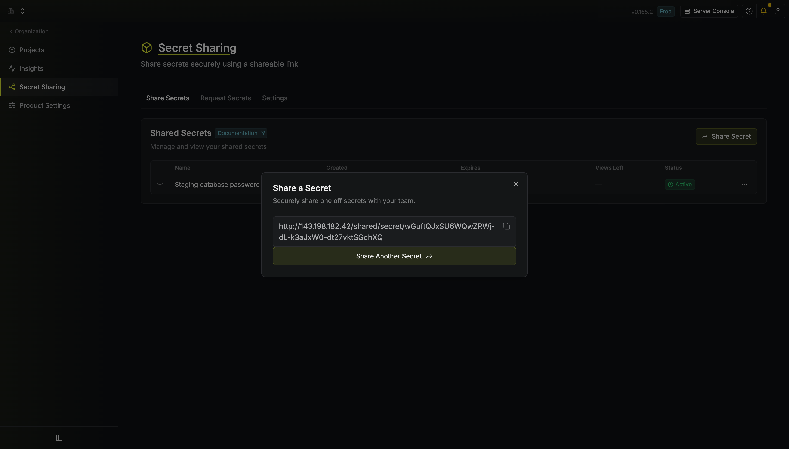
    </Step>
    <Step title="Access Shared Secret">
        Visiting the secret link will display its contents.

        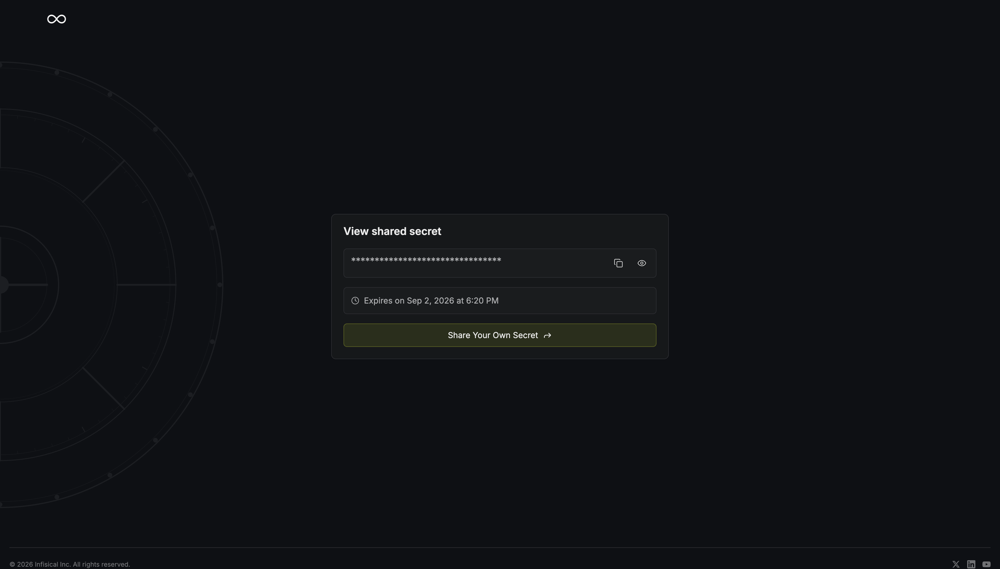
    </Step>

</Steps>

## Deleting a shared secret

To delete a shared secret, hover over its row on the Secret Sharing page and select the trash icon.

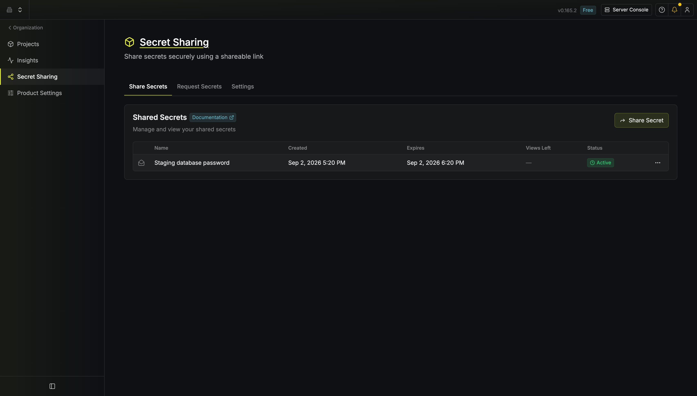

## Requesting a secret

<Steps>
    
    <Step title="Navigate to the Secrets Management product">
        
    </Step>

    <Step title="Navigate to the Secret Sharing page">
        
    </Step>

    <Step title="Navigate to the Request Secrets tab">
        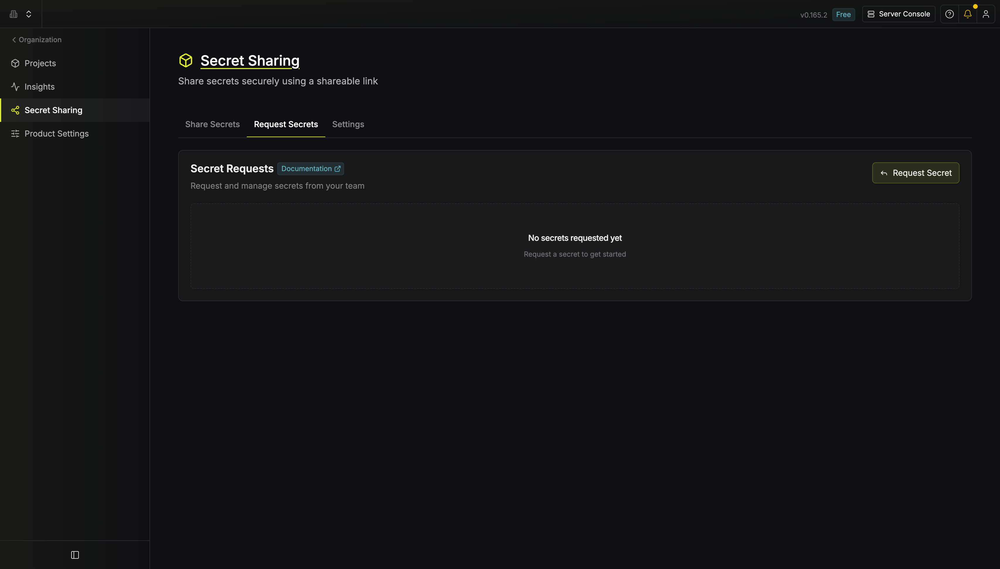
    </Step>
    
    <Step title="Configure Secret Request">
        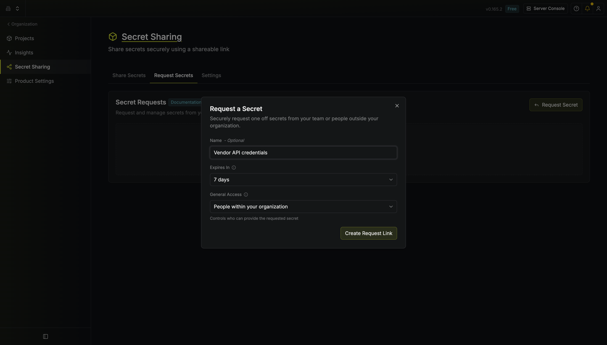

        - **Name (optional):** A friendly name for the secret request.
        - **Expires In:** The time it'll take for the request to expire.
        - **General Access:** Who can see the request. (e.g., Everyone, Organization Members)
    </Step>
    <Step title="Copy Link and Share Request">
        After creating the secret request, its link will be displayed. Share this with the intended recipients.

        <Info>
            If no access restrictions are set, anyone with this link can view the request before it expires.
        </Info>

        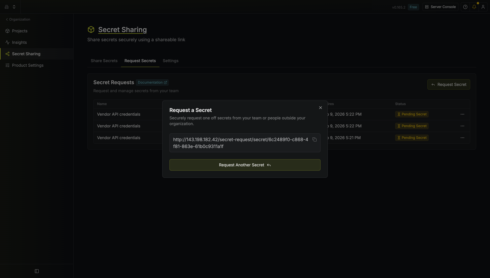
    </Step>
    <Step title="Access Secret Request">
        Visiting the secret request link will display a page for secret input.

        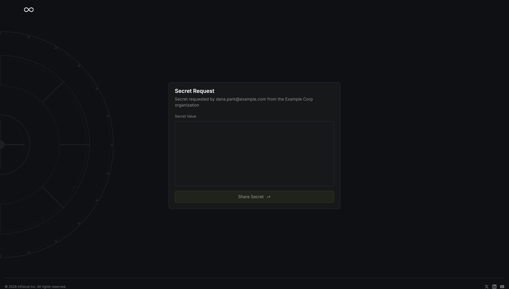
    </Step>

</Steps>

## Custom branding

<Info>
    Custom branding for shared secret pages is a paid feature.

    If you're using Infisical Cloud, then it is available under the **Enterprise Tier**. If you're self-hosting Infisical, then you should contact sales@infisical.com to purchase an enterprise license to use it.

</Info>

You can customize the branding of your shared secret pages and secret request pages by providing your own logo and colors.

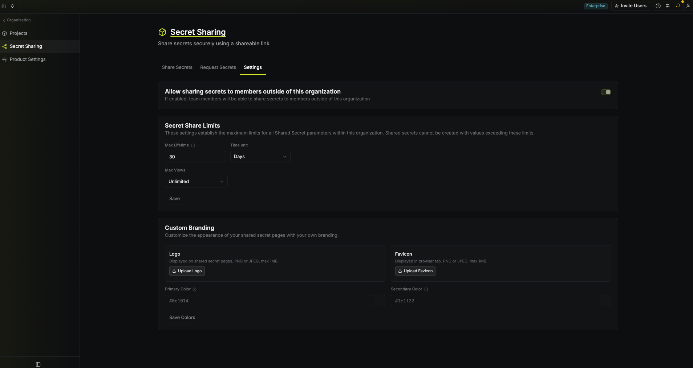

If custom branding is added, the shared secret page will display your custom logo and colors without any information about Infisical.

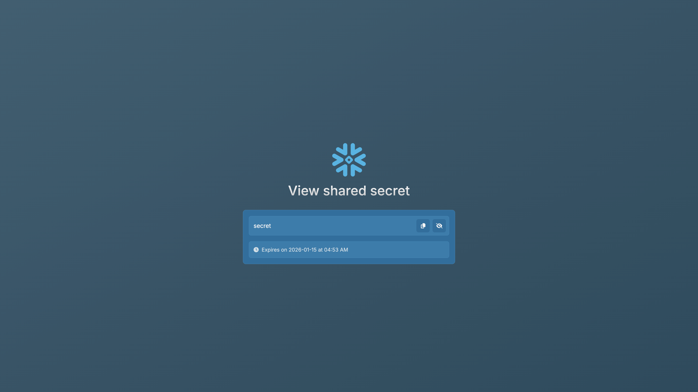

## FAQ

<AccordionGroup>
	<Accordion title="Can secrets be changed after they are shared?">
		No, secrets cannot be changed after they've been created. This is to ensure
		that secrets are not tampered with.
	</Accordion>
</AccordionGroup>
