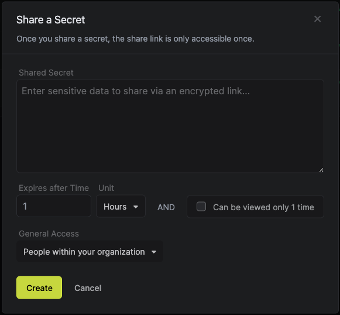
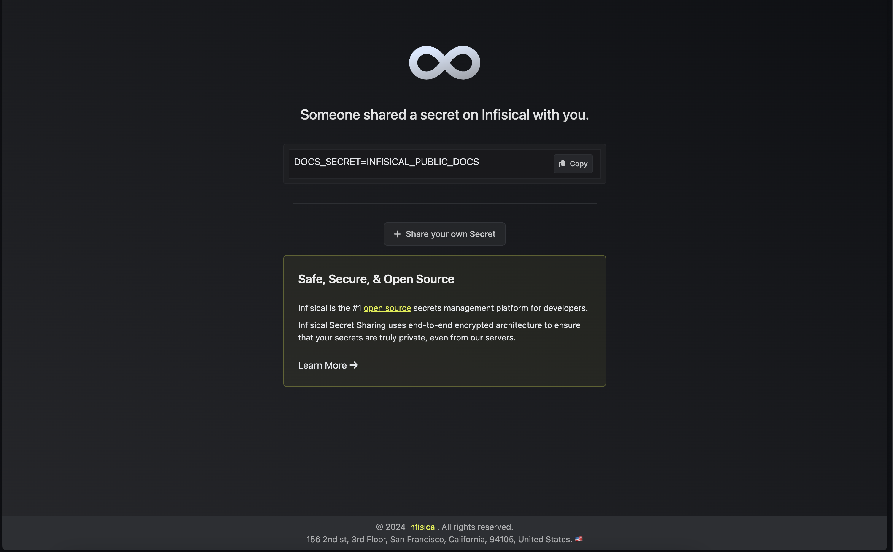

Developers frequently need to share secrets with team members, contractors, or other third parties, which can be risky due to potential leaks or misuse.
Infisical offers a secure solution for sharing secrets over the internet in a time and view count bound manner. It is possible to share secrets without signing up via [share.infisical.com](https://share.infisical.com) or via Infisical Dashboard (which has more advanced funcitonality).

With its zero-knowledge architecture, secrets shared via Infisical remain unreadable even to Infisical itself.

## Share a Secret

1. Navigate to the **Organization** page.
2. Click on the **Secret Sharing** tab from the sidebar.

<Note>
  Infisical does not have access to the shared secrets. This is a part of our
  zero knowledge architecture.
</Note>

3. Click on the **Share Secret** button. Set the secret, its expiration time and specify if the secret can be viewed only once. It expires as soon as any of the conditions are met.
Also, specify if the secret can be accessed by anyone or only people within your organization.

   

<Note>
  Secret once set cannot be changed. This is to ensure that the secret is not
  tampered with.
</Note>

5. Copy the link and share it with the intended recipient. Anyone with the link can access the secret before its expiration condition. Hence, it is recommended to share the link only with the intended recipient.

## Access a Shared Secret

Just click on the link you received to access the secret. The secret will be displayed on the screen & for how long it is valid.

## Delete a Shared Secret

In the **Secret Sharing** tab, click on the **Delete** button next to the secret you want to delete. This will delete the secret immediately & the link will no longer be accessible.
