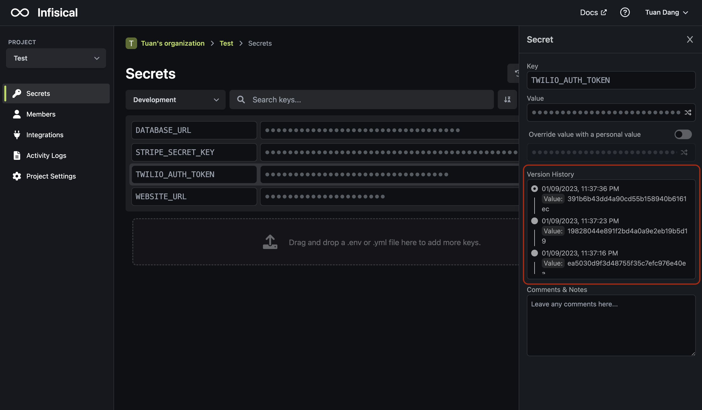

Secret versioning records changes made to every secret.

<Note>
  You can copy and paste a secret version value to the "Value" input field "roll
  back" to that secret version. This creates a new secret version at the top of
  the stack. We're releasing the ability to press and automatically roll back to
  a secret version soon.
</Note>
