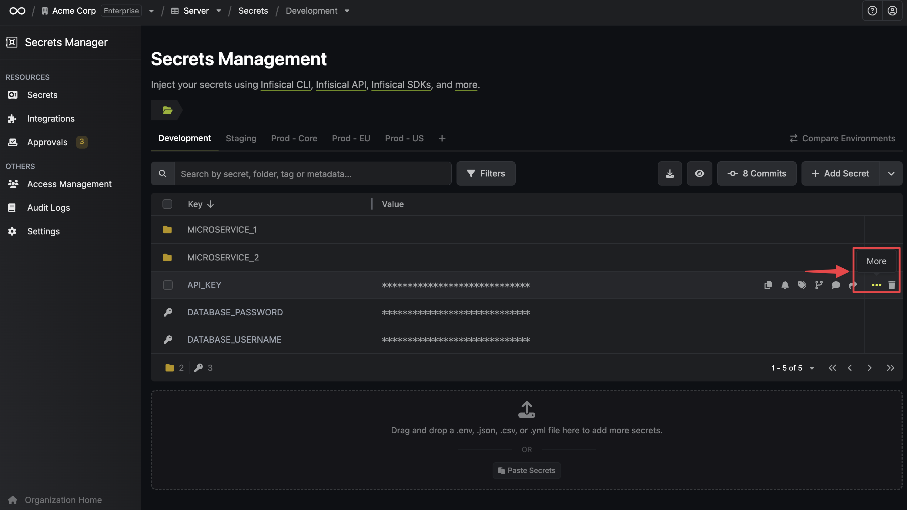
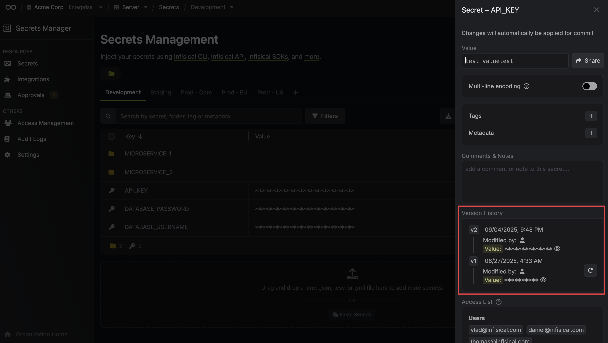

<Info>
  **Tier:** Pro, Enterprise
</Info>

Every time a secret change is performed, a new version of the same secret is created. 

The short video below walks through secret versioning and point-in-time recovery, covering how Infisical keeps a history of every secret change and how to roll back to a previous state.

 

  <iframe
    src="https://www.youtube.com/embed/tWVQcx4XiAA"
    title="YouTube video player"
    style={{ position: "absolute", top: 0, left: 0, width: "100%", height: "100%", border: 0 }}
    allow="accelerometer; autoplay; clipboard-write; encrypted-media; gyroscope; picture-in-picture; web-share"
    allowfullscreen
  ></iframe>

 

Such versions can be accessed visually by opening up the [secret sidebar](/documentation/platform/project#drawer) (as seen below) or [retrieved via API](/api-reference/endpoints/secrets/read) 
by specifying the `version` query parameter.

The secret versioning functionality is heavily connected to [Point-in-time Recovery](/documentation/platform/pit-recovery) of secrets in Infisical.

<Note>
  You can copy and paste a secret version value to the "Value" input field "roll
  back" to that secret version. This creates a new secret version at the top of
  the stack. We're releasing the ability to automatically roll back to
  a secret version soon.
</Note>
