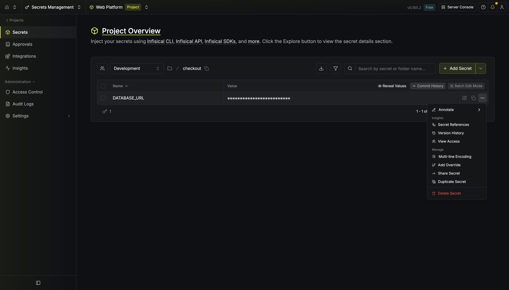
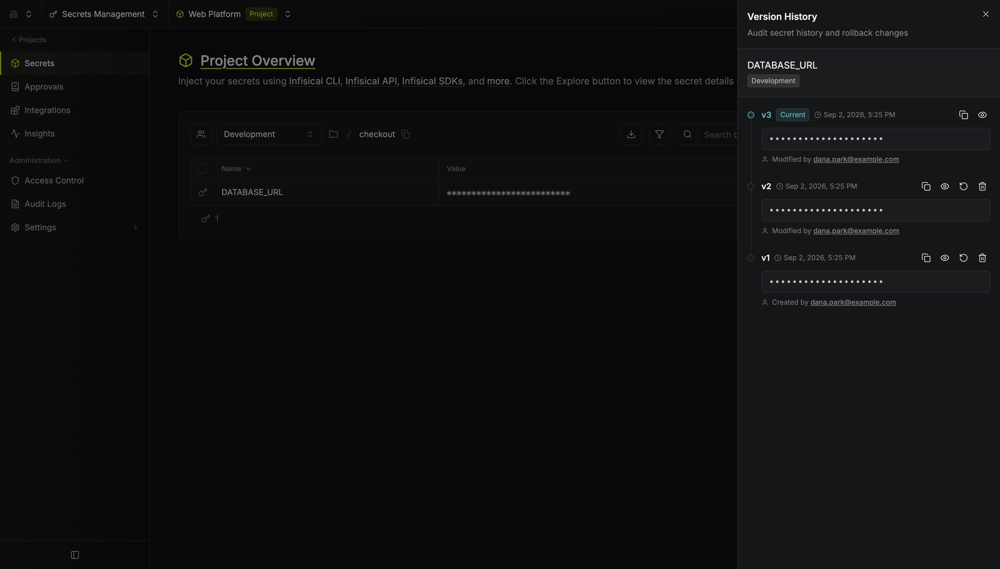

Every time a secret change is performed, a new version of the same secret is created. 

The short video below walks through secret versioning and point-in-time recovery, covering how Infisical keeps a history of every secret change and how to roll back to a previous state.

 

  <iframe
    src="https://www.youtube.com/embed/tWVQcx4XiAA"
    title="YouTube video player"
    style={{ position: "absolute", top: 0, left: 0, width: "100%", height: "100%", border: 0 }}
    allow="accelerometer; autoplay; clipboard-write; encrypted-media; gyroscope; picture-in-picture; web-share"
    allowfullscreen
  ></iframe>

 

To see a secret's versions, hover over it, select the three dot menu, then select **Version History**. You can also [read a specific version through the API](/api-reference/endpoints/secrets/read) with the `version` query parameter.

The secret versioning functionality is heavily connected to [Point-in-time Recovery](/documentation/platform/pit-recovery) of secrets in Infisical.

<Note>
  Select the restore icon on any earlier version to roll the secret back to it.
  This overwrites the current value and adds a new version at the top of the
  stack.
</Note>
