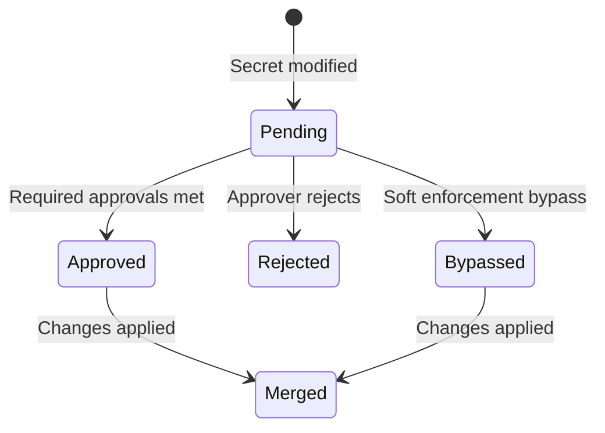

## Why this matters

Updating secrets in high-stakes environments like production carries real risk:

- **Broad access creates exposure.** Most developers should not have direct access to production secrets, yet they are often the ones who need to add or change them. Organizations rely on informal processes — Slack messages, manual handoffs — to gate these changes, which slows development and is error-prone.
- **Unreviewed changes cause incidents.** A mistyped value or accidental deletion in production can take down a service. Requiring a second set of eyes before a change takes effect reduces the likelihood of human error reaching production.
- **Propagation is often manual.** After secrets change, the corresponding applications need to be redeployed with the correct values. Without automation, this step is frequently missed or done incorrectly.

Approval workflows address these problems by introducing structured review and enforcement into the secret change process — similar to how pull requests gate code changes before they reach the main branch.

## How it works

An approval workflow consists of two parts: a **policy** that defines what requires approval, and a **change request** that captures each proposed modification for review.

### Policies

A policy targets a specific environment (and optionally a secret path) and assigns one or more approvers. When anyone modifies a secret that matches the policy, Infisical creates a change request instead of applying the update immediately.

Policies support several configuration options:

- **Approvers** — The users or groups responsible for reviewing change requests that match the policy.
- **Required approvals** — The minimum number of approval votes needed before a change request can be merged.
- **Self-approval** — Whether an approver can approve their own change request. Disabling this ensures that every change is reviewed by a different person.
- **Enforcement level** — Controls how strictly the policy is applied. There are two levels:

| Level | Behavior |
|-------|----------|
| **Hard** | Every matching change requires full approval before it can be merged. No exceptions. |
| **Soft** | Designated users can bypass the approval requirement in break-glass situations. All approvers are notified by email when a bypass occurs. |

When bypass is enabled, you can restrict it to specific users or groups. If no restriction is set, anyone can bypass. A bypass can only be performed by the person who created the change request — bypassers cannot bypass requests submitted by others.

### Change requests

When a user modifies a secret in a policy-protected environment, Infisical automatically creates a change request containing the proposed changes. The request follows this lifecycle:

Approvers are notified through email, [Slack](/documentation/platform/workflow-integrations/slack-integration), or [Microsoft Teams](/documentation/platform/workflow-integrations/microsoft-teams-integration). They can then approve, reject, or (once sufficient approvals are met) merge the request from the Infisical dashboard.

After a change request is merged, the updated secrets are automatically synced to connected applications — for example, through the [Infisical Kubernetes Operator](https://infisical.com/docs/integrations/platforms/kubernetes) — removing the manual propagation step.

## Learn more

- [Set up approval workflows](/documentation/platform/pr-workflows) — Step-by-step guide to creating and using change policies
- [Access requests](/documentation/platform/access-controls/access-requests) — Request-based access to environments and paths
- [Scoping secrets](/documentation/platform/secrets-mgmt/concepts/access-control) — How access to secrets is controlled in Infisical
