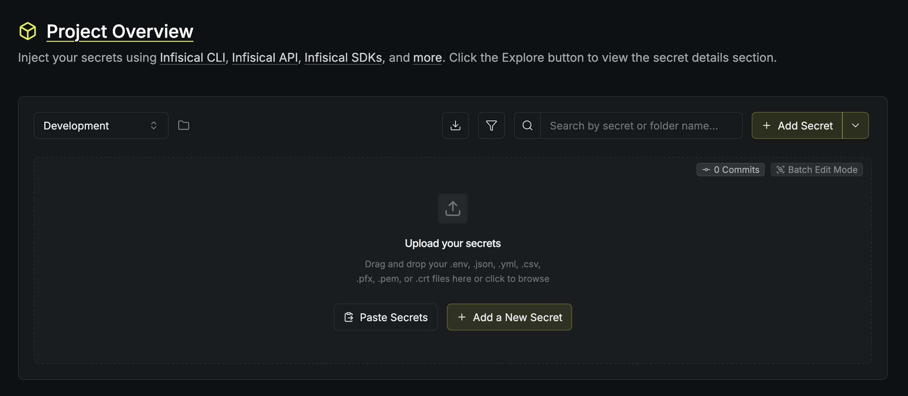
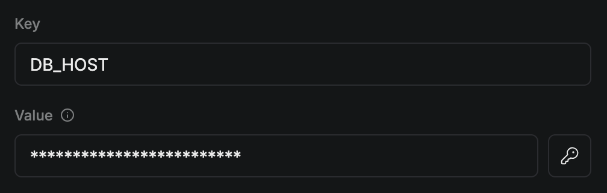
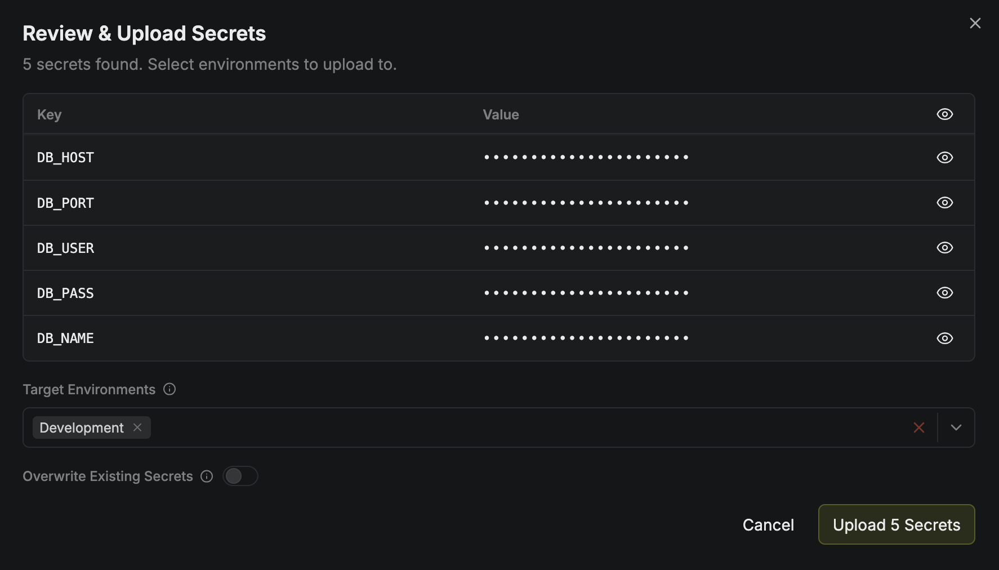

This quickstart guide walks you through the core secrets management workflow. You'll create a [project](/documentation/platform/secrets-mgmt/project), add a secret to one of its environments, and inject the secret into an application using the [Infisical CLI](/cli/overview), all without needing a `.env` file.

<Info>
Prerequisites:

- An Infisical account on [Infisical Cloud](https://app.infisical.com) or a [self-hosted instance](/self-hosting/overview)
- The [Infisical CLI](/cli/overview) installed for your platform
- An application or script you run locally
</Info>

## Step 1: Create a project

In Infisical, a [project](/documentation/platform/secrets-mgmt/project) holds all secrets for one application or service. To create a project:

<Steps>
  <Step>
    Log in to [Infisical](https://app.infisical.com).
  </Step>
  <Step>
    Select **Secrets Management** > **+ Add New Project**.
  </Step>
  <Step>
    In the **Project Name** field, enter a name for the project (e.g., `orders-service`).
  </Step>
</Steps>

This opens your new project in the **Development** environment:

<Frame>
  
</Frame>

<Note>
  Within a project, secrets are organized across [environments](/documentation/platform/secrets-mgmt/project#project-environments). Every new project starts with three environments: **Development**, **Staging**, and **Production**.
</Note>

## Step 2: Add a secret

You have two options for adding secrets to your project:

<Tabs>
  <Tab title="Create a brand new secret">
    To create a new secret from scratch:

    <Steps>
      <Step>
        Select **+ Add a New Secret**.
      </Step>
      <Step>
        In the **Key** and **Value** fields, enter the key-value pair for your secret. For example:

        <Frame>
          
        </Frame>
      </Step>
      <Step>
        Select **Create Secret**.
      </Step>
    </Steps>
  </Tab>
  <Tab title="Import secrets from an existing file">
    To import secrets from an existing file:

    <Steps>
      <Step>
        Drag and drop the file containing your secrets (or enter the file's contents manually by selecting **Paste Secrets**).
      </Step>
      <Step>
        Review the discovered secrets. For example:

        <Frame>
          
        </Frame>
      </Step>
      <Step>
        Select **Upload Secrets**.
      </Step>
    </Steps>
  </Tab>
</Tabs>

## Step 3: Authenticate with the CLI

Next, authenticate with the Infisical CLI by running [`infisical login`](/cli/commands/login):

```bash
infisical login
```

This prompts you to select your hosting option, then opens your browser to complete the login.

<Note>
  In a containerized environment such as WSL 2 or Codespaces, run `infisical login -i` to avoid browser-based login.
</Note>

## Step 4: Connect your project

Now that the CLI is authenticated, you can connect your application to your Infisical project:

<Steps>
  <Step>
    In your application's directory, link it to the Infisical project you created by running [`infisical init`](/cli/commands/init):

    ```bash
    infisical init
    ```
  </Step>
  <Step>
    Follow the prompts to select the organization/project where you created your secret earlier. This writes a `.infisical.json` file to your project with [local project settings](/cli/project-config):

    ```json .infisical.json
    {
      "workspaceId": "xxxxxxxx-xxxx-xxxx-xxxx-xxxxxxxxxxxx",
      "defaultEnvironment": "",
      "gitBranchToEnvironmentMapping": null
    }
    ```

    <Note>
    `.infisical.json` files contain no secrets and are safe to commit to version control systems like git.
    </Note>
  </Step>
</Steps>

## Step 5: Inject the secret into your app

Now that your Infisical project is configured, Infisical can provide your application with the secret it needs.

Start your application by wrapping its start command with [`infisical run`](/cli/commands/run):

<CodeGroup>
  ```bash Node.js
  infisical run --env=dev -- npm run dev
  ```

  ```bash Flask
  infisical run --env=dev -- flask run
  ```

  ```bash Go
  infisical run --env=dev -- go run main.go
  ```
</CodeGroup>

Infisical fetches the secret and injects it as an environment variable. This lets your application read the secret from its environment at runtime.

<Check>
  You can now manage your application's secrets through Infisical without needing a `.env` file.
</Check>

## Next Steps

<CardGroup cols={2}>
  <Card title="Core Concepts" icon="book" href="/documentation/platform/secrets-mgmt/concepts/secrets-mgmt">
    Understand how projects, environments, folders, and secrets fit together.
  </Card>
  <Card title="Secrets Delivery" icon="truck-fast" href="/documentation/platform/secrets-mgmt/concepts/secrets-delivery">
    Deliver secrets to production with SDKs, agents, Kubernetes, and CI/CD.
  </Card>
  <Card title="Local Development Guide" icon="laptop-code" href="/documentation/guides/local-development">
    Set up a secure local development workflow for your whole team.
  </Card>
  <Card title="Access Control" icon="shield-halved" href="/documentation/platform/secrets-mgmt/concepts/access-control">
    Scope who can access which environments and paths.
  </Card>
</CardGroup>
