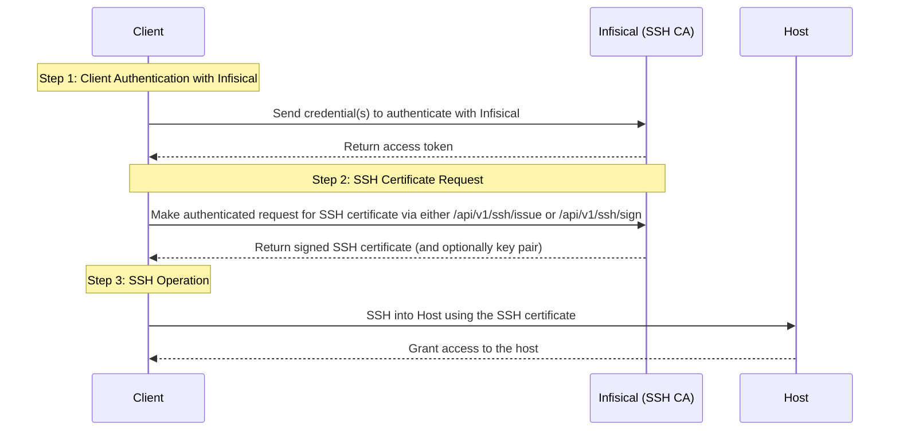

Infisical can be used to issue SSH certificates to provide short-lived, secure SSH access to your infrastructure.

## Concept

The following sequence diagram illustrates the client workflow for accessing a host using an SSH certificate (and optionally key pair)
supplied by Infisical.

TODO: Mention required configuration on the host.

At a high-level, Infisical issues a signed SSH certificate to a client that can be used to access a host.

To be more specific:

1. The client authenticates with Infisical; this can be done using a machine identity [authentication method](/documentation/platform/identities/machine-identities) or a user [authentication method](/documentation/platform/identities/user-identities).
2. The client makes an authenticated request for an SSH certificate via either the `/api/v1/ssh/issue` or `/api/v1/ssh/sign` endpoints. Note tha if the client wishes to use an existing SSH key pair, it can use the `/api/v1/ssh/sign` endpoint; otherwise, it can use the `/api/v1/ssh/issue` endpoint to have Infisical issue a new SSH key pair in conjunction with the certificate.
3. The client uses the issued SSH certificate (and potentially SSH key pair) to access the host.

<Info>Test</Info>

<Note>Note on using CLI</Note>
