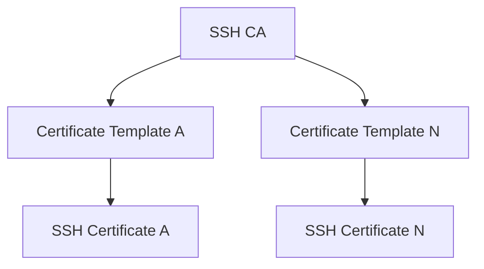
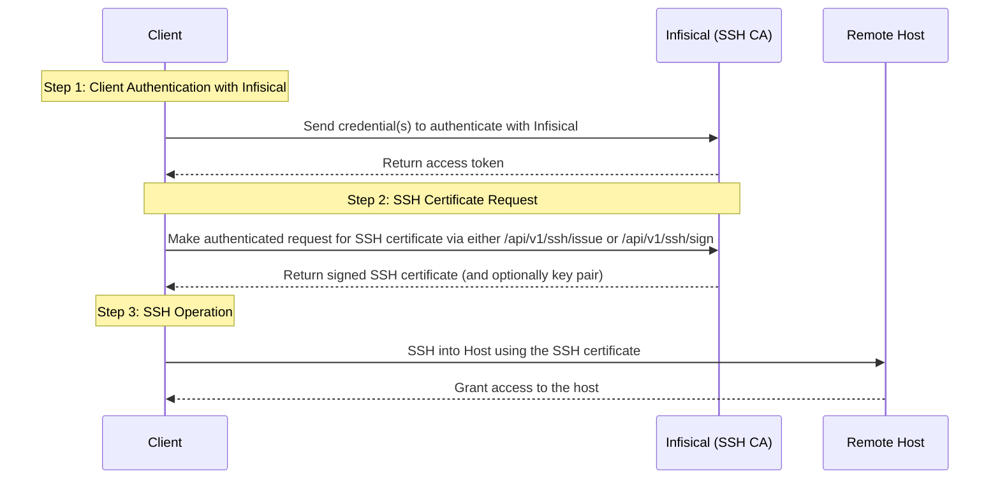

## Concept

Infisical can be used to issue SSH credentials to clients to provide short-lived, secure SSH access to infrastructure;
this improves on many limitations of traditional SSH key-based authentication via mitigation of private key compromise, static key management,
unauthorized access, and SSH key sprawl.

The following concepts are useful to know when working with Infisical SSH:

- SSH Certificate Authority (CA): A trusted authority that issues SSH certificates.
- Certificate Template: A set of policies bound to a SSH CA for certificates issued under that template; a CA can possess multiple templates, each with different policies for a different purpose (e.g. for admin versus developer access).
- SSH Certificate: A short-lived, credential issued by the SSH CA granting time-bound access to infrastructure.

<div align="center">



</div>

When using Infisical SSH to provision client access to a remote host, an operator must create a SSH CA in Infisical; a certificate template under it,
specifying policies such as allowed users that can be requested under that template by a client; and configure the host to trust certificates issued by the Infisical SSH CA.

When a client needs access to a host, they authenticate with Infisical and request a SSH certificate (and optionally key pair)
to be used to access the host for a time-bound session as part of the SSH operation.

## Client Workflow

The following sequence diagram illustrates the client workflow for accessing a remote host using an SSH certificate (and optionally key pair)
supplied by Infisical.



At a high-level, Infisical issues a signed SSH certificate to a client that can be used to access a remote host.

To be more specific:

1. The client authenticates with Infisical; this can be done using a machine identity [authentication method](/documentation/platform/identities/machine-identities) or a user [authentication method](/documentation/platform/identities/user-identities).
2. The client makes an authenticated request for an SSH certificate via either the `/api/v1/ssh/issue` or `/api/v1/ssh/sign` endpoints. Note that if the client wishes to use an existing SSH key pair, it can use the `/api/v1/ssh/sign` endpoint; otherwise, it can use the `/api/v1/ssh/issue` endpoint to have Infisical issue a new SSH key pair in conjunction with the certificate.
3. The client uses the issued SSH certificate (and potentially SSH key pair) to temporarily access the host.

<Note>
  Note that the workflow above requires an operator to perform additional
  configuration on the remote host to trust SSH certificates issued by
  Infisical.
</Note>

## Guide to Configuring Infisical SSH

In the following steps, we explore how to configure Infisical SSH to start issuing SSH certificates to clients as well as a remote host to trust these certificates
as part of the SSH operation.

<Steps>
  <Step title="Configuring Infisical SSH">
    1.1. Start by creating a SSH project in the SSH tab of your organization.
    
    
    
    1.2. Next, create a CA in the **Certificate Authorities** tab of the
    project.
    
    
    
    
    
    Here's some guidance on each field:

    - Friendly Name: A friendly name for the CA; this is only for display.
    - Key Algorithm: The type of public key algorithm and size, in bits, of the key pair for the CA. Supported key algorithms are `RSA 2048`, `RSA 4096`, `ECDSA P-256`, and `ECDSA P-384` with the default being `RSA 2048`.

    1.3. Next, create a certificate template in the **Certificate Templates** section of the newly-created CA.

    A certificate template is a set of policies for certificates issued under that template; each template is bound to a specific CA.

    With certificate templates, you can specify, for example, that certificates issued under a template are only allowed for users with a specific username like `ec2-user` or perhaps that the max TTL requested cannot exceed 1 year.

    

    

    Here's some guidance on each field:

    - SSH Template Name: A name for the certificate template; this must be a valid slug.
    - Allowed Users: A comma-separated list of valid usernames (e.g. `ec2-user`) on the remote host for which a client can request a certificate for. If you wish to allow a client to request a certificate for any username, set this to `*`; alternatively, if left blank, the template will not allow issuance of certificates under any username.
    - Allowed Hosts: A comma-separated list of valid hostnames/domains on the remote host for which a client can request a certificate for. Each item in the list can be either a wildcard hostname (e.g. `*.acme.com`), a specific hostname (e.g. `example.com`), an IPv4 address (e.g. `192.168.1.1`), or an IPv6 address. If left empty, the template will not allow any hostnames; if set to `*`, the template will allow any hostname.
    - Default TTL: The default Time-to-Live (TTL) for certificates issued under this template when a client does not explicitly specify a TTL in the certificate request.
    - Max TTL: The maximum TTL for certificates issued under this template.
    - Allow User Certificates: Whether or not to allow issuance of user certificates.
    - Allow Host Certificates: Whether or not to allow issuance of host certificates.
    - Allow Custom Key IDs: Whether or not to allow clients to specify a custom key ID to be included on the certificate as part of the certificate request.

    1.4. Finally, add the user(s) you wish to be able to request a SSH certificate to the SSH project through the **Access Control** tab.

  </Step>
  <Step title="Configuring the remote host">
  
    2.1. Begin by downloading the CA's public key from the CA's details section.
    
    
    
    <Note>
      The CA's public key can also be retrieved programmatically via API by making a `GET` request to the `/ssh/ca/<ca-id>/public-key` endpoint.
    </Note>
    
    2.2. Next, create a file containing this public key in the SSH folder of the remote host; we'll call the file `ca.pub`.

    This would result in the file at the path `/etc/ssh/ca.pub`.

    2.3. Next, add the following lines to the `/etc/ssh/sshd_config` file on the remote host.

    ```bash
    TrustedUserCAKeys /etc/ssh/ca.pub

    PubkeyAcceptedKeyTypes=+ssh-rsa,ssh-rsa-cert-v01@openssh.com
    ```

    2.4. Finally, reload the SSH daemon on the remote host to apply the changes.

    ```bash
    sudo systemctl reload sshd
    ```

    At this point, the remote host is configured to trust SSH certificates issued by the Infisical SSH CA.

  </Step>
</Steps>

## Guide to Using Infisical SSH to Access a Host

We show how to obtain a SSH certificate and use it for a client to access a host via CLI:

<Note>
  The subsequent guide assumes the following prerequisites:

- SSH Agent is running: The `ssh-agent` must be actively running on the host machine.
- OpenSSH is installed: The system should have OpenSSH installed; this includes
  both the `ssh` client and `ssh-agent`.
- `SSH_AUTH_SOCK` environment variable
  is set; the `SSH_AUTH_SOCK` variable should point to the UNIX socket that
  `ssh-agent` uses for communication.

</Note>

<Steps>
  <Step title="Authenticate with Infisical">

```bash
infisical login
```

  </Step>
  <Step title="Obtain a SSH certificate and load it into the SSH agent">
    Run the `infisical ssh issue-credentials` command, specifying the `--addToAgent` flag to automatically load the SSH certificate into the SSH agent.
    ```bash
    infisical ssh issue-credentials --certificateTemplateId=<certificate-template-id> --principals=<username> --addToAgent
    ```

    Here's some guidance on each flag:

    - `certificateTemplateId`: The ID of the certificate template to use for issuing the SSH certificate.
    - `principals`: The comma-delimited username(s) or hostname(s) to include in the SSH certificate.
    
    For fuller documentation on commands and flags supported by the Infisical CLI for SSH, refer to the docs [here](/cli/commands/ssh).
 
  </Step>
  <Step title="SSH into the host">
    Finally, SSH into the desired host; the SSH operation will be performed using the SSH certificate loaded into the SSH agent.

    ```bash
    ssh username@hostname
    ```
  </Step>
</Steps>

<Note>
  Note that the above workflow can be executed via API or other client methods
  such as SDK.
</Note>