<Info>
   Azure SAML SSO is a paid feature.
   
   If you're using Infisical Cloud, then it is available under the **Pro Tier**. If you're self-hosting Infisical,
   then you should contact sales@infisical.com to purchase an enterprise license to use it.
</Info>

<Steps>
   <Step title="Prepare the SAML SSO configuration in Infisical">
      In Infisical, head to your Organization Settings > Authentication > SAML SSO Configuration and select **Set up SAML SSO**.

      Next, copy the **Reply URL (Assertion Consumer Service URL)** and **Identifier (Entity ID)** to use when configuring the Azure SAML application.

      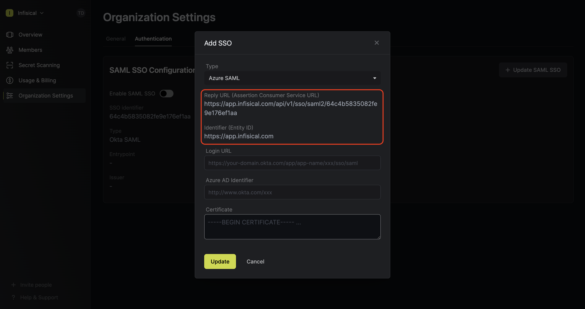
   </Step>
   <Step title="Create a SAML application in Azure">
      In the Azure Portal, navigate to the Azure Active Directory and select **Enterprise applications**. On this screen, select **+ New application**.

      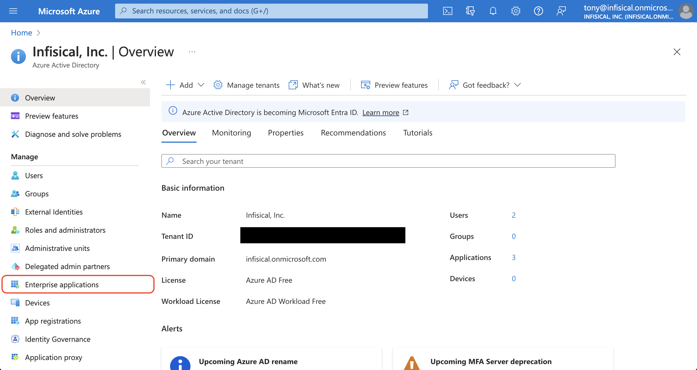

      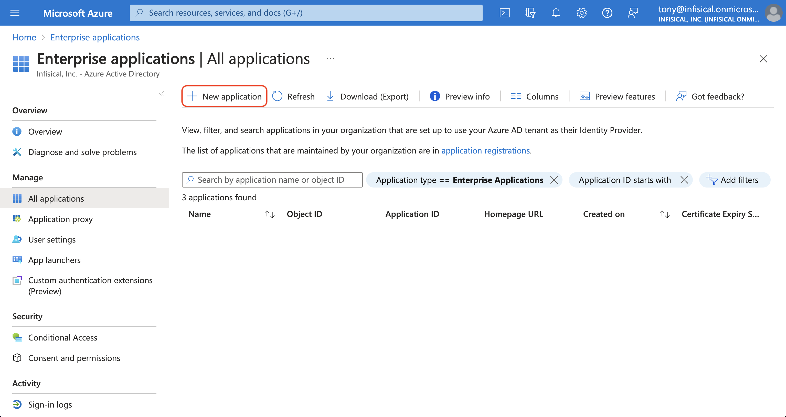
      
      On the next screen, press the **+ Create your own application** button.
      Give the application a unique name like Infisical; choose the "Integrate any other application you don't find in the gallery (Non-gallery)"
      option and hit the **Create** button.

      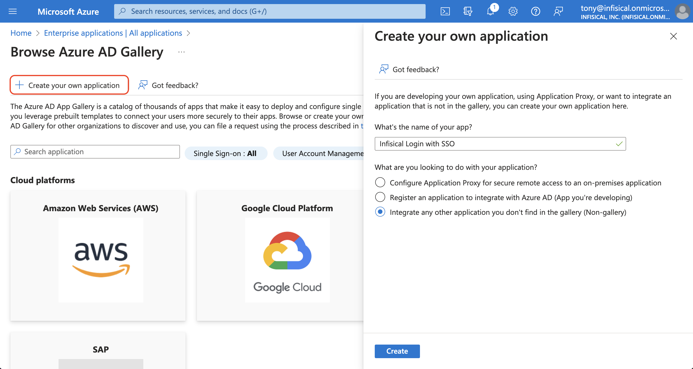

      On the application overview screen, select **Single sign-on** from the left sidebar. From there, select the **SAML** single sign-on method.

      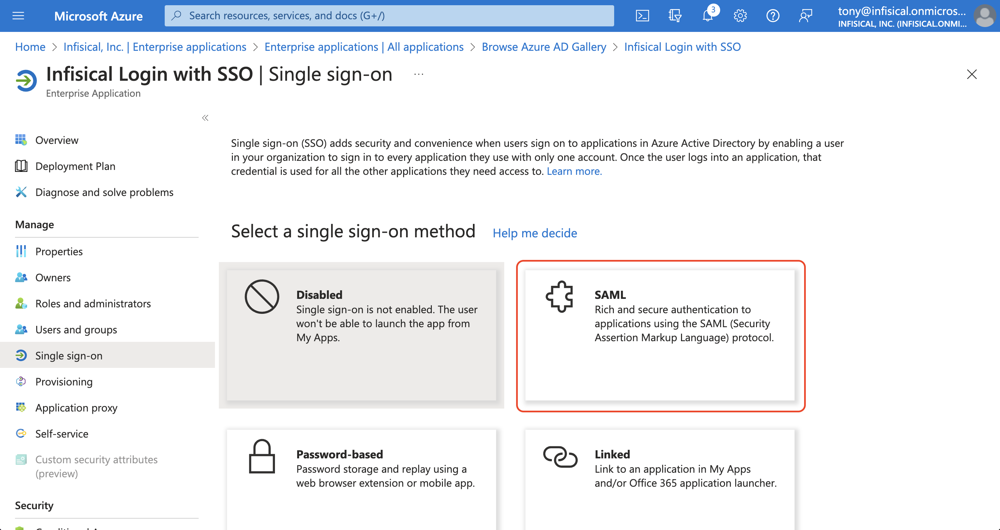

      Next, select **Edit** in the **Basic SAML Configuration** section and add/set the **Identifier (Entity ID)** to **Entity ID** and add/set the **Reply URL (Assertion Consumer Service URL)** to **ACS URL** from step 1.

      

      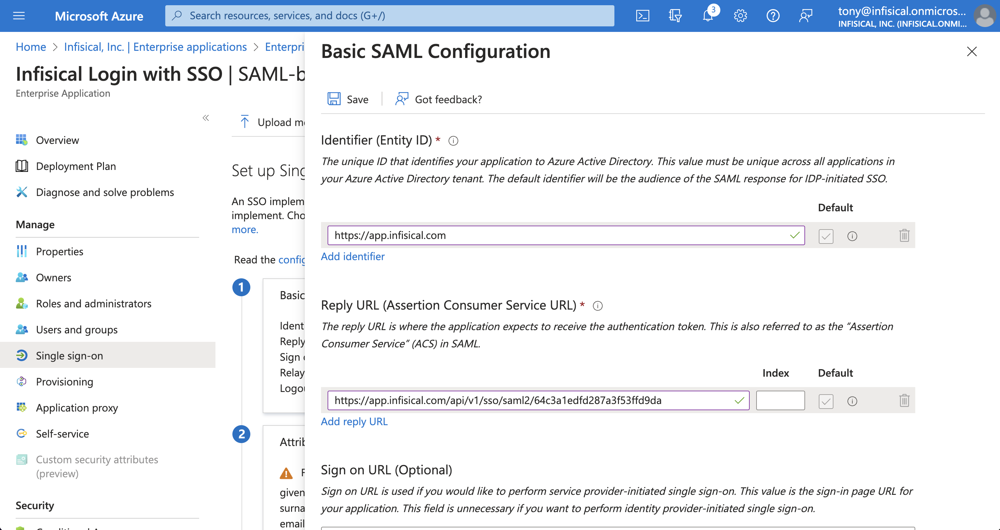

      <Note>
      If you're self-hosting Infisical, then you will want to replace
      `https://app.infisical.com` with your own domain.
      </Note>

      Back in the **Set up Single Sign-On with SAML** screen, select **Edit** in the **Attributes & Claims** section and configure the following map:

      - `email -> user.userprinciplename`
      - `firstName -> user.givenname`
      - `lastName -> user.surname`

      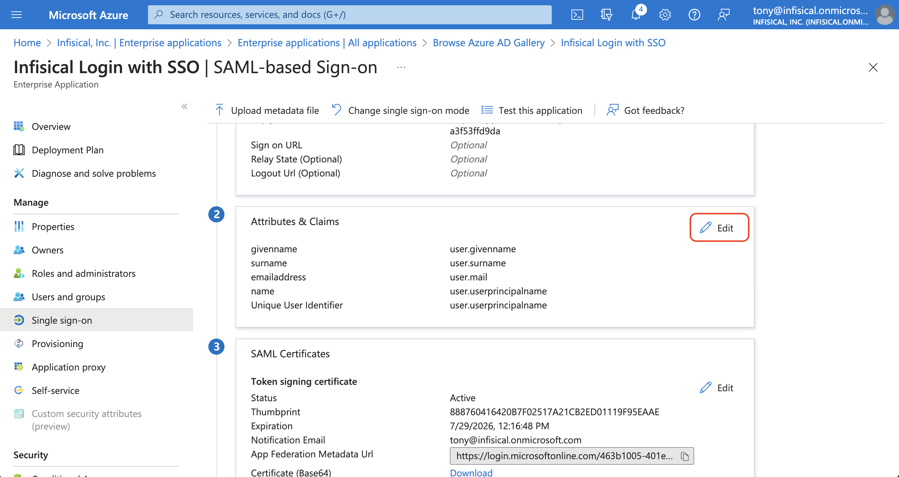

      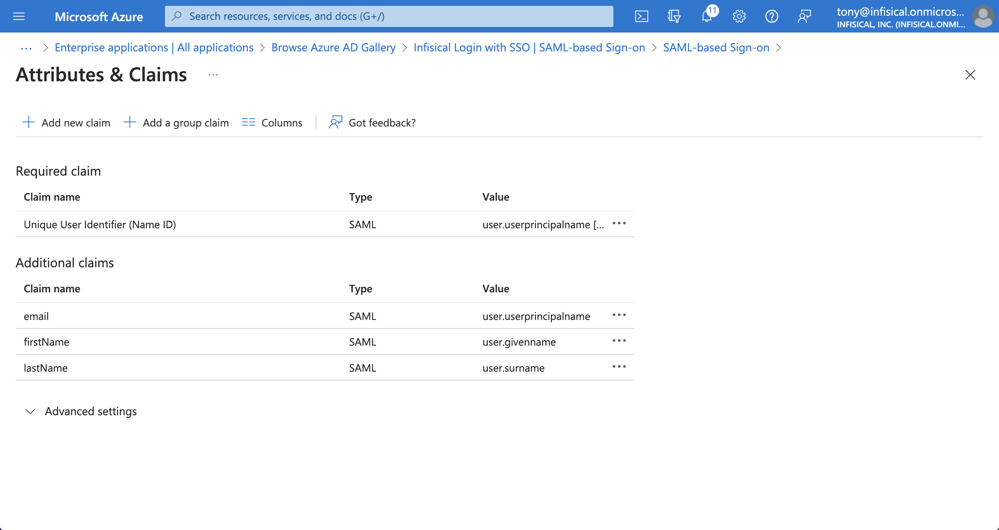

      Back in the **Set up Single Sign-On with SAML** screen, select **Edit** in the **SAML Certificates** section and set the **Signing Option** field to **Sign SAML response and assertion**.

      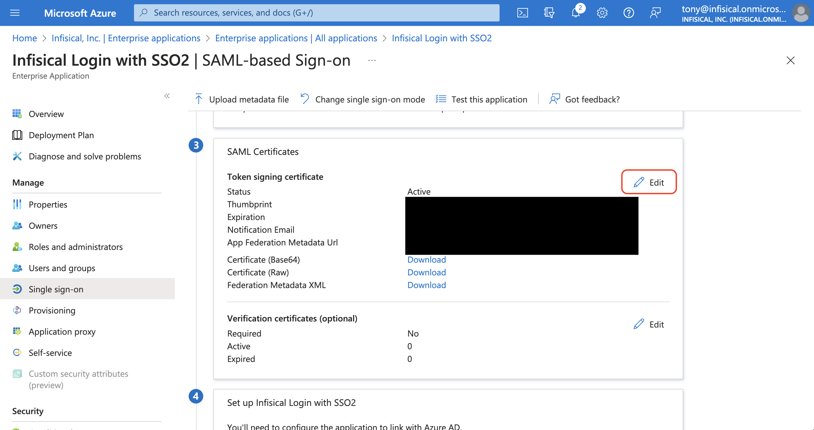

      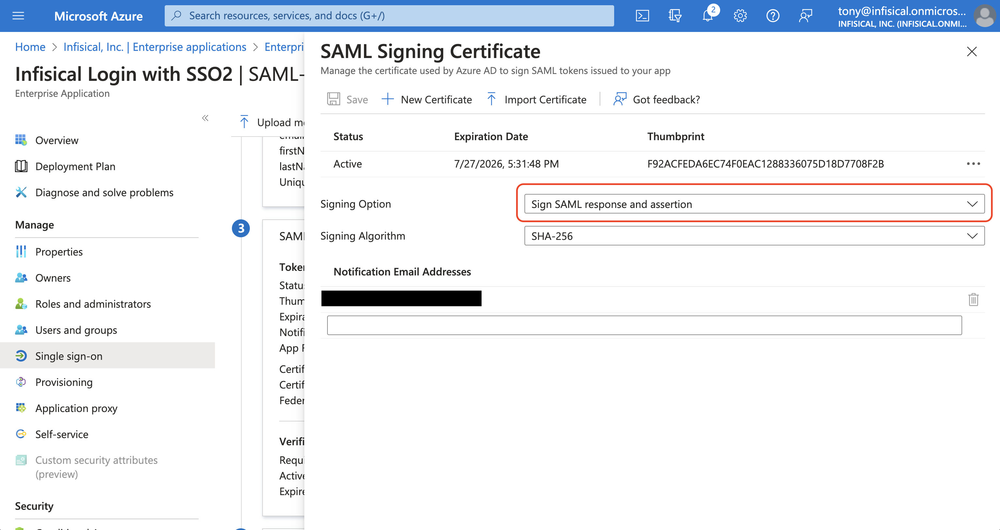
   </Step>
   <Step title="Retrieve Identity Provider (IdP) Information from Azure">
      In the **Set up Single Sign-On with SAML** screen, copy the **Login URL** and **SAML Certificate** to use when finishing configuring Azure SAML in Infisical.

      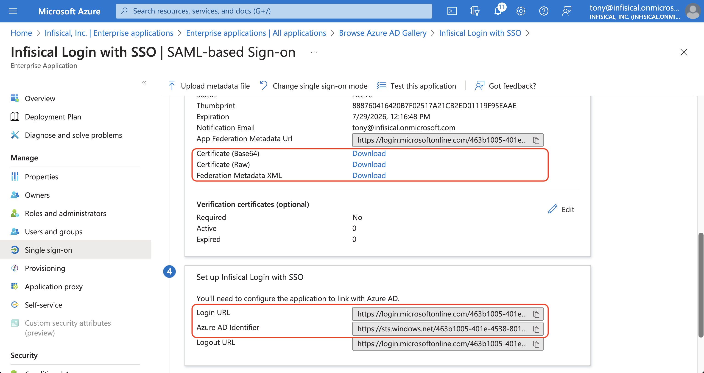

      In the **Properties** screen, copy the **Application ID** to use when finishing configuring Azure SAML in Infisical.

      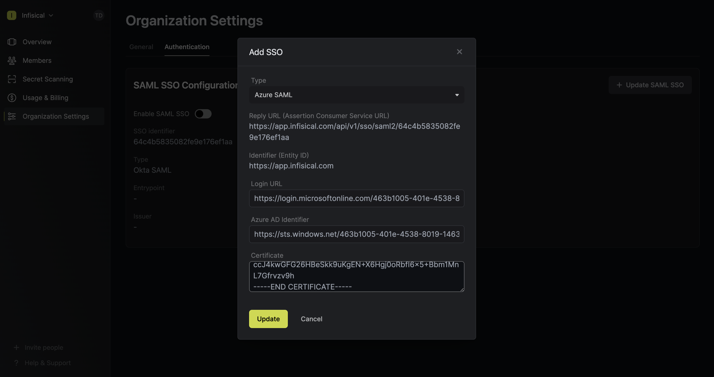
   </Step>
   <Step title="Finish configuring SAML in Infisical">
      Back in Infisical, set **Login URL**, **Azure Application ID**, and **SAML Certificate** from step 3. Once you've done that, press **Update** to complete the required configuration.

      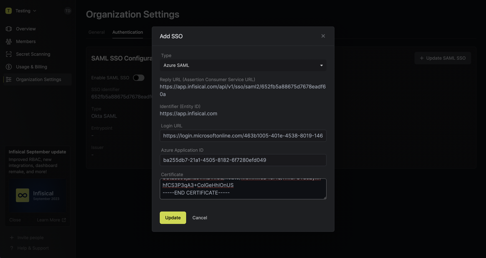

      <Note>
      When pasting the certificate into Infisical, you'll want to retain `-----BEGIN
      CERTIFICATE-----` and `-----END CERTIFICATE-----` at the first and last line
      of the text area respectively.

      Having trouble?, try copying the X509 certificate information from the Federation Metadata XML file in Azure.

      </Note>
   </Step>
   <Step title="Assign users in Azure to the application">
      Back in Azure, navigate to the **Users and groups** tab and select **+ Add user/group** to assign access to the login with SSO application on a user or group-level.
      
      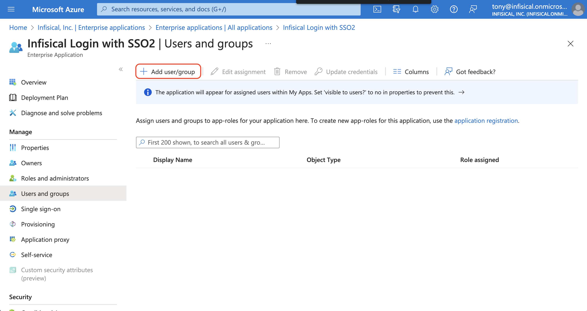
   </Step>   
   <Step title="Enable SAML SSO in Infisical">
      Enabling SAML SSO allows members in your organization to log into Infisical via Azure.

      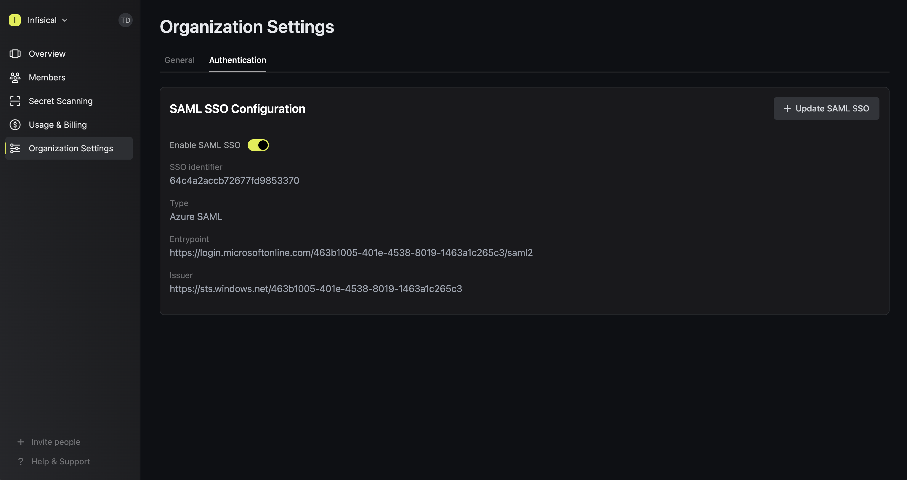
   </Step>
   <Step title="Enforce SAML SSO in Infisical">
      Enforcing SAML SSO ensures that members in your organization can only access Infisical
      by logging into the organization via Azure.

      To enforce SAML SSO, you're required to test out the SAML connection by successfully authenticating at least one Azure user with Infisical;
      Once you've completed this requirement, you can toggle the **Enforce SAML SSO** button to enforce SAML SSO.

      <Warning>
         We recommend ensuring that your account is provisioned the application in Azure
         prior to enforcing SAML SSO to prevent any unintended issues.
      </Warning>
   </Step>
</Steps>

<Note>
   If you're configuring SAML SSO on a self-hosted instance of Infisical, make sure to
   set the `AUTH_SECRET` and `SITE_URL` environment variable for it to work:
   
   - `AUTH_SECRET`: A secret key used for signing and verifying JWT. This can be a random 32-byte base64 string generated with `openssl rand -base64 32`.
   - `SITE_URL`: The URL of your self-hosted instance of Infisical - should be an absolute URL including the protocol (e.g. https://app.infisical.com)
</Note>
