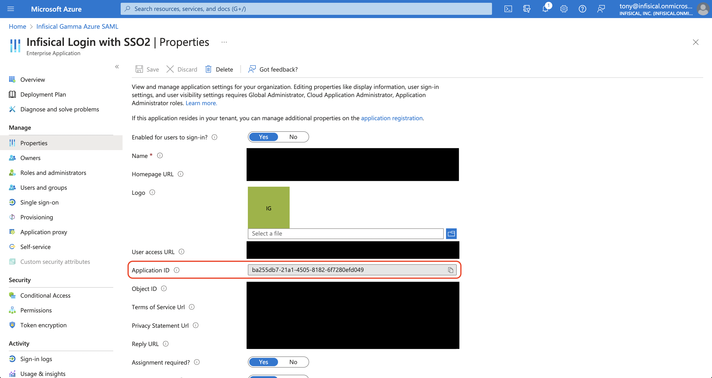

1. In Infisical, head over to your organization Settings > Authentication > SAML SSO Configuration and select **Set up SAML SSO**.
   Next, copy the **Reply URL (Assertion Consumer Service URL)** and **Identifier (Entity ID)** to use when configuring the Azure SAML application.

2. In the Azure Portal, navigate to the Azure Active Directory and select **Enterprise applications**. On this screen, select
   **+ New application**.

2. On the next screen, press the **+ Create your own application** button.
   Give the application a unique, Infisical-specific name; choose the "Integrate any other application you don't find in the gallery (Non-gallery)"
   option and hit the **Create** button.

3. On the application overview screen, select **Single sign-on** from the left sidebar. From there,
   select the **SAML** single sign-on method.

4. Next, select **Edit** in the **Basic SAML Configuration** section and add/set the **Identifier (Entity ID)**
   to **Entity ID** and add/set the **Reply URL (Assertion Consumer Service URL)** to **ACS URL** from step 1.

<Note>
  If you're self-hosting Infisical, then you will want to replace
  `https://app.infisical.com` with your own domain.
</Note>

5. Back in the **Set up Single Sign-On with SAML** screen, select **Edit** in the **Attributes & Claims** section and configure the following map:

- `email -> user.userprinciplename`
- `firstName -> user.firstName`
- `lastName -> user.lastName`

6. Back in the **Set up Single Sign-On with SAML** screen, select **Edit** in the **SAML Certificates** section and set the **Signing Option** field to **Sign SAML response and assertion**.

7. Get IdP values:

Back in the **Set up Single Sign-On with SAML** screen, copy the **Login URL**, **Azure AD Identifier** and **SAML Certificate** to use when finishing configuring Azure SAML in Infisical.

Back in Infisical, set **Login URL** and **Azure AD Identifier** from above. Once you've done that, press **Update** to complete the required configuration.

<Note>
When pasting the certificate into Infisical, you'll want to retain `-----BEGIN
  CERTIFICATE-----` and `-----END CERTIFICATE-----` at the first and last line
  of the text area respectively.

Having trouble?, try copying the X509 certificate information from the Federation Metadata XML file in Azure.

</Note>

7. Assignments

Finally, navigate to the **Users and groups** tab and select **+ Add user/group** to assign access to the login with SSO application on a user or group-level.

8. Return to Infisical and enable SAML SSO.

Enabling SAML SSO enforces all members in your organization to only be able to log into Infisical via Azure.

