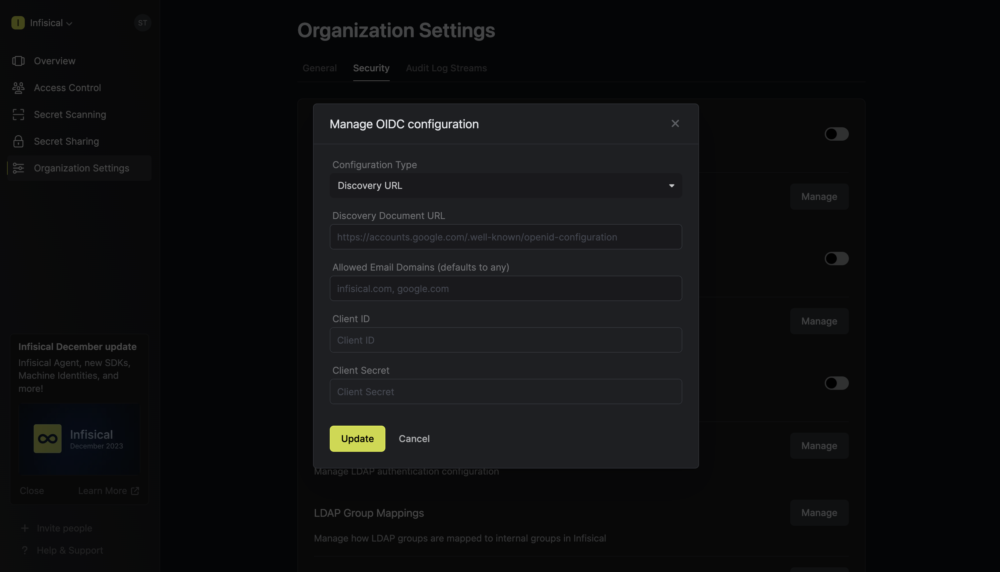
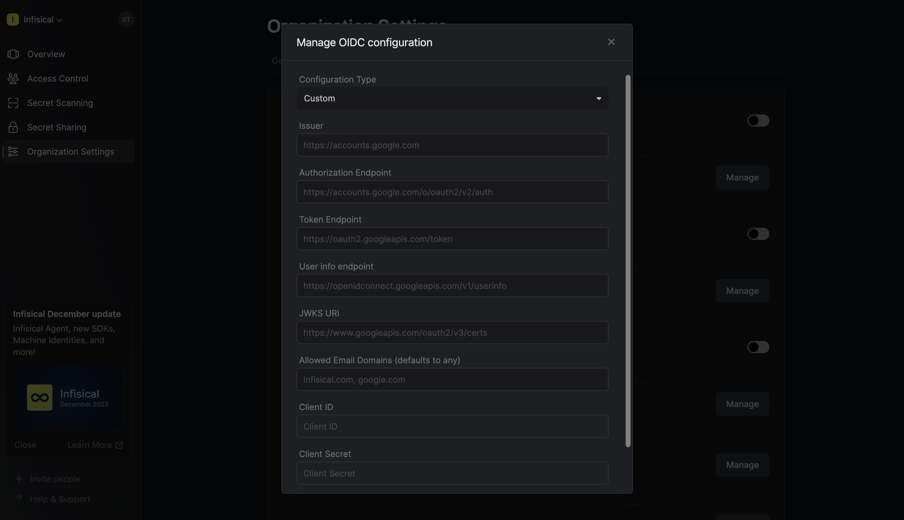
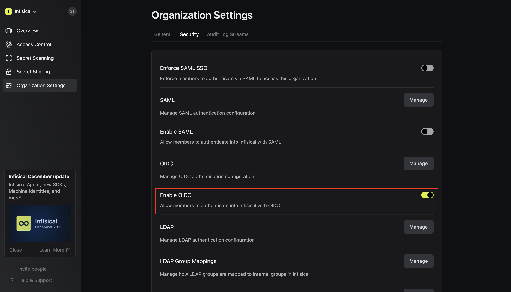

<Info>
  OIDC SSO is a paid feature. If you're using Infisical Cloud, then it is
  available under the **Pro Tier**. If you're self-hosting Infisical, then you
  should contact sales@infisical.com to purchase a self-hosted license to use
  it.
</Info>

You can configure your organization in Infisical to have members authenticate with the platform through identity providers via [OpenID Connect](https://openid.net/specs/openid-connect-core-1_0.html).

Prerequisites:

- The identity provider (Okta, Google, Azure AD, etc.) should support OIDC.
- Users in the IdP should have a configured `email` and `given_name`.

<Steps>
   <Step title="Setup Identity Provider">
      1.1. Register your application with the IdP to obtain a **Client ID** and **Client Secret**. These credentials are used by Infisical to authenticate with your IdP.

      1.2. Configure **Redirect URL** to be `https://app.infisical.com/api/v1/sso/oidc/callback`. If you're self-hosting Infisical, replace the domain with your own.

      1.3. Configure the scopes needed by Infisical (email, profile, openid) and ensure that they are mapped to the ID token claims.

      1.4. Access the IdP’s OIDC discovery document (usually located at `https://<idp-domain>/.well-known/openid-configuration`). This document contains important endpoints such as authorization, token, userinfo, and keys.
   </Step>
   <Step title="Finish configuring OIDC in Infisical">
      2.1. Back in Infisical, head to the **Single Sign-On (SSO)** page and select the **General** tab. Select **Connect** for **OIDC**.
      

      2.2. You can configure OIDC either through the Discovery URL (Recommended) or by inputting custom endpoints.

      To configure OIDC via Discovery URL, set the **Configuration Type** field to **Discovery URL** and fill out the **Discovery Document URL** field.

      <Note>
      Note that the Discovery Document URL typically takes the form: `https://<idp-domain>/.well-known/openid-configuration`.
      </Note>

      

      To configure OIDC via the custom endpoints, set the **Configuration Type** field to **Custom** and input the required endpoint fields.
      

      2.3. Select the appropriate JWT signature algorithm for your IdP. Currently, the supported options are RS256, RS512, HS256, and EdDSA.

      2.4. Optionally, you can define a whitelist of allowed email domains. Wildcard patterns such as `*.example.com` are supported to allow entire subdomain trees (e.g. `team.example.com`, `eng.example.com`).

      Finally, fill out the **Client ID** and **Client Secret** fields and press **Update** to complete the required configuration.

       </Step>

     <Step title="Enable OIDC SSO in Infisical">
      Enabling OIDC SSO allows members in your organization to log into Infisical via the configured Identity Provider

      
    </Step>

    <Step title="Enforce OIDC SSO in Infisical">
      Enforcing OIDC SSO ensures that members in your organization can only access Infisical
      by logging into the organization via the Identity provider.

      To enforce OIDC SSO, you're required to test out the OpenID connection by successfully authenticating at least one IdP user with Infisical.
      Once you've completed this requirement, you can toggle the **Enforce OIDC SSO** button to enforce OIDC SSO.

      <Warning>
         We recommend ensuring that your account is provisioned using the identity provider prior to enforcing OIDC SSO to prevent any unintended issues.
      </Warning>
      <Info>
         In case of a lockout, an organization admin can use the [Admin Login Portal](https://infisical.com/docs/documentation/platform/sso/overview#admin-login-portal) in the `/login/admin` path e.g. https://app.infisical.com/login/admin.
      </Info>
    </Step>

  </Steps>

<Tip>
    If you are only using one organization on your Infisical instance, you can configure a default organization in the [Server Admin Console](/documentation/platform/admin-panel/server-admin#default-organization) to expedite OIDC login.
</Tip>

<Note>
  If you're configuring OIDC SSO on a self-hosted instance of Infisical, make
  sure to set the `AUTH_SECRET` and `SITE_URL` environment variable for it to
  work:
    

    - `AUTH_SECRET`: A secret key used for signing and verifying JWT. This
  can be a random 32-byte base64 string generated with `openssl rand -base64
  32`.
    

    - `SITE_URL`: The absolute URL of your self-hosted instance of Infisical including the protocol (e.g. https://app.infisical.com)
</Note>
