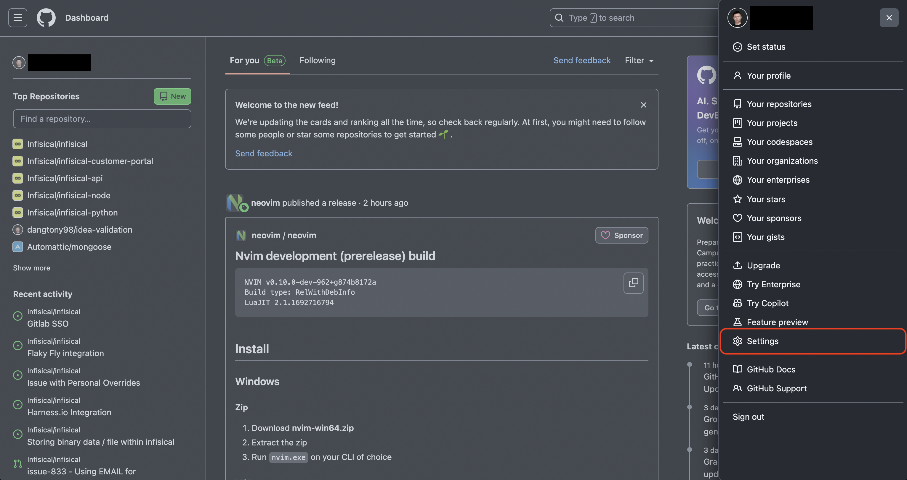
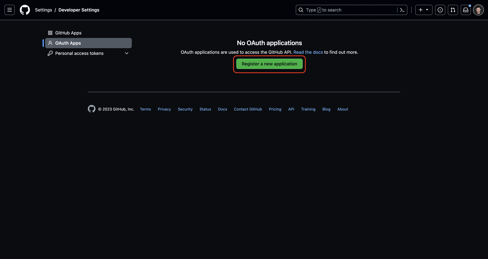
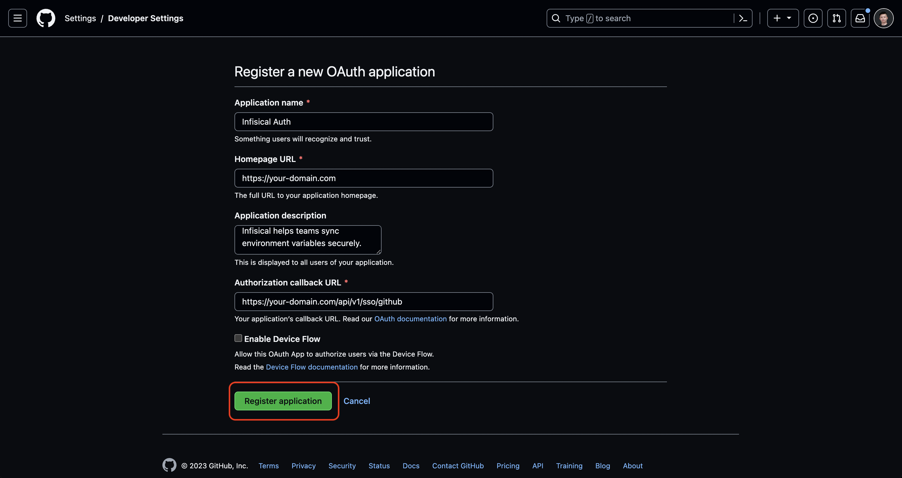
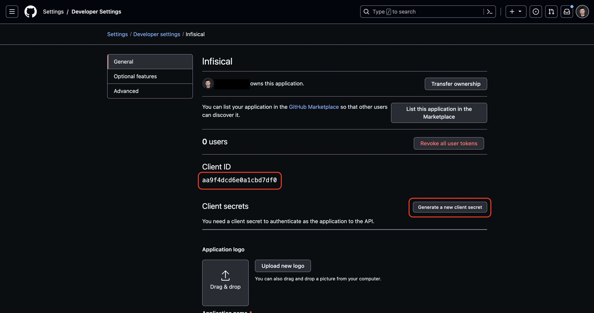

Using GitHub SSO on a self-hosted instance of Infisical requires configuring an OAuth2 application in GitHub and registering your instance with it.

<Steps>
  <Step title="Create an OAuth application in GitHub">
    Navigate to your user Settings > Developer settings > OAuth Apps to create a new GitHub OAuth application.

    
    
    

    Create the OAuth application. As part of the form, set the **Homepage URL** to your self-hosted domain `https://your-domain.com`
    and the **Authorization callback URL** to `https://your-domain.com/api/v1/sso/github`.

    

    <Note>
        If you have a GitHub organization, you can create an OAuth application under it
        in your organization Settings > Developer settings > OAuth Apps > New Org OAuth App.
    </Note>
  </Step>
  <Step title="Add your OAuth application credentials to Infisical">
    Obtain the **Client ID** and generate a new **Client Secret** for your GitHub OAuth application.

    

    Back in your Infisical instance, make sure to set the following environment variables:

    - `CLIENT_ID_GITHUB_LOGIN`: The **Client ID** of your GitHub OAuth application.
    - `CLIENT_SECRET_GITHUB_LOGIN`: The **Client Secret** of your GitHub OAuth application.
    - `AUTH_SECRET`: A secret key used for signing and verifying JWT. This can be a random 32-byte base64 string generated with `openssl rand -base64 32`.
    - `SITE_URL`: The URL of your self-hosted instance of Infisical - should be an absolute URL including the protocol (e.g. https://app.infisical.com)
      
    Once added, restart your Infisical instance and log in with GitHub.
  </Step>
</Steps>

## FAQ

<AccordionGroup>
  <Accordion title="Why is GitHub SSO not working?">
    It is likely that you have misconfigured your self-hosted instance of Infisical. You should:

    - Check that you have set the `CLIENT_ID_GITHUB_LOGIN`, `CLIENT_SECRET_GITHUB_LOGIN`, 
    `AUTH_SECRET`, and `SITE_URL` environment variables.
    - Check that the **Authorization callback URL** specified in GitHub matches the `SITE_URL` environment variable.
    For example, if the former is `https://app.infisical.com/api/v1/sso/github` then the latter should be `https://app.infisical.com`.
  </Accordion>
</AccordionGroup>