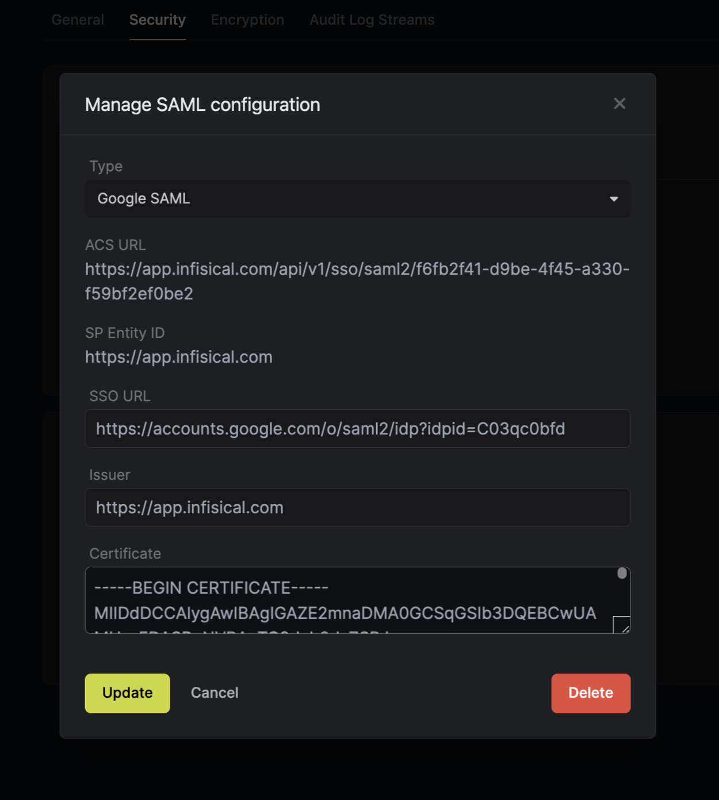

<Info>
  Google SAML SSO feature is a paid feature. If you're using Infisical Cloud,
  then it is available under the **Pro Tier**. If you're self-hosting Infisical,
  then you should contact sales@infisical.com to purchase an enterprise license
  to use it.
</Info>

<Steps>
   <Step title="Prepare the SAML SSO configuration in Infisical">
        In Infisical, head to the **Single Sign-On (SSO)** page and select the **General** tab. Click **Connect** for **SAML** under the Connect to an Identity Provider section. Select **Google**, then click **Connect** again.

        

        Next, note the **ACS URL** and **SP Entity ID** to use when configuring the Google SAML application.

        

   </Step>
   <Step title="Create a SAML application in Google">
        2.1. In your [Google Admin console](https://support.google.com/a/answer/182076), head to Menu > Apps > Web and mobile apps and
        create a **custom SAML app**.
        
        
        
        2.2. In the **App details** tab, give the application a unique name like Infisical.
        
        
        
        2.3. In the **Google Identity Provider details** tab, copy the **SSO URL**, **Entity ID** and **Certificate**.
        
        
        
        2.4. Back in Infisical, set **SSO URL** and **Certificate** to the corresponding items from step 2.3.
        
        
        
        2.5. Back in the Google Admin console, in the **Service provider details** tab, set the **ACS URL** and **Entity ID** to the corresponding items from step 1.

        Also, check the **Signed response** checkbox.

        

        2.6. In the **Attribute mapping** tab, configure the following map:

        - **First name** -> **firstName**
        - **Last name** -> **lastName**
        - **Primary email** -> **email**

        

        Click **Finish**.
    </Step>
    <Step title="Assign users in Google Workspace to the application">
        Back in your [Google Admin console](https://support.google.com/a/answer/182076), head to Menu > Apps > Web and mobile apps > your SAML app
        and press on **User access**.

        

        To assign everyone in your organization to the application, click **On for everyone** or **Off for everyone** and then click **Save**.

        You can also assign an organizational unit or set of users to an application; you can learn more about that [here](https://support.google.com/a/answer/6087519?hl=en#add_custom_saml&turn_on&verify_sso&&zippy=%2Cstep-add-the-custom-saml-app%2Cstep-turn-on-your-saml-app%2Cstep-verify-that-sso-is-working-with-your-custom-app).

        
    </Step>
    <Step title="Enable SAML SSO in Infisical">
        Enabling SAML SSO allows members in your organization to log into Infisical via Google Workspace.

        
    </Step>
    <Step title="Enforce SAML SSO in Infisical">
        Enforcing SAML SSO ensures that members in your organization can only access Infisical
        by logging into the organization via Google.

        To enforce SAML SSO, you're required to test out the SAML connection by successfully authenticating at least one Google user with Infisical;
        Once you've completed this requirement, you can toggle the **Enforce SAML SSO** button to enforce SAML SSO.

        <Warning>
            We recommend ensuring that your account is provisioned the application in Google
            prior to enforcing SAML SSO to prevent any unintended issues.
        </Warning>
        <Info>
            In case of a lockout, an organization admin can use the admin login portal in the `/login/admin` path e.g. https://app.infisical.com/login/admin.
        </Info>
    </Step>

</Steps>

<Tip>
    If you are only using one organization on your Infisical instance, you can configure a default organization in the [Server Admin Console](../admin-panel/server-admin#default-organization) to expedite SAML login.
</Tip>

<Note>
    If you're configuring SAML SSO on a self-hosted instance of Infisical, make
    sure to set the `AUTH_SECRET` and `SITE_URL` environment variable for it to
    work:
    

    - `AUTH_SECRET`: A secret key used for signing and verifying JWT. This
    can be a random 32-byte base64 string generated with `openssl rand -base64
    32`.
    

    - `SITE_URL`: The absolute URL of your self-hosted instance of Infisical including the protocol (e.g. https://app.infisical.com)
</Note>

References:

- Google's guide to [set up your own custom SAML app](https://support.google.com/a/answer/6087519?hl=en#add_custom_saml&turn_on&verify_sso&&zippy=%2Cstep-add-the-custom-saml-app%2Cstep-turn-on-your-saml-app%2Cstep-verify-that-sso-is-working-with-your-custom-app).
