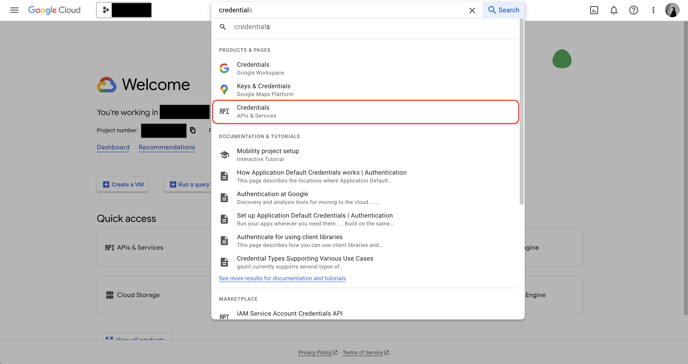
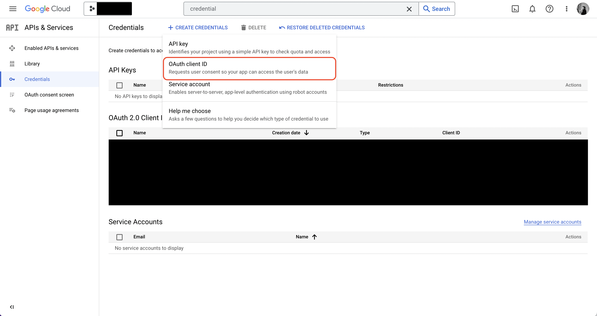
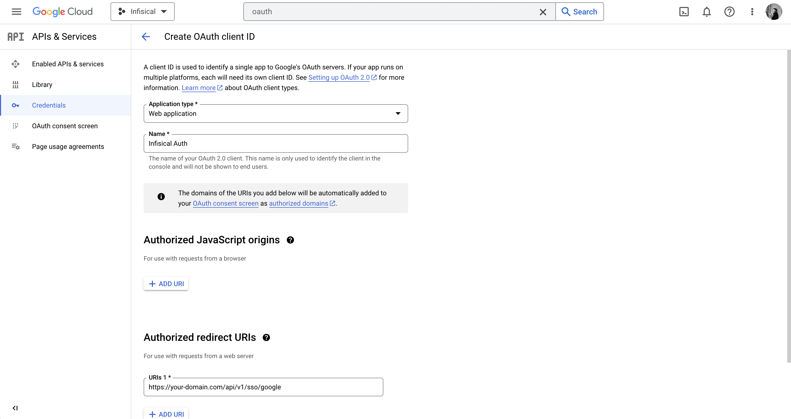
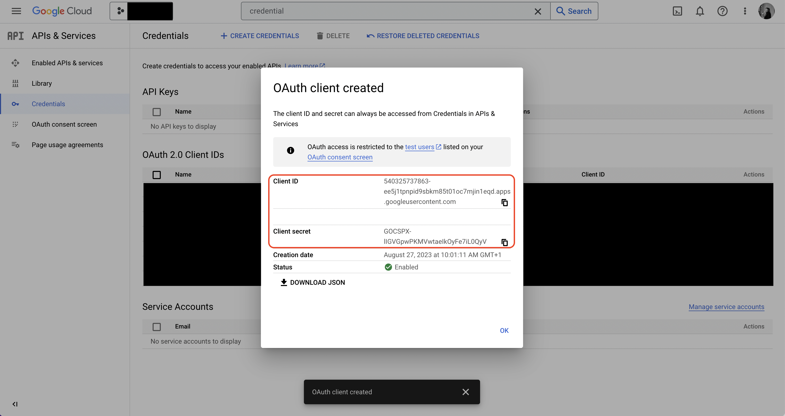

Using Google SSO on a self-hosted instance of Infisical requires configuring an OAuth2 application in GCP and registering your instance with it.

<Steps>
  <Step title="Create an OAuth2 application in GCP">
    Navigate to your project API & Services > Credentials to create a new OAuth2 application.
        
    
    

    Create the application. As part of the form, add to **Authorized redirect URIs**: `https://your-domain.com/api/v1/sso/google`.

    
  </Step>
  <Step title="Add your OAuth2 application credentials to Infisical">
    Obtain the **Client ID** and **Client Secret** for your GCP OAuth2 application.

    
      
    Back in your Infisical instance, make sure to set the following environment variables:

    - `CLIENT_ID_GOOGLE_LOGIN`: The **Client ID** of your GCP OAuth2 application.
    - `CLIENT_SECRET_GOOGLE_LOGIN`: The **Client Secret** of your GCP OAuth2 application.
    - `AUTH_SECRET`: A secret key used for signing and verifying JWT. This can be a random 32-byte base64 string generated with `openssl rand -base64 32`.
    - `SITE_URL`: The URL of your self-hosted instance of Infisical - should be an absolute URL including the protocol (e.g. https://app.infisical.com)
      
    Once added, restart your Infisical instance and log in with Google
  </Step>
</Steps>

## FAQ

<AccordionGroup>
  <Accordion title="Why is Google SSO not working?">
    It is likely that you have misconfigured your self-hosted instance of Infisical. You should:

    - Check that you have set the `CLIENT_ID_GOOGLE_LOGIN`, `CLIENT_SECRET_GOOGLE_LOGIN`, 
    `AUTH_SECRET`, and `SITE_URL` environment variables.
    - Check that the **Authorized redirect URI** specified in GCP matches the `SITE_URL` environment variable.
    For example, if the former is `https://app.infisical.com/api/v1/sso/google` then the latter should be `https://app.infisical.com`.
  </Accordion>
</AccordionGroup>