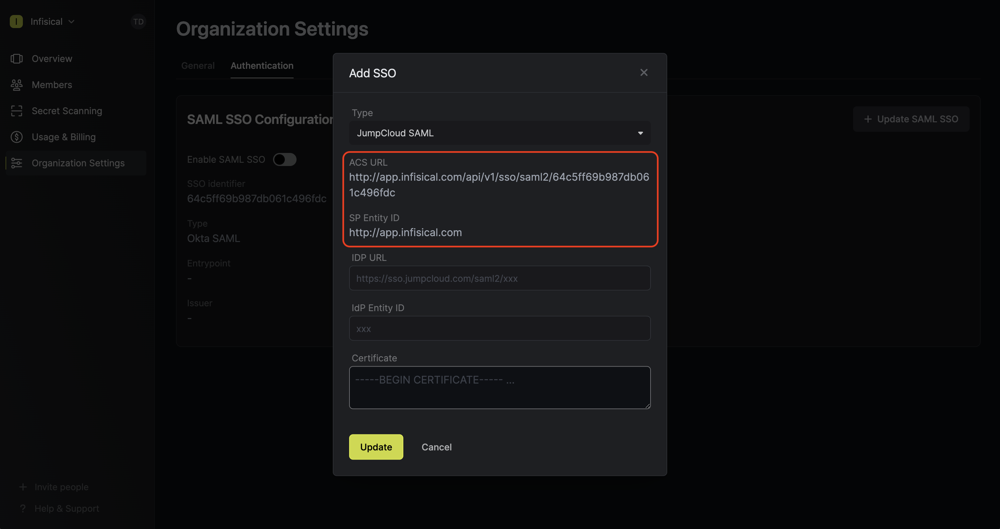
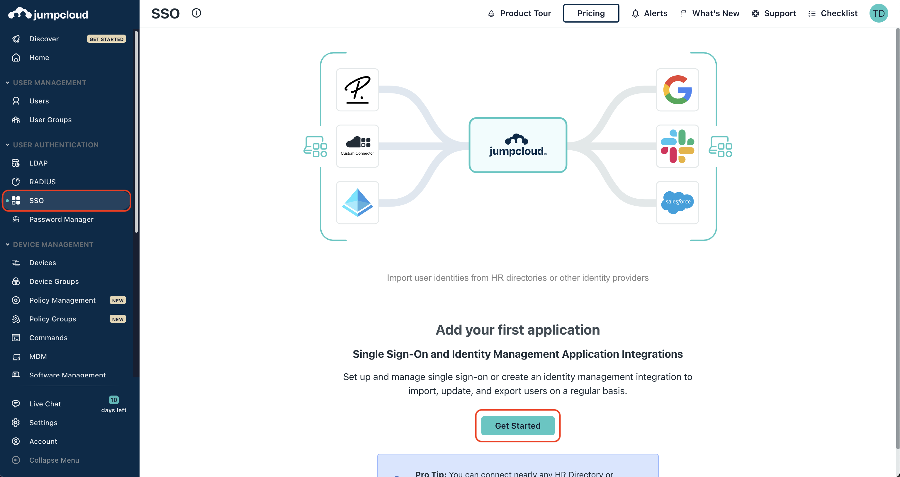
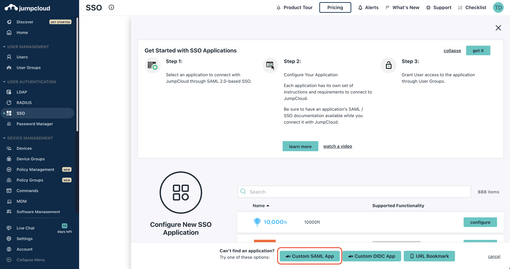
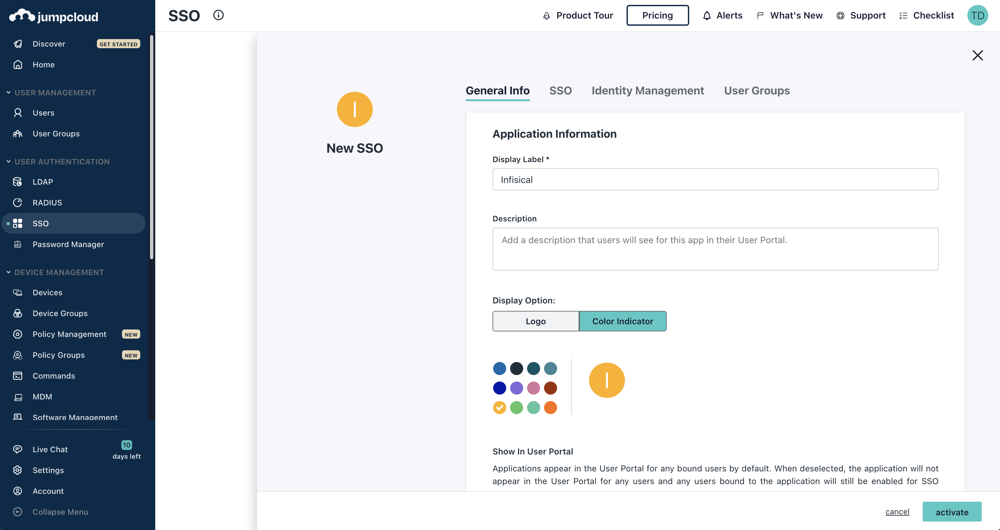
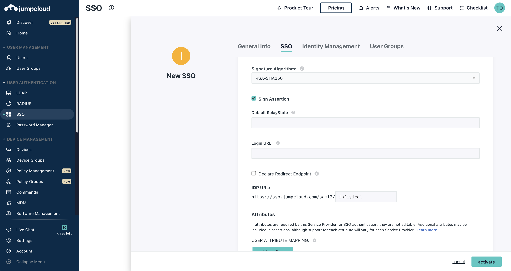
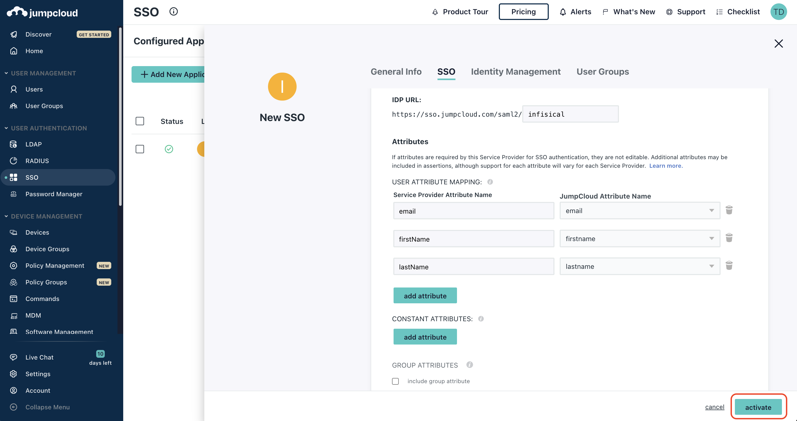
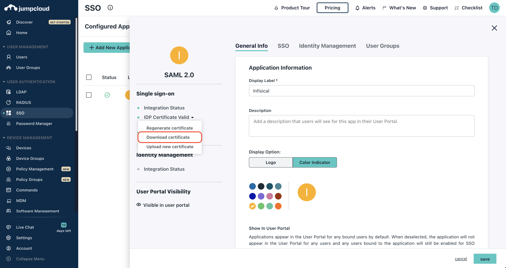
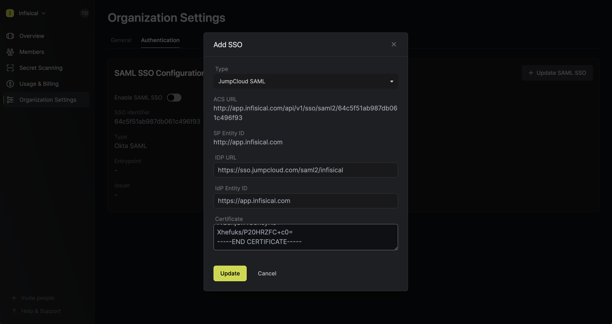
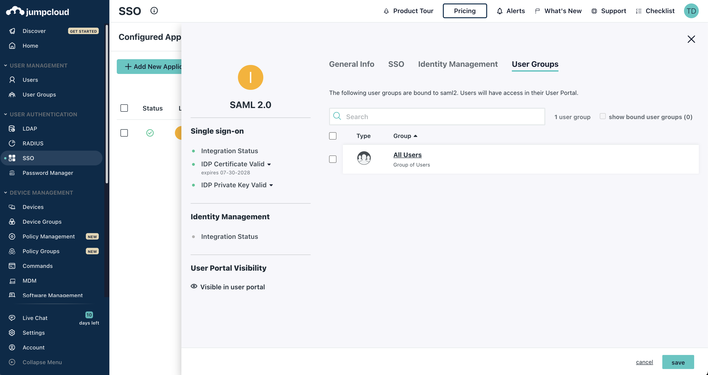
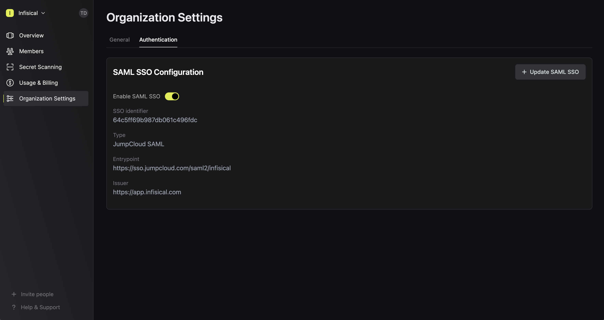

<Info>
   JumpCloud SAML SSO is a paid feature.
   
   If you're using Infisical Cloud, then it is available under the **Pro Tier**. If you're self-hosting Infisical,
   then you should contact sales@infisical.com to purchase an enterprise license to use it.
</Info>

<Steps>
   <Step title="Prepare the SAML SSO configuration in Infisical">
      In Infisical, head to Organization Settings > Security and click **Connect** for SAML under the Connect to an Identity Provider section. Select JumpCloud, then click **Connect** again.

      Next, copy the **ACS URL** and **SP Entity ID** to use when configuring the JumpCloud SAML application.

      
   </Step>
   <Step title="Create a SAML application in JumpCloud">
      2.1. In the JumpCloud Admin Portal, navigate to User Authentication > SSO and create an application. If this is your first application, select **Get Started**; if not, select **+Add New Application**

      

      2.2. Next, select **Custom SAML App** to open up the **New SSO** dialog.

      

      2.3. In the **General Info** tab, give the application a unique name like Infisical.

      

      2.4. In the **SSO** tab, set the **SP Entity ID** and **ACS URL** from step 1; set the **IdP Entity ID** to the same value as the **SP Entity ID**.

      

      2.5. On the same tab, check the **Sign Assertion** checkbox and fill the **IDP URL** to something unique.
         Copy the **IDP URL** to use when finishing configuring the JumpCloud SAML in Infisical.

      

      2.6. On the same tab, in the **Attributes** section, configure the following map:

      - `email -> email`
      - `firstName -> firstname`
      - `lastName -> lastname`

      

      Finally press activate to create the SAML application.

      2.7. Next, select the newly created SAML application and select **Download certificate** under the **IDP Certificate Valid** dropdown

      
   </Step>
   <Step title="Finish configuring SAML in Infisical">
      Back in Infisical, set the **IDP URL** from step 2.5 and the **IdP Entity ID** from step 2.4. Also, paste the certificate from the previous step.

      

      <Note>
         When pasting the certificate into Infisical, you'll want to retain `-----BEGIN
         CERTIFICATE-----` and `-----END CERTIFICATE-----` at the first and last line
         of the text area respectively.
      </Note>
   </Step>
   <Step title="Assign users in JumpCloud to the application">
      Back in JumpCloud, navigate to the **User Groups** tab and assign users to the newly created application.

      
   </Step>
   <Step title="Enable SAML SSO in Infisical">
      Enabling SAML SSO allows members in your organization to log into Infisical via JumpCloud.

      
   </Step>
   <Step title="Enforce SAML SSO in Infisical">
      Enforcing SAML SSO ensures that members in your organization can only access Infisical
      by logging into the organization via JumpCloud.

      To enforce SAML SSO, you're required to test out the SAML connection by successfully authenticating at least one JumpCloud user with Infisical;
      Once you've completed this requirement, you can toggle the **Enforce SAML SSO** button to enforce SAML SSO.
      
      <Warning>
         We recommend ensuring that your account is provisioned the application in JumpCloud
         prior to enforcing SAML SSO to prevent any unintended issues.
      </Warning>
      <Info>
         In case of a lockout, an organization admin can use the admin login portal in the `/login/admin` path e.g. https://app.infisical.com/login/admin.
      </Info>
   </Step>
</Steps>

<Tip>
    If you are only using one organization on your Infisical instance, you can configure a default organization in the [Server Admin Console](../admin-panel/server-admin#default-organization) to expedite SAML login.
</Tip>

<Note>
    If you're configuring SAML SSO on a self-hosted instance of Infisical, make
    sure to set the `AUTH_SECRET` and `SITE_URL` environment variable for it to
    work:
    

    - `AUTH_SECRET`: A secret key used for signing and verifying JWT. This
    can be a random 32-byte base64 string generated with `openssl rand -base64
    32`.
    

    - `SITE_URL`: The absolute URL of your self-hosted instance of Infisical including the protocol (e.g. https://app.infisical.com)
</Note>
