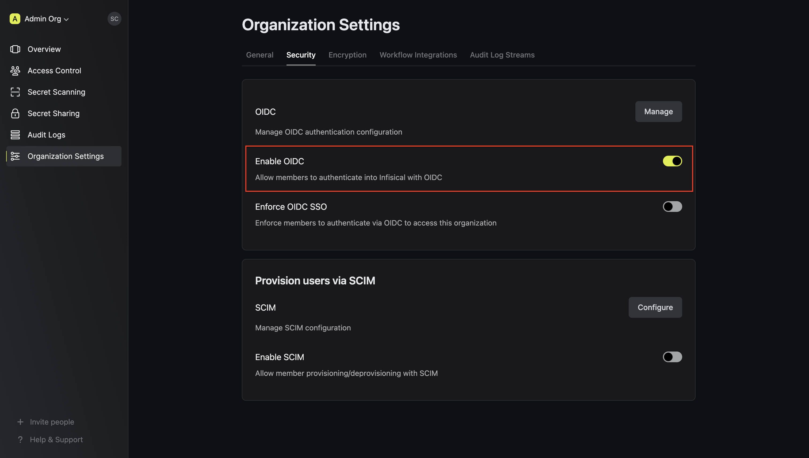

<Info>
  Okta OIDC SSO is a paid feature. If you're using Infisical Cloud, then it is
  available under the **Pro Tier**. If you're self-hosting Infisical, then you
  should contact sales@infisical.com to purchase a self-hosted license to use
  it.
</Info>

<Steps>
   <Step title="Prepare the OIDC SSO configuration in Infisical">
      In Infisical, head to the **Single Sign-On (SSO)** page and select the **General** tab. Click **Connect** for **OIDC** under the Connect to an Identity Provider section.

      

      Take note of the **Callback URL** displayed, as you will need it when configuring the Okta OIDC application. The callback URL follows the format: `https://app.infisical.com/api/v1/sso/oidc/callback`.

      <Note>
         If you're self-hosting Infisical, replace `https://app.infisical.com` with your own domain.
      </Note>
   </Step>
   <Step title="Create an OIDC application in Okta">
      In the Okta Admin Portal, select Applications > Applications from the navigation. On the Applications screen, click the **Create App Integration** button.

      
      <!-- SCREENSHOT PLACEHOLDER: Screenshot of Okta Admin Portal showing the Applications page with the "Create App Integration" button highlighted -->

      In the Create a New Application Integration dialog, select **OIDC - OpenID Connect** as the Sign-in method and **Web Application** as the Application type, then click **Next**.

      
      <!-- SCREENSHOT PLACEHOLDER: Screenshot of the "Create a new app integration" dialog with "OIDC - OpenID Connect" and "Web Application" options selected -->

      On the New Web App Integration screen, configure the following settings:
      - **App integration name**: Enter a name like `Infisical`
      - **Grant type**: Ensure **Authorization Code** is checked
      - **Sign-in redirect URIs**: Set to `https://app.infisical.com/api/v1/sso/oidc/callback`
      - **Sign-out redirect URIs**: (Optional) Set to `https://app.infisical.com`
      - **Controlled access**: Select the appropriate access level for your organization

      
      <!-- SCREENSHOT PLACEHOLDER: Screenshot of the "New Web App Integration" configuration page showing the app name, grant type, and redirect URI fields -->

      <Note>
         If you're self-hosting Infisical, replace `https://app.infisical.com` with your own domain in the redirect URIs.
      </Note>

      Click **Save** to create the application.

   </Step>
   <Step title="Retrieve Identity Provider (IdP) Information from Okta">
      After creating the application, you will be taken to the application's settings page. From the **General** tab, copy the **Client ID** and **Client Secret** values.

      
      <!-- SCREENSHOT PLACEHOLDER: Screenshot of the Okta application's General tab showing the Client ID and Client Secret fields -->

      Next, you need to obtain the Discovery Document URL (also known as the OpenID Configuration URL). This URL follows the format: `https://<your-okta-domain>/.well-known/openid-configuration`.

      To find your Okta domain, look at the URL in your browser's address bar while in the Okta Admin Portal. It typically looks like `https://your-company.okta.com` or `https://your-company.oktapreview.com`.

      
      <!-- SCREENSHOT PLACEHOLDER: Screenshot highlighting the Okta domain in the browser address bar -->

      Your Discovery Document URL will be: `https://<your-okta-domain>/.well-known/openid-configuration`

      For example: `https://your-company.okta.com/.well-known/openid-configuration`

   </Step>
   <Step title="Finish configuring OIDC in Infisical">
      Back in Infisical, on the OIDC configuration page, set the **Configuration Type** to **Discovery URL**.

      Fill in the following fields:
      - **Discovery Document URL**: Enter the OpenID Configuration URL from step 3 (e.g., `https://your-company.okta.com/.well-known/openid-configuration`)
      - **Client ID**: Enter the Client ID from step 3
      - **Client Secret**: Enter the Client Secret from step 3
      - **JWT Signature Algorithm**: Select **RS256** (this is the default algorithm used by Okta)

      
      <!-- SCREENSHOT PLACEHOLDER: Screenshot of the Infisical OIDC configuration form with the Discovery URL, Client ID, Client Secret, and JWT Signature Algorithm fields filled in -->

      <Info>
         Currently, the following JWT signature algorithms are supported: RS256, RS512, HS256, and EdDSA. Okta typically uses RS256.
      </Info>

      Optionally, you can define a whitelist of allowed email domains to restrict which users can authenticate.

      Once you've filled in all the required fields, click **Update** to save the configuration.

   </Step>
   <Step title="Assign users in Okta to the application">
      Back in Okta, navigate to the **Assignments** tab of your Infisical application and click **Assign**. You can assign access to the application on a user-by-user basis using the **Assign to People** option, or in bulk using the **Assign to Groups** option.

      
      <!-- SCREENSHOT PLACEHOLDER: Screenshot of the Okta application's Assignments tab showing the Assign dropdown with "Assign to People" and "Assign to Groups" options -->

      At this point, you have configured everything you need within the context of the Okta Admin Portal.

   </Step>
   <Step title="Enable OIDC SSO in Infisical">
      Enabling OIDC SSO allows members in your organization to log into Infisical via Okta.

      

   </Step>
   <Step title="Enforce OIDC SSO in Infisical">
      Enforcing OIDC SSO ensures that members in your organization can only access Infisical
      by logging into the organization via Okta.

      To enforce OIDC SSO, you're required to test out the OpenID connection by successfully authenticating at least one Okta user with Infisical.
      Once you've completed this requirement, you can toggle the **Enforce OIDC SSO** button to enforce OIDC SSO.

      <Warning>
         We recommend ensuring that your account is provisioned using the application in Okta
         prior to enforcing OIDC SSO to prevent any unintended issues.
      </Warning>
      <Info>
         In case of a lockout, an organization admin can use the [Admin Login Portal](https://infisical.com/docs/documentation/platform/sso/overview#admin-login-portal) in the `/login/admin` path e.g. https://app.infisical.com/login/admin.
      </Info>
   </Step>
</Steps>

<Tip>
    If you are only using one organization on your Infisical instance, you can configure a default organization in the [Server Admin Console](../admin-panel/server-admin#default-organization) to expedite OIDC login.
</Tip>

<Note>
  If you're configuring OIDC SSO on a self-hosted instance of Infisical, make
  sure to set the `AUTH_SECRET` and `SITE_URL` environment variable for it to
  work:
    

    - `AUTH_SECRET`: A secret key used for signing and verifying JWT. This
  can be a random 32-byte base64 string generated with `openssl rand -base64
  32`.
    

    - `SITE_URL`: The absolute URL of your self-hosted instance of Infisical including the protocol (e.g. https://app.infisical.com)
</Note>
