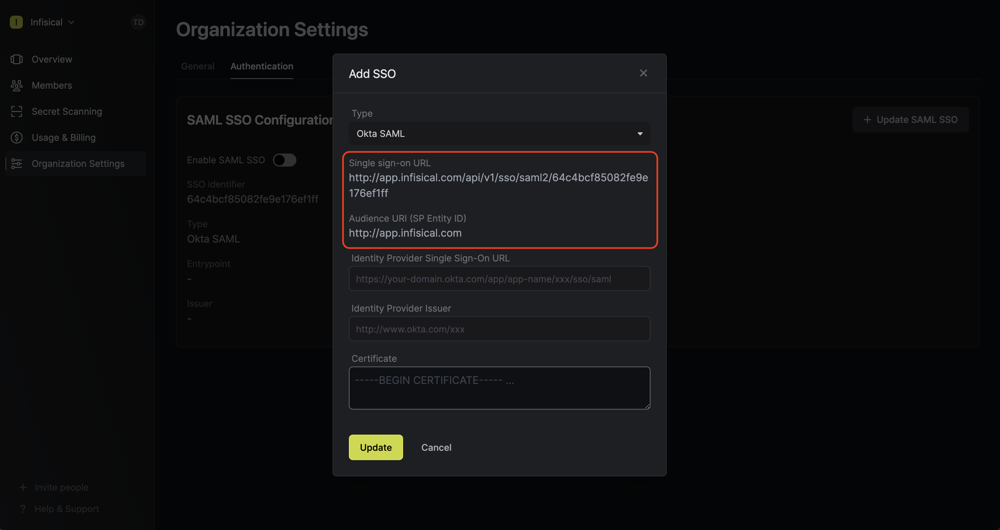
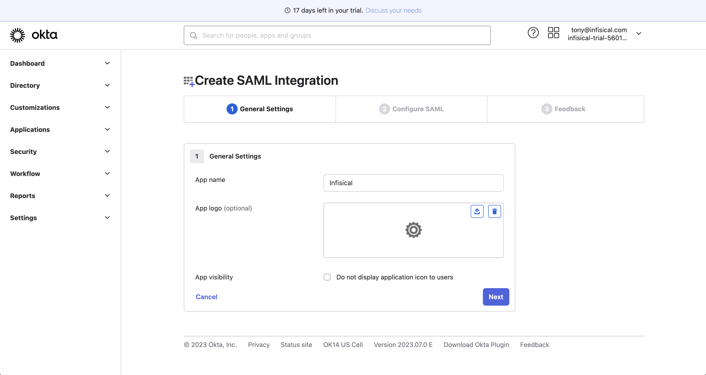
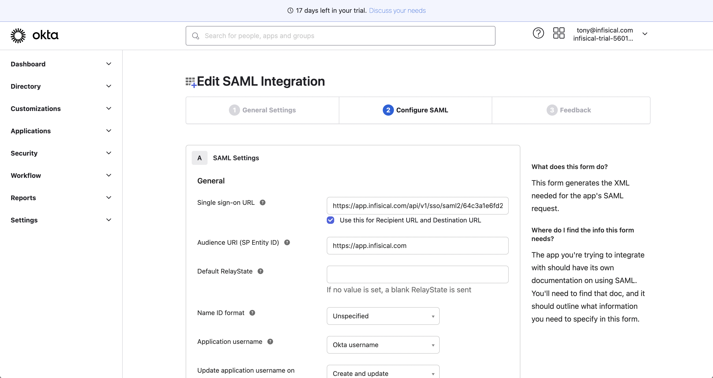
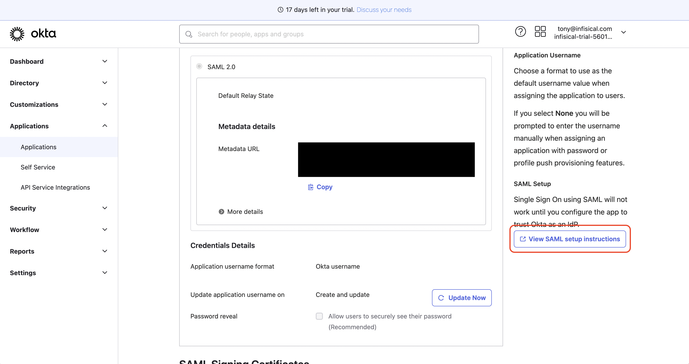
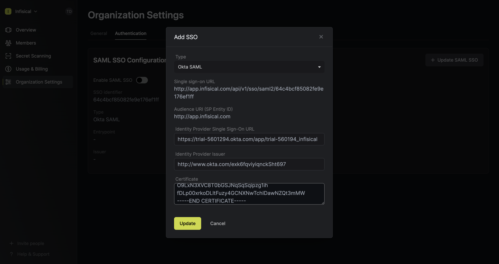

<Info>
  Okta SAML SSO is a paid feature. If you're using Infisical Cloud, then it is
  available under the **Pro Tier**. If you're self-hosting Infisical, then you
  should contact sales@infisical.com to purchase an enterprise license to use
  it.
</Info>

<Steps>
   <Step title="Prepare the SAML SSO configuration in Infisical">
      In Infisical, head to Organization Settings > Security and click **Connect** for SAML under the Connect to an Identity Provider section. Select Okta, then click **Connect** again.
      
      Next, copy the **Single sign-on URL** and **Audience URI (SP Entity ID)** to use when configuring the Okta SAML 2.0 application.
      
   </Step>
   <Step title="Create a SAML application in Okta">
      In the Okta Admin Portal, select Applications > Applications from the navigation. On the Applications screen, select the **Create App Integration**
      button.

      

      In the Create a New Application Integration dialog, select the **SAML 2.0** radio button:

      

      On the General Settings screen, give the application a unique name like Infisical and select **Next**.

      

      On the Configure SAML screen, set the **Single sign-on URL** and **Audience URI (SP Entity ID)** from step 1.

      

      <Note>
         If you're self-hosting Infisical, then you will want to replace
         `https://app.infisical.com` with your own domain.
      </Note>

      Also on the Configure SAML screen, configure the **Attribute Statements** to map:

      - `id -> user.id`,
      - `email -> user.email`,
      - `firstName -> user.firstName`
      - `lastName -> user.lastName`

      

      Once configured, select **Next** to proceed to the Feedback screen and select **Finish**.

   </Step>
   <Step title="Retrieve Identity Provider (IdP) Information from Okta">
      Once your application is created, select the **Sign On** tab for the app and select the **View Setup Instructions** button located on the right side of the screen:

      

      Copy the **Identity Provider Single Sign-On URL**, the **Identity Provider Issuer**, and the **X.509 Certificate** to use when finishing configuring Okta SAML in Infisical.

      

   </Step>
   <Step title="Finish configuring SAML in Infisical">
      Back in Infisical, set **Identity Provider Single Sign-On URL**, **Identity Provider Issuer**,
      and **Certificate** to **X.509 Certificate** from step 3. Once you've done that, press **Update** to complete the required configuration.

      

   </Step>
   <Step title="Assign users in Okta to the application">
      Back in Okta, navigate to the **Assignments** tab and select **Assign**. You can assign access to the application on a user-by-user basis using the Assign to People option, or in-bulk using the Assign to Groups option.

      

      At this point, you have configured everything you need within the context of the Okta Admin Portal.

   </Step>
   <Step title="Enable SAML SSO in Infisical">
      Enabling SAML SSO allows members in your organization to log into Infisical via Okta.

      

   </Step>
   <Step title="Enforce SAML SSO in Infisical">
      Enforcing SAML SSO ensures that members in your organization can only access Infisical
      by logging into the organization via Okta.

      To enforce SAML SSO, you're required to test out the SAML connection by successfully authenticating at least one Okta user with Infisical;
      Once you've completed this requirement, you can toggle the **Enforce SAML SSO** button to enforce SAML SSO.

      <Warning>
         We recommend ensuring that your account is provisioned the application in Okta
         prior to enforcing SAML SSO to prevent any unintended issues.
      </Warning>
      <Info>
         In case of a lockout, an organization admin can use the admin login portal in the `/login/admin` path e.g. https://app.infisical.com/login/admin.
      </Info>

   </Step>
</Steps>

<Tip>
    If you are only using one organization on your Infisical instance, you can configure a default organization in the [Server Admin Console](../admin-panel/server-admin#default-organization) to expedite SAML login.
</Tip>

<Note>
    If you're configuring SAML SSO on a self-hosted instance of Infisical, make
    sure to set the `AUTH_SECRET` and `SITE_URL` environment variable for it to
    work:
    

    - `AUTH_SECRET`: A secret key used for signing and verifying JWT. This
    can be a random 32-byte base64 string generated with `openssl rand -base64
    32`.
    

    - `SITE_URL`: The absolute URL of your self-hosted instance of Infisical including the protocol (e.g. https://app.infisical.com)
</Note>
