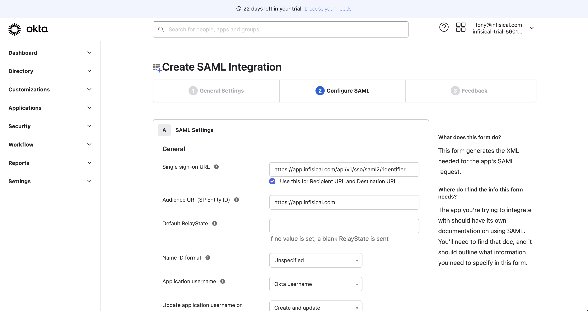

1. In the Okta Admin Portal, select Applications > Applications from the
   navigation. On the Applications screen, select the Create App Integration
   button.

2. In the Create a New Application Integration dialog, select the SAML 2.0 radio button:

3. On the General Settings screen, give the application a unique, Infisical-specific name and select Next.

4. On the Configure SAML screen, configure the following fields:

- Single sign on URL: `https://app.infisical.com/api/v1/sso/saml2/:identifier`; we'll update the `:identifier` part later in step 6.
- Audience URI (SP Entity ID): `https://app.infisical.com`

<Note>
  If you're self-hosting Infisical, then you will want to replace
  `https://app.infisical.com` with your own domain.
</Note>

4. Also on the Configure SAML screen, configure the Attribute Statements to map:

- `id -> user.id`,
- `email -> user.email`,
- `firstName -> user.firstName`
- `lastName -> user.lastName`

Once configured, select the Next button to proceed to the Feedback screen and select Finish.

5. Get IdP values

Once your application is created, select the Sign On tab for the app and select the View Setup Instructions button located on the right side of the screen:

Copy the Identity Provider Single Sign-On URL, the Identity Provider Issuer, and the X.509 Certificate to be pasted into your Infisical SAML SSO configuration details with the following map:

- `Audience -> Audience URI (SP Entity ID) from Okta`
- `Entrypoint -> Identity Provider Single Sign-On URL from Okta`
- `Issuer -> Identity Provider Issuer from Okta`
- `Certificate -> X.509 Certificate from Okta`

6. Create the SSO configuration and copy your SSO identifier in Infisical; update `:identifier` from step 4 earlier to be this value.

7. Assignments

Finally, navigate to the Assignments tab and select the Assign button:

You can assign access to the application on a user-by-user basis using the Assign to People option, or in-bulk using the Assign to Groups option.

At this point, you have configured everything you need within the context of the Okta Admin Portal.

8. Return to Infisical and enable SAML SSO.

Enabling SAML SSO enforces all members in your organization to only be able to log into Infisical via Okta.
