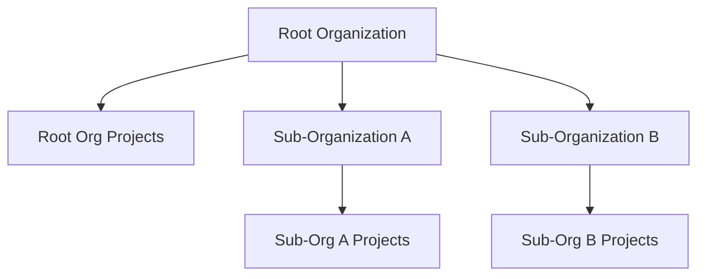

<Info>
  Sub-organizations is a paid feature. If you're using Infisical Cloud, then it
  is available under the **Enterprise Tier**. If you're self-hosting Infisical,
  then you should contact team@infisical.com to purchase an enterprise license
  to use it.
</Info>

Sub-organizations allow you to create child organizations within a root organization. Each sub-organization works like a regular organization, with its own projects, members, and settings, while sharing authentication and billing with the root organization.

Sub-organizations are ideal when you need to:

- **Segment by business unit**: Give departments (Engineering, Sales, Marketing) independent project spaces
- **Delegate administration**: Allow team leads to manage their own organization without root-level access
- **Maintain clear boundaries**: Keep projects and resources isolated between teams while sharing a common user directory

## Key Concepts

- **Sub-organizations work like regular organizations.** Visually and functionally, there's little difference.
- **One level of nesting.** Root organization to sub-organizations. Sub-organizations cannot create their own sub-organizations.
- **Authentication at root level only.** SSO, SCIM, and identity configuration happens at the root organization.
- **Resources flow downward.** Users, groups, and machine identities from the root organization can be added to sub-organizations, but must be explicitly added before use.
- **Resources stay where they're created.** Resources in a sub-organization are not visible to the root organization or other sub-organizations.

## Resource Inheritance

The following resources from a root organization can be added to sub-organizations:

- **Users**
- **Groups**
- **Machine Identities**

App connections, gateways, and relays are specific to each organization. Each organization (root or sub) manages their own.

## Project Visibility

Projects are scoped to the organization where they are created. This ensures clear boundaries between teams and means users only see projects relevant to their scope of work.

- **In a root organization**: You see only root organization projects
- **In a sub-organization**: You see only that sub-organization's projects

## Working with Users

Users exist at the root organization level where authentication is configured. Sub-organizations can add users from the root organization to grant them access to sub-organization projects.

**In a root organization:**
- Projects can invite any user from the organization
- Projects can provision new users directly via project invite (with appropriate permissions)

**In a sub-organization:**
- Projects can only see users who have been added to the sub-organization
- Users must be added to the sub-organization before they can join projects

## Working with Machine Identities

Machine identities represent services, CI/CD pipelines, or automated processes. They can be created at the root organization level and shared with sub-organizations, or created directly within a sub-organization.

**In a root organization:**
- Projects can link machine identities directly

**In a sub-organization:**
- Root-level machine identities must be added to the sub-organization first
- Sub-organizations can also create their own machine identities

## Working with Groups

Groups let you manage access for multiple users at once. Root organization groups can be shared with sub-organizations, and sub-organizations can also create their own groups.

- Root organization groups can be added to sub-organizations
- Once added, the group is available to all projects in that sub-organization
- Sub-organizations can create their own groups with users or nested groups

## Creating a Sub-Organization

1. Click on the **Organization** tab in the header
2. Click **+ New Sub-Organization**
3. Enter a name (this becomes the slug used in API calls)
4. You are automatically assigned as Admin of the new sub-organization

## Adding Resources to a Sub-Organization

To use root organization resources in a sub-organization:

1. Switch to the sub-organization
2. Go to **Access Control** > **Users**, **Groups**, or **Machine Identities**
3. Click **Add from Organization** and select the resources to include

Once added, these resources can be assigned to projects within the sub-organization.
