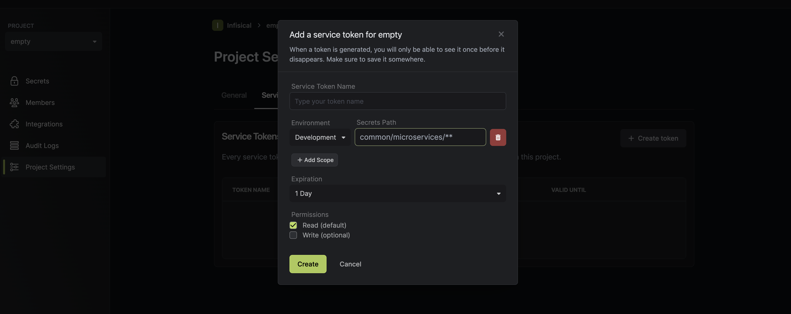

Service tokens play an integral role in allowing programmatic interactions with an Infisical project, functioning as digital token that open access to specific project resources such as secrets.

When you generate a service token, you can define its access level, not only by specifying the paths and environments it can interact with, but also by determining the level of mutation it can perform, such as read-only, write, or both. 

This level of control not only ensures maximum flexibility but also significantly enhances security as it allows you to define fine grained access to project resources. 

## Creating a service token

To generate the the token, head over to your project settings as shown below. On creating a service token you can scope it to a path to limit the access.

### Service token permissions

Service tokens can be scoped to multiple environments and paths. To add a new permission, choose the environment you want to give access to and then choose the path you'd like to give access to within that environment.

Permissions for paths are powered by [Glob pattern](https://www.malikbrowne.com/blog/a-beginners-guide-glob-patterns/). This means you can create advanced folder permissions with a simple Glob patterns.

**Examples of common Glob pattens**

<Accordion title="Examples of common Glob pattens">
  1. `/**`: This pattern matches all folders at any depth in the directory structure. For example, it would match folders like `/folder1/`, `/folder1/subfolder/`, and so on.

  2. `/*`: This pattern matches all immediate subfolders in the current directory. It does not match any folders at a deeper level. For example, it would match folders like `/folder1/`, `/folder2/`, but not `/folder1/subfolder/`.

  3. `/*/*`: This pattern matches all subfolders at a depth of two levels in the current directory. It does not match any folders at a shallower or deeper level. For example, it would match folders like `/folder1/subfolder/`, `/folder2/subfolder/`, but not `/folder1/` or `/folder1/subfolder/subsubfolder/`.

  4. `/folder1/*`: This pattern matches all immediate subfolders within the `/folder1/` directory. It does not match any folders outside of `/folder1/`, nor does it match any subfolders within those immediate subfolders. For example, it would match folders like `/folder1/subfolder1/`, `/folder1/subfolder2/`, but not `/folder2/subfolder/`.
</Accordion>
