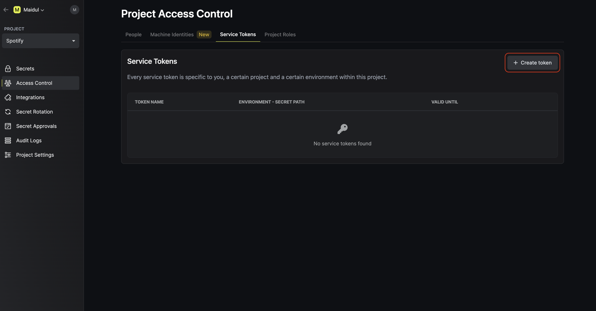
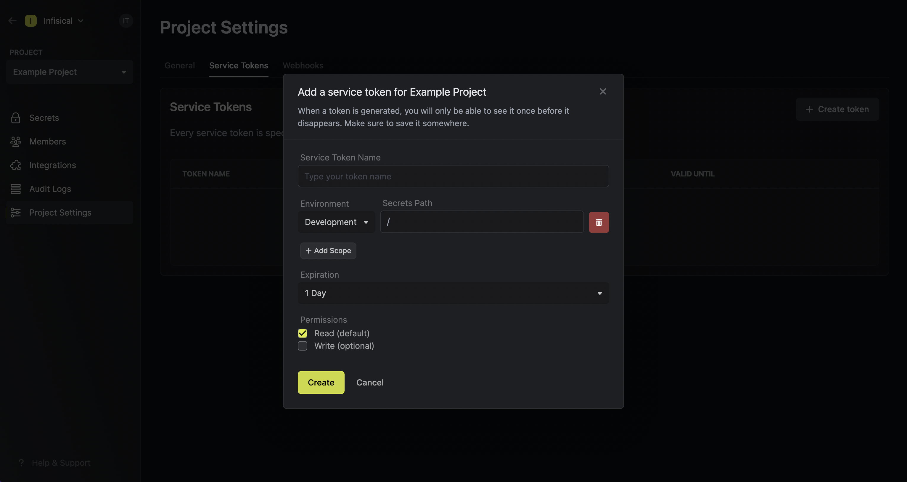

Service tokens are authentication credentials that services can use to access designated endpoints in the Infisical API to manage project resources like secrets.
Each service token can be provisioned scoped access to select environment(s) and path(s) within them.

## Service Tokens

You can manage service tokens in Access Control > Service Tokens (tab).

### Service Token (Current)

Service Token (ST) is the current widely-used authentication method for managing secrets.

Here's a few pointers to get you acquainted with it:

- When you create a ST, you get a token prefixed with `st`. The part after the last `.` delimiter is a symmetric key; everything
  before it is an access token. When authenticating with the Infisical API, it is important to send in only the access token portion
  of the token.
- ST supports expiration; it gets deleted automatically upon expiration.
- ST supports provisioning `read` and/or `write` permissions broadly applied to all accessible environment(s) and path(s).
- ST is not editable.

## Creating a service token

To create a service token, head to Access Control > Service Tokens as shown below and press **Create token**.

Now input any token configuration details such as which environment(s) and path(s) you'd like to provision
the token access to. Here's some guidance for each field:

- Name: A friendly name for the token.
- Scopes: The environment(s) and path(s) the token should have access to.
- Permissions: You can indicate whether or not the token should have `read/write` access to the paths.
  Also, note that Infisical supports [glob patterns](https://www.malikbrowne.com/blog/a-beginners-guide-glob-patterns/) when defining access scopes to path(s).
- Expiration: The time when this token should be rendered inactive.

In the above screenshot, you can see that we are creating a token token with `read` access to all subfolders at any depth
of the `/common` path within the development environment of the project; the token expires in 6 months and can be used from any IP address.

<Note>
  For a deeper understanding of service tokens, it is recommended to read [this
  guide](https://infisical.com/docs/internals/service-tokens).
</Note>

**FAQ**

<AccordionGroup>
  <Accordion title="Why is the Infisical API rejecting my service token?">
      There are a few reasons for why this might happen:

    - The service token has expired.
    - The service token is insufficiently permissioned to interact with the secrets in the given environment and path.
    - You are attempting to access a `/raw` secrets endpoint that requires your project to disable E2EE.
    - (If using ST V3) The service token has not been activated yet.
    - (If using ST V3) The service token is being used from an untrusted IP.

  </Accordion>
  <Accordion title="Can you provide examples for using glob patterns?">
    1. `/**`: This pattern matches all folders at any depth in the directory structure. For example, it would match folders like `/folder1/`, `/folder1/subfolder/`, and so on.

    2. `/*`: This pattern matches all immediate subfolders in the current directory. It does not match any folders at a deeper level. For example, it would match folders like `/folder1/`, `/folder2/`, but not `/folder1/subfolder/`.

    3. `/*/*`: This pattern matches all subfolders at a depth of two levels in the current directory. It does not match any folders at a shallower or deeper level. For example, it would match folders like `/folder1/subfolder/`, `/folder2/subfolder/`, but not `/folder1/` or `/folder1/subfolder/subsubfolder/`.

    4. `/folder1/*`: This pattern matches all immediate subfolders within the `/folder1/` directory. It does not match any folders outside of `/folder1/`, nor does it match any subfolders within those immediate subfolders. For example, it would match folders like `/folder1/subfolder1/`, `/folder1/subfolder2/`, but not `/folder2/subfolder/`.

  </Accordion>
</AccordionGroup>
