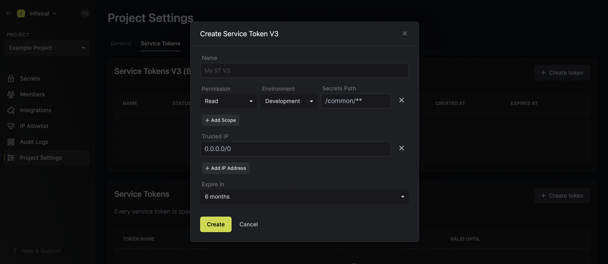

Service tokens are authentication credentials that services can use to access designated endpoints in the Infisical API to manage project resources like secrets.
Each service token can be provisioned scoped access to select environment(s) and path(s) within them.

## Service Tokens

Infisical currently offers Service Token V3 and Service Token; you can manage both types of tokens in Project Settings > Service Tokens.

### Service Token V3 (Beta)

Service Token V3 (ST V3) is a new and improved authentication method that is in beta. 

<Note>
  Currently, the Service Token V3 authentication method can only be used with the latest [Node SDK](https://github.com/Infisical/infisical-node) and [Python SDK](https://github.com/Infisical/infisical-python).
  You can also make an API call with it to create, read, update, or delete secrets.

  We will be releasing compatibility for it with the CLI and K8s operator in the coming month.
  
  That said, we recommend using ST V3 whenever possible.
</Note>

Here's a few pointers to get you acquainted with it:

- When you create a ST V3, you export a `JSON` file containing 3 components: `publicKey`, `privateKey`, and `serviceToken` where
`serviceToken` is a JWT token prefixed with `stv3`. The token provides access to the Infisical API and the public-private key
pairs are to support cryptographic operations for the client whenever E2EE is needed.
- ST V3 supports IP allowlisting; this means you can restrict the usage of a ST V3 to a specific IP or CIDR range.
- ST V3 supports provisioning granular `read` or `readWrite` access down to each path.
- ST V3 supports toggling on/off active states, so you can render a ST V3 inactive without deleting it.
- ST V3 supports expiration, so, if specified, a token will automatically turn inactive after a period of time.
- ST V3 tracks most recent usage; it also keeps track of each token's usage count.
- ST V3 is editable.

### Service Token (Current)

Service Token (ST) is the current widely-used authentication method.

<Note>
  We recently released ST V3, a revised version of this Service Token, which you can read about above.

  Whenever possible, you should use ST V3 because we will be deprecating ST sometime Q4 2023.
</Note>

Here's a few pointers to get you acquainted with it:

- When you create a ST, you get a token prefixed with `st`. The part after the last `.` delimiter is a symmetric key; everything
before it is an access token. When authenticating with the Infisical API, it is important to send in only the access token portion
of the token.
- ST supports expiration; it gets deleted automatically upon expiration.
- ST supports provisioning `read` and/or `write` permissions broadly applied to all accessible environment(s) and path(s).
- ST is not editable.

## Creating a service token

To create a service token, head to Project Settings > Service Tokens as shown below and press **Create token**.

Now input any token configuration details such as which environment(s) and path(s) you'd like to provision
the token access to. Here's some guidance for each field:

- Name: A friendly name for the token.
- Scopes: The environment(s) and path(s) the token should have access to.
If using ST V3, you can also indicate whether or not the token should have `read` or `readWrite` access to each path.
Also, note that Infisical supports [glob patterns](https://www.malikbrowne.com/blog/a-beginners-guide-glob-patterns/) when defining access scopes to path(s).
- Trusted IPs: The IPs or CIDR ranges that the token can be used from. By default, each token is given the `0.0.0.0/0` entry representing all possible IPv4 addresses.
- Expiration: The time when this token should be rendered inactive.

<Warning>
  Restricting token usage to specific trusted IPs is a paid feature.

  If you’re using Infisical Cloud, then it is available under the Pro Tier. If you’re self-hosting Infisical, then you should contact team@infisical.com to purchase an enterprise license to use it.
</Warning>

In the above screenshot, you can see that we are creating a token token with `read` access to all subfolders at any depth
of the `/common` path within the development environment of the project; the token expires in 6 months and can be used from any IP address. 

**FAQ**

<AccordionGroup>
<Accordion title="Why is the Infisical API rejecting my service token?">
  There are a few reasons for why this might happen:
  
  - The service token has expired.
  - The service token is insufficently permissioned to interact with the secrets in the given environment and path.
  - You are attempting to access a `/raw` secrets endpoint that requires your project to disable E2EE.
  - (If using ST V3) The service token has not been activated yet.
  - (If using ST V3) The service token is being used from an untrusted IP.
</Accordion>
<Accordion title="Can you provide examples for using glob patterns?">
  1. `/**`: This pattern matches all folders at any depth in the directory structure. For example, it would match folders like `/folder1/`, `/folder1/subfolder/`, and so on.

  2. `/*`: This pattern matches all immediate subfolders in the current directory. It does not match any folders at a deeper level. For example, it would match folders like `/folder1/`, `/folder2/`, but not `/folder1/subfolder/`.

  3. `/*/*`: This pattern matches all subfolders at a depth of two levels in the current directory. It does not match any folders at a shallower or deeper level. For example, it would match folders like `/folder1/subfolder/`, `/folder2/subfolder/`, but not `/folder1/` or `/folder1/subfolder/subsubfolder/`.

  4. `/folder1/*`: This pattern matches all immediate subfolders within the `/folder1/` directory. It does not match any folders outside of `/folder1/`, nor does it match any subfolders within those immediate subfolders. For example, it would match folders like `/folder1/subfolder1/`, `/folder1/subfolder2/`, but not `/folder2/subfolder/`.
</Accordion>
</AccordionGroup>