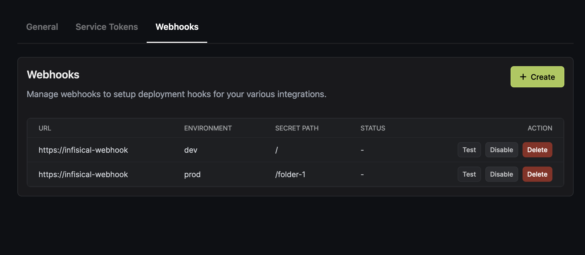

Webhooks can be used to trigger changes to your integrations when secrets are modified, providing smooth integration with other third-party applications.



To create a webhook for a particular project, go to `Project Settings > Webhooks`.

When creating a webhook, you can specify an environment and folder path (using glob patterns) to trigger only specific integrations. 

## Secret Key Verification

A secret key is a way for users to verify that a webhook request was sent by Infisical and is intended for the correct integration.

When you provide a secret key, Infisical will sign the payload of the webhook request using the key and attach a header called `x-infisical-signature` to the request with a payload.

The header will be in the format `t=<timestamp>;<signature>`. You can then generate the signature yourself by generating a SHA256 hash of the payload with the secret key that you know.

If the signature in the header matches the signature that you generated, then you can be sure that the request was sent by Infisical and is intended for your integration. The timestamp in the header ensures that the request is not replayed.

### Webhook Payload Format

```json
{
  "event": "secret.modified",
  "project": {
    "workspaceId":"the workspace id",
    "environment": "project environment",
    "secretPath": "project folder path"
  },
  "timestamp": ""
}
```
