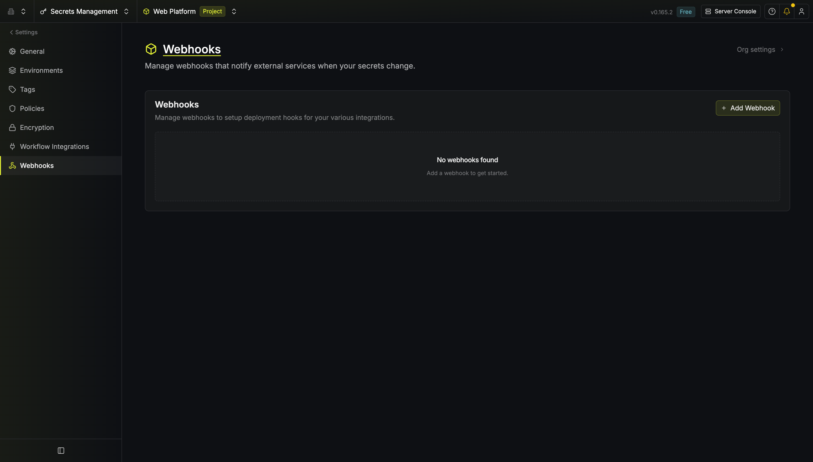
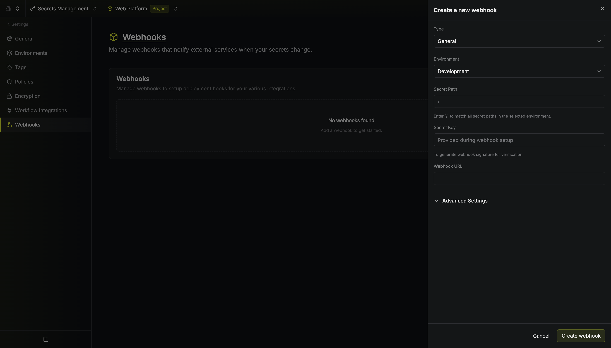

Webhooks can be used to trigger changes to your integrations when secrets are modified, providing smooth integration with other third-party applications.



To create a webhook for a particular project, go to `Project Settings > Webhooks`.

Infisical supports three webhook types: General, Slack, and Microsoft Teams. Use General for any HTTPS endpoint; use Slack with [Incoming Webhook](https://api.slack.com/messaging/webhooks); use Microsoft Teams with an [incoming webhook (with Workflows)](https://support.microsoft.com/en-us/office/create-incoming-webhooks-with-workflows-for-microsoft-teams-8ae491c7-0394-4861-ba59-055e33f75498). When you create a webhook, you can limit it to an environment and optional folder path so it runs only when secrets change in that scope.



## Secret Key Verification

A secret key is a way for users to verify that a webhook request was sent by Infisical and is intended for the correct integration.

When you provide a secret key, Infisical will sign the payload of the webhook request using the key and attach a header called `x-infisical-signature` to the request with a payload.

The header will be in the format `t=<timestamp>;<signature>`. You can then generate the signature yourself by generating a SHA256 hash of the payload with the secret key that you know.

If the signature in the header matches the signature that you generated, then you can be sure that the request was sent by Infisical and is intended for your integration. The timestamp in the header ensures that the request is not replayed.

## Event Filtering

By default, webhooks trigger on every supported event. You can narrow this down under **Advanced Settings** when creating a webhook, and only receive the events you care about. You can also change the events on existing webhooks by clicking **Edit** and selecting the events you want.

Supported events:

- **Secret Modified** (`secrets.modified`): triggered when secrets in the configured scope are created, updated, or deleted.
- **Secret Rotation Failed** (`secrets.rotation-failed`): triggered when a secret rotation in the configured scope fails.
- **Honey Token Triggered** (`honey-token.triggered`): triggered when a honey token is activated.
- **Change Request Modified** (`secrets.change-request.modified`): triggered when a secret change request in the configured scope is created, reviewed, closed, reopened, or merged.
- **Access Request Modified** (`secrets.access-request.modified`): triggered when an access request is created, edited, reviewed, or revoked. This event matches the environment and the secret path, and the path test is deliberately conservative: Infisical delivers the event unless the requested path and the watched path provably cannot overlap. An access request's path is a pattern rather than a single folder, which is why the matching rule differs from the other events.

### Webhook Payload Format

Every payload has a top-level `timestamp` field, in epoch milliseconds, set to when Infisical sent the webhook.

```json
{
	"event": "secrets.modified",
	"project": {
		"workspaceId": "the workspace id",
		"environment": "project environment (slug)",
		"environmentName": "project environment (name)",
		"secretPath": "project folder path",
		"changedBy": "Actor that changed the secret",
		"changedByActorType": "The actor type that triggered the change. Possible values: `service`, `user`, `identity`."
	},
	"timestamp": 1787222520000
}
```


```json
{
	"event": "secrets.rotation-failed",
	"project": {
		"projectId": "the project id",
		"projectName": "the project name",
		"environment": "project environment",
		"environmentName": "project environment (name)",
		"secretPath": "project folder path",
		"rotationName": "name of the failed rotation",
		"errorMessage": "error details",
		"triggeredManually": false
	},
	"timestamp": 1787222520000
}
```

```json
{
	"event": "honey-token.triggered",
	"project": {
		"projectId": "the project id",
		"projectName": "the project name",
		"environment": "project environment (slug)",
		"environmentName": "project environment (name)",
		"secretPath": "project folder path"
	},
	"honeyToken": {
		"name": "name of the honey token",
		"eventName": "the AWS event that triggered the honey token",
		"sourceIp": "IP address of the caller",
		"awsRegion": "AWS region where the event occurred"
	},
	"timestamp": 1787222520000
}
```

The change request and access request payloads below carry no secret values, no diff of the proposed change, and no free text a user typed, such as a commit message, a bypass reason, or a review note.

```json
{
	"event": "secrets.change-request.modified",
	"action": "merged",
	"project": {
		"id": "b4f1e2a0-6c3d-4f2b-9a1e-7d8c6b5a4f3e",
		"name": "Payments Platform"
	},
	"request": {
		"id": "2a7c9e10-4b3d-4f5a-8c6b-1d2e3f4a5b6c",
		"slug": "k3Bq7ZxP1r",
		"url": "https://app.infisical.com/organizations/<org-id>/projects/secret-management/<project-id>/approval?requestId=<request-id>",
		"target": {
			"environment": {
				"name": "Production",
				"slug": "prod"
			},
			"secretPath": "/backend"
		},
		"status": "close",
		"hasMerged": true,
		"isBypassed": false,
		"policy": {
			"id": "b1c2d3e4-f5a6-4b7c-8d9e-0f1a2b3c4d5e",
			"name": "Production secrets",
			"enforcementLevel": "hard"
		},
		"requestedBy": {
			"type": "user",
			"id": "d4e5f6a7-b8c9-4d0e-9f1a-2b3c4d5e6f7a",
			"name": "Priya Natarajan",
			"email": "priya@example.com"
		},
		"createdAt": "2026-08-20T10:00:00.000Z",
		"updatedAt": "2026-08-20T10:42:00.000Z"
	},
	"timestamp": 1787222520000
}
```

`requestedBy` is `null` when the person who created the change request has since deleted their account.

Reviewing a change request writes only the review, never the request row, so two `reviewed` deliveries for the same request carry an identical `request.updatedAt`. Order and deduplicate deliveries by the top-level `timestamp` rather than by `request.updatedAt`.

```json
{
	"event": "secrets.access-request.modified",
	"action": "reviewed",
	"project": {
		"id": "b4f1e2a0-6c3d-4f2b-9a1e-7d8c6b5a4f3e",
		"name": "Payments Platform"
	},
	"request": {
		"id": "f3e2d1c0-9b8a-4c7d-8e6f-5a4b3c2d1e0f",
		"url": "https://app.infisical.com/organizations/<org-id>/projects/secret-management/<project-id>/approval?selectedTab=resource-requests&requestId=<request-id>",
		"status": "approved",
		"isBypassed": false,
		"policy": {
			"id": "a9b8c7d6-e5f4-4a3b-8c2d-1e0f9a8b7c6d",
			"name": "Production access",
			"enforcementLevel": "soft",
			"hasSequencedApprovers": true
		},
		"requestedAccess": {
			"target": {
				"environment": {
					"name": "Production",
					"slug": "prod"
				},
				"secretPath": "/services/*"
			},
			"isTemporary": true,
			"temporaryRange": "1h",
			"permissions": [
				{ "subject": "secrets", "actions": ["read", "edit"] },
				{ "subject": "secret-folders", "actions": ["create"] }
			]
		},
		"requestedBy": {
			"type": "user",
			"id": "d4e5f6a7-b8c9-4d0e-9f1a-2b3c4d5e6f7a",
			"name": "Priya Natarajan",
			"email": "priya@example.com"
		},
		"expiresAt": "2026-08-21T10:00:00.000Z",
		"approvedAt": "2026-08-20T10:42:00.000Z",
		"revokedAt": null,
		"createdAt": "2026-08-20T10:00:00.000Z",
		"updatedAt": "2026-08-20T10:42:00.000Z"
	},
	"timestamp": 1787222520000
}
```
