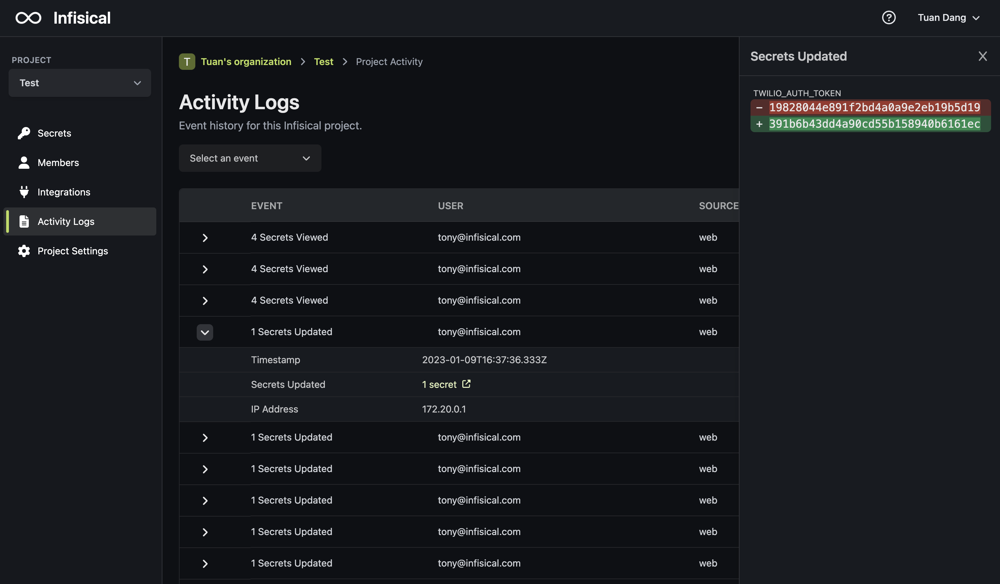

Activity logs record all actions going through Infisical including who performed which CRUD operations on environment variables and from what IP address. They help answer questions like:

- Who added or updated environment variables recently?
- Did Bob read environment variables last week (if at all)?
- What IP address was used for that action?

