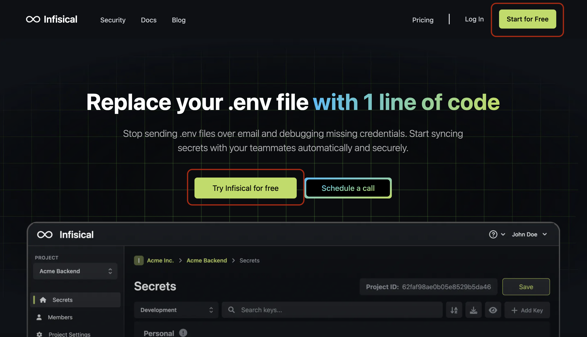

## Self-hosted

If you're using a self-hosted installation, follow the [setup](/self-hosting/overview) then open your website URL `{WEBSITE_URL}/login`.

## Infisical Cloud

**Step 1.** Open [infisical.com](https://infisical.com/) and click on either "Try Infisical for free" or "Start for free" to head to the signup sequence.

**Step 2.** Fill out the signup sequence.

After verifying your email address, you'll be prompted to fill out some required fields to set up your account.

| Field      | Description                 |
| ---------- | --------------------------- |
| Email      | Enter a valid email address |
| First name | Your first name             |
| Last name  | Your last name              |
| Password   | Password                    |

Once you've done that, you'll be taken to the dashboard where we've populated some default environment variables for demonstration.

