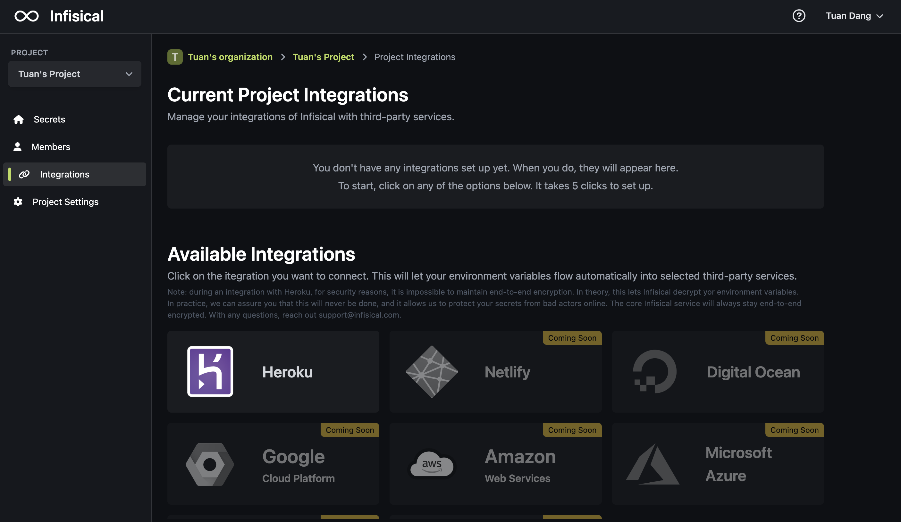

Integrations allow environment variables to be synced across your entire infrastructure from local development to CI/CD and production.

We're still early with integrations, but expect more soon. 

<Card title="View integrations documentation" icon="link" href="/integrations/overview">
  View all available integrations and their guide
</Card>

