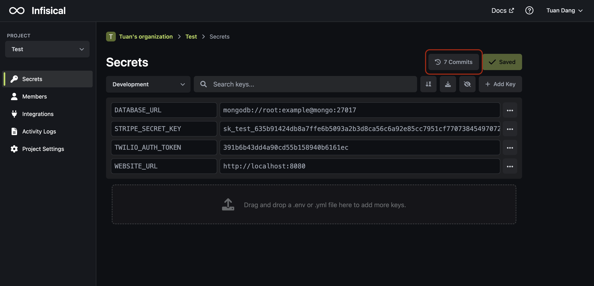
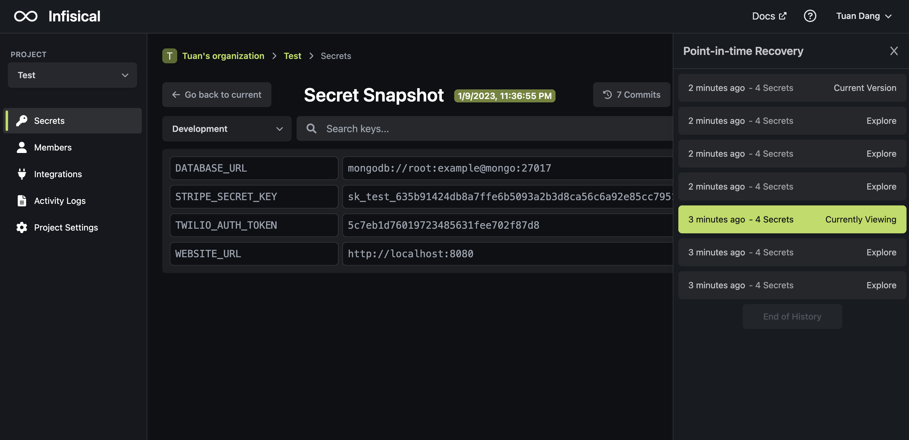
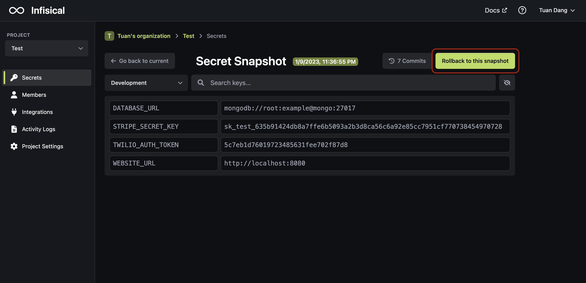

Point-in-time recovery allows environment variables to be rolled back to any point in time. It's powered by snapshots that get captured after mutations to environment variables.

## Commits

Similar to Git, a commit in Infisical is a snapshot of your project's secrets at a specific point in time. You can browse and view your project's snapshots via the "Point-in-Time Recovery" sidebar.

## Rolling back

Environment variables can be rolled back to any point in time via the "Rollback to this snapshot" button.

<Note>
  Rolling back environment variables to a past snapshot creates a new commit and
  snapshot at the top of the stack and updates secret versions.
</Note>
