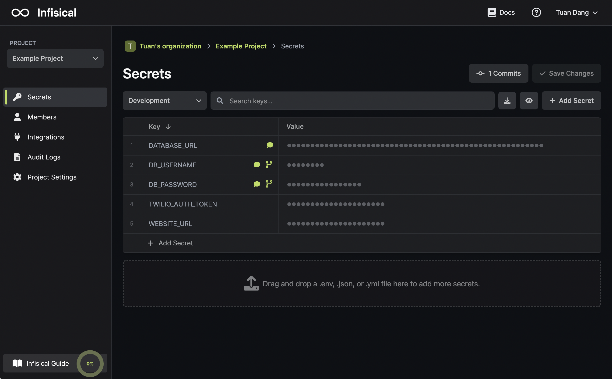
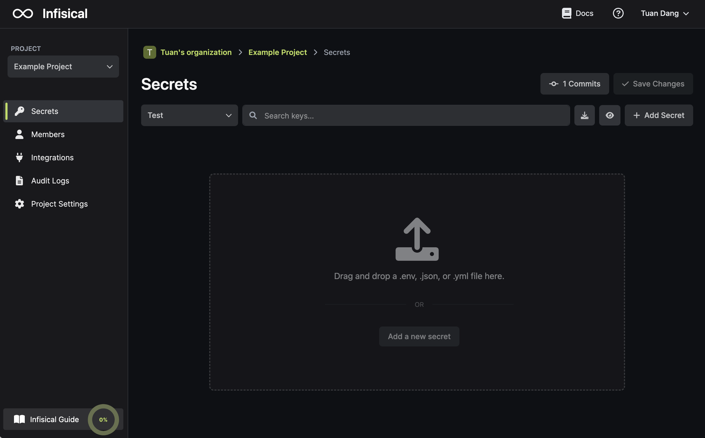
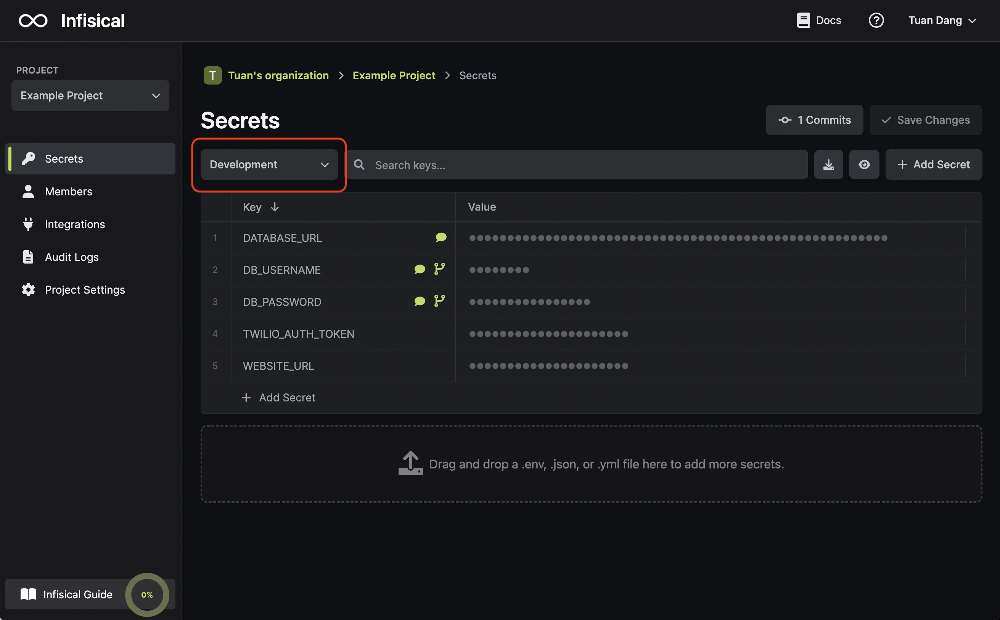
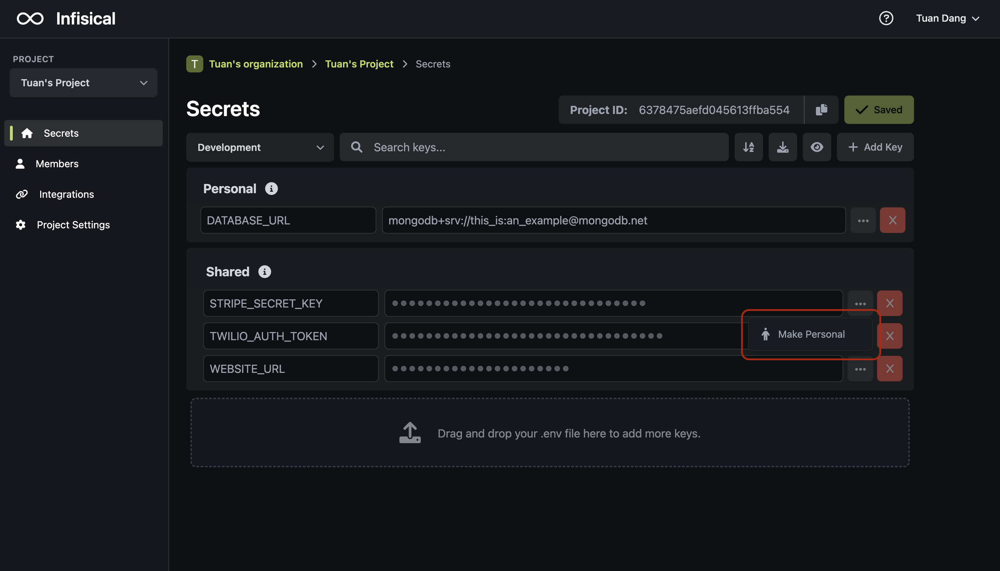
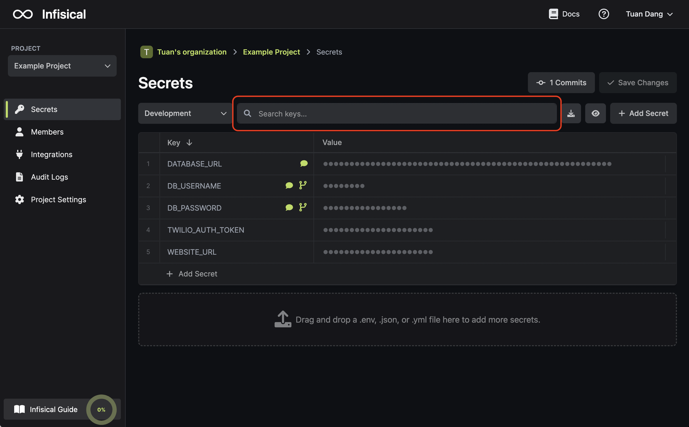
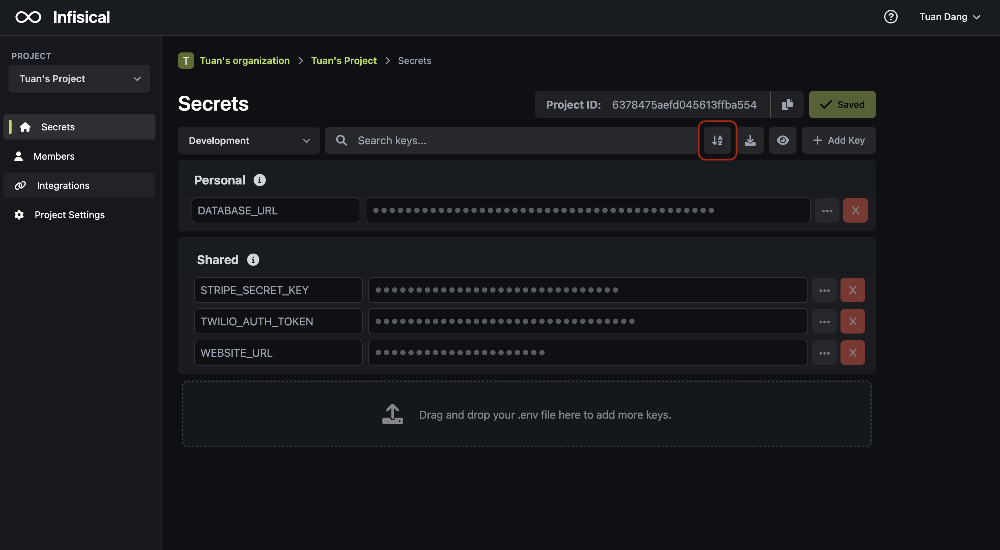
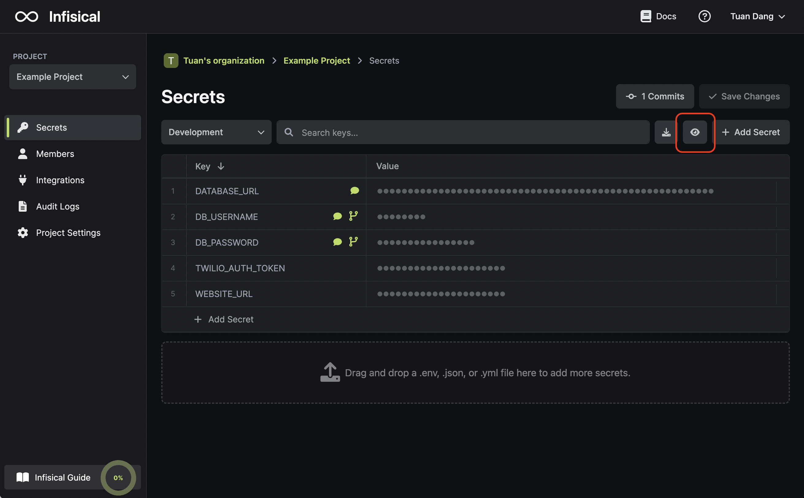
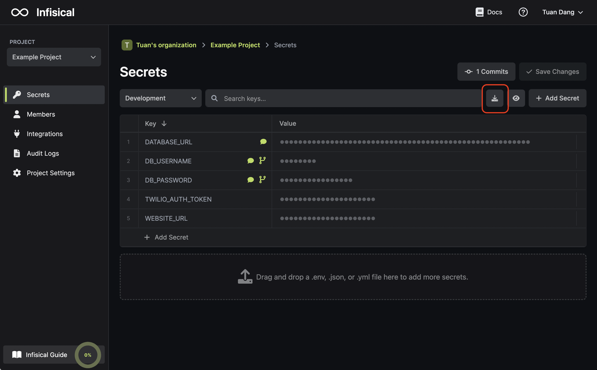

A project houses environment variables for an application.

## Dashboard

The dashboard page is where you can manage environment variables for a given project.

### Environment variables

Environment variables can be added or removed from a project. By default, they are pre-populated in your first project for demonstration. For any subsequent project, it can be convenient to import existing environment variables by dragging and dropping a .env file containing them.

Here's what dragging and dropping a .env looks like:

### Environments

In most cases, environment variables belong to specific environments: development, staging, testing, and production. You can input environment variables for each environment that your project uses.

### Personal/Shared scoping

Every environment variable is classified as either personal or shared.

- A personal environment variable is one created by a user of a project to be available for that user only.
- A shared environment variable is one created by a user of a project to be available for other users of the project.

You can toggle the classification of an environment variable by pressing on its settings:

### Search

You can search for any environment variable by its key.

### Sort

You can sort environment variables alphabetically by their keys.

### Hide/Un-hide

You can hide or un-hide the values of your environment variables. By default, the values are hidden for your privacy.

### Download as .env

You can download your environment variables back in a .env file.

