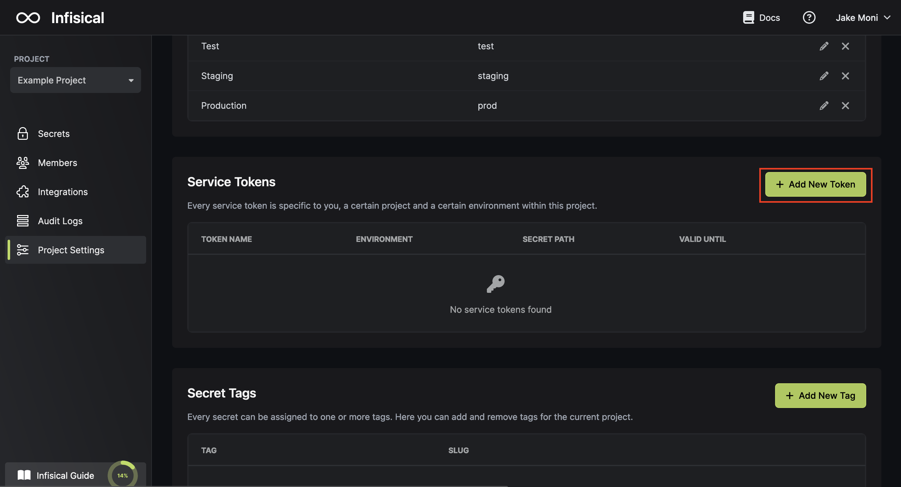

An Infisical Token is needed to authenticate the CLI when there isn't an easy way to input your login credentials.

It's useful for your CI/CD environments and integrations such as [Docker](/integrations/platforms/docker) and [Docker Compose](/integrations/platforms/docker-compose).

To generate the the token, head over to your project settings as shown below.

<Note>
  The token grants read-only access to a particular environment and project for
  a specified amount of time. Once the token is expired, the CLI using it will no longer be able to make
  requests with it.
</Note>

