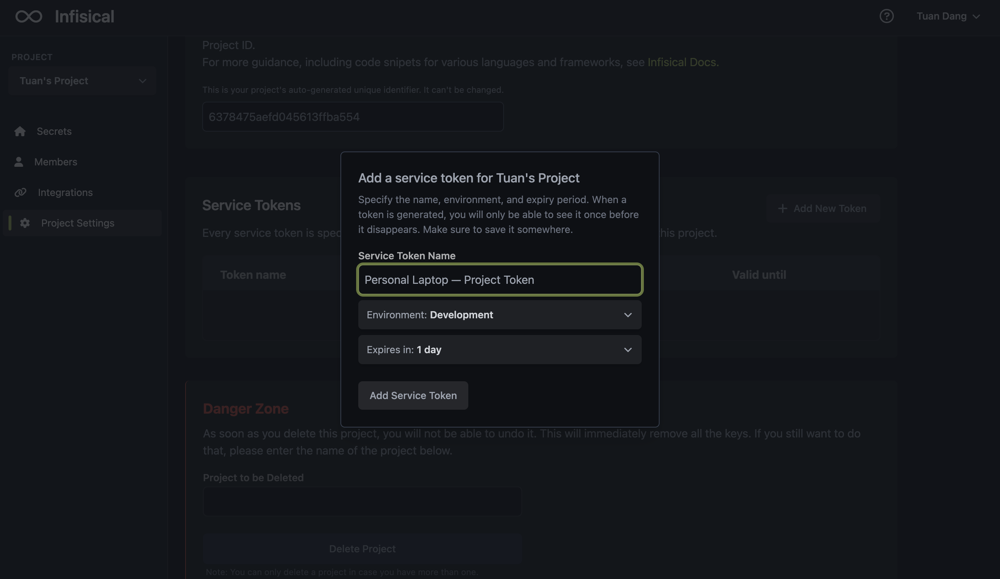
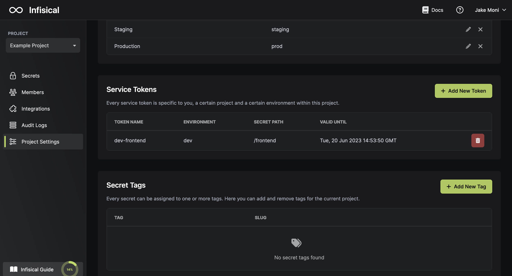

An Infisical Token is needed to authenticate the CLI when there isn't an easy way to manually type in your login credentials to sync environment variables to your applications.

It grants read-only access to a particular environment and project for a specified amount of time; once the token expires, any CLI application that relies on it for authentication will be denied access to retrieve related secrets.

This is useful in the following contexts:

- Docker/Docker-Compose integration: An Infisical Token can be passed to a Docker container as an environment variable for the CLI to authenticate and pull its corresponding secrets.

## Generate an Infisical Token

It's possible to generate an Infisical token in the settings of a project.

To use the Infisical Token in the CLI, check out the docs for that [here](../../getting-started/cli/token).
