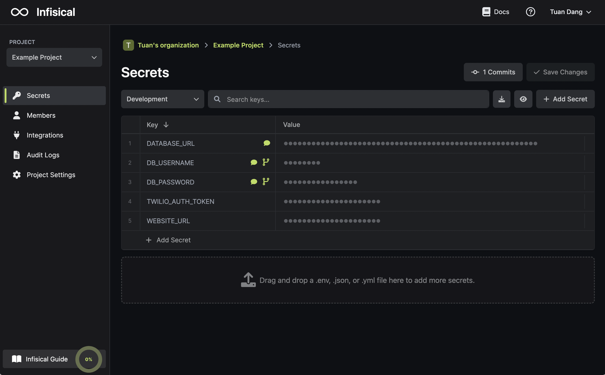

This example demonstrates how to store and inject environment variables from [Infisical Cloud](https://app.infisical.com) into your application.

Note that the Infisical CLI is platform-agnostic and can inject environment variables across many tech stacks and frameworks.

## Set up Infisical Cloud

1. Login or create an accout at `app.infisical.com`.
2. Create a new project.
3. Populate your environment variables as in the image below.



## Set up the CLI

1. Follow the instructions to [install the CLI](/cli/overview).

2. Initialize Infisical for your project.

```bash
# move to your project
cd /path/to/project

# initialize infisical
infisical init
```

## Start your app with environment variables injected

```bash
# inject environment variables into app
infisical run -- [your application start command]
```

<Info>
  Check out our [integrations](/integrations/overview) for injecting environment
  variables into frameworks and platforms like Docker.
</Info>

Your app should be running with the environment variables injected.
