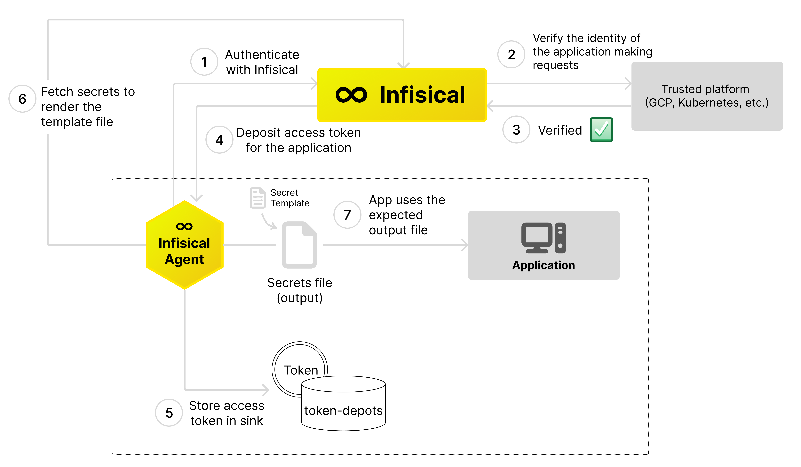

Infisical Agent is a client daemon that simplifies the adoption of Infisical by providing a more scalable and user-friendly approach for applications to interact with Infisical.
It eliminates the need to modify application logic by enabling clients to decide how they want their secrets rendered through the use of templates.



### Key features:
- Token renewal: Automatically authenticates with Infisical and deposits renewed access tokens at specified path for applications to consume
- Templating: Renders secrets via user provided templates to desired formats for applications to consume

### Token renewal

### Templating

### Configuration

| Field                        | Description |
| ---------------------------- | ----------- |
| `infisical.address`          | The URL of the Infisical service. Default: `"https://app.infisical.com"`. |
| `auth.type`                  | The type of authentication method used. |
| `auth.config.token-path`     | The file path where the initial token for authentication is stored.  |
| `sinks[].type`               | The type of sink in a list of sinks. Each item specifies a sink type, default is `"file"`. |
| `sinks[].config.path`        | The file path where the token is stored for each sink in the list. Default: `"/some/path/to/store/token/toke-name"`. |
| `templates[].source-path`    | The path to the source template file in a list of templates. Default: `/some/path/template-name`. |
| `templates[].destination-path` | The path where the output file from the template will be saved in a list of templates. Default: `/some/path/output-file-name`. |


## Quick start Infisical Agent

```bash 
infisical agent --config agent-config-file.yaml
```

```text secret-template-file
{{- with secret "6553ccb2b7da580d7f6e7260" "dev" "/" }}
{{- range . }}
{{ .Key }}={{ .Value }}
{{- end }}
{{- end }}
```

```yaml agent-config-file.yaml
infisical:
  address: "https://app.infisical.com"
auth:
  type: "token"
  config:
    token-path: "/path/where/to/file/with/initial/token"
sinks:
  - type: "file"
    config:
      path: "/some/path/to/store/token/toke-name"
templates:
  - source-path: /some/path/template-name 
    destination-path: /some/path/output-file-name 
```