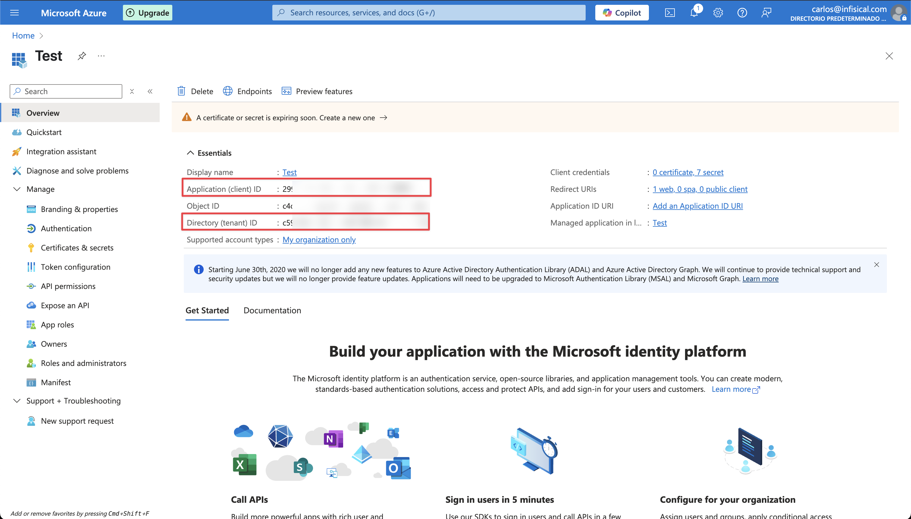

Infisical currently only supports two methods for connecting to Azure, which are OAuth and Client Secrets.

<Accordion title="Self-Hosted Instance">
  Using the Azure Client Secrets connection on a self-hosted instance of Infisical requires configuring an application in Azure
  and registering your instance with it.

  **Prerequisites:**

  - Set up Azure.

  <Steps>
    <Step title="Create an application in Azure">
      Navigate to Azure Active Directory > App registrations to create a new application.

      <Info>
        Azure Active Directory is now Microsoft Entra ID.
      </Info>
      
      

      Create the application. As part of the form, set the **Redirect URI** to `https://your-domain.com/organization/app-connections/azure/oauth/callback`.
      <Tip>
        The domain you defined in the Redirect URI should be equivalent to the `SITE_URL` configured in your Infisical instance.
      </Tip>

      
    </Step>
    <Step title="Assign API permissions to the application">

      For the Azure Connection to work with Client Secrets, you need to assign the following permission to the application.

      #### Azure Client Secrets permissions
    
      Set the API permissions of the Azure application to include the following permissions: 
        - Microsoft Graph
          - `Application.ReadWrite.All`
          - `Application.ReadWrite.OwnedBy`
          - `Application.ReadWrite.All` (Delegated)
          - `Directory.ReadWrite.All` (Delegated)
          - `User.Read` (Delegated)

      

    </Step>
    <Step title="Add your application credentials to Infisical">
      Obtain the **Application (Client) ID** and **Directory (Tenant) ID** (this will be used later in the Infisical connection) in Overview and generate a **Client Secret** in Certificate & secrets for your Azure application.

      
      
      

      Back in your Infisical instance, add two new environment variables for the credentials of your Azure application.

      - `INF_APP_CONNECTION_AZURE_CLIENT_SECRETS_CLIENT_ID`: The **Application (Client) ID** of your Azure application.
      - `INF_APP_CONNECTION_AZURE_CLIENT_SECRETS_CLIENT_SECRET`: The **Client Secret** of your Azure application.

      <Note>
        If you can't directly access and modify environment variables, you can update them using the [Server Admin Console](/documentation/platform/admin-panel/server-admin#environment-variables-tab).
      </Note>

      Once added, restart your Infisical instance and use the Azure Client Secrets connection.
    </Step>
    </Steps>    

</Accordion>

<AccordionGroup>

  <Accordion title="Client Secret Authentication">
    Ensure your Azure application has the required permissions that Infisical needs for the Azure Client Secrets connection to work.

    **Prerequisites:**
    - An active Azure setup.

    <Steps>
      <Step title="Assign API permissions to the application">
        For the Azure Client Secrets connection to work, assign the following permissions to your Azure application:

        #### Required API Permissions
      
        **Microsoft Graph**
        - `Application.ReadWrite.All`
        - `Application.ReadWrite.OwnedBy`
        - `Application.ReadWrite.All` (Delegated)
        - `Directory.ReadWrite.All` (Delegated)
        - `User.Read` (Delegated)

        
      </Step>
    </Steps>
  </Accordion>
  <Accordion title="Certificate Authentication">
    Ensure your Azure application has the required permissions that Infisical needs for the Azure Client Secrets connection to work.

    **Prerequisites:**
    - An active Azure setup.

    <Steps>
      <Step title="Assign API permissions to the application">
        For the Azure Client Secrets connection to work, assign the following permissions to your Azure application:

        #### Required API Permissions
      
        **Microsoft Graph**
        - `Application.ReadWrite.All`
        - `Application.ReadWrite.OwnedBy`
        - `Application.ReadWrite.All` (Delegated)
        - `Directory.ReadWrite.All` (Delegated)
        - `User.Read` (Delegated)

        
      </Step>

      <Step title="Upload your certificate to your Azure App Registration">
        Navigate to the **Certificates & secrets** section of your Azure App Registration, and press the **Upload certificate** button.

        Select the **Upload** button and upload your certificate.

        

        <Tip>
          Keep in mind that both the certificate and its private key are required to configure the Azure Client Secrets connection in Infisical.
        </Tip>
      </Step>
    </Steps>

  </Accordion>

</AccordionGroup>

## Setup Azure Connection in Infisical

<Steps>
	<Step title="Navigate to App Connections">
		Navigate to the **Integrations** tab in the desired project, then select **App Connections**. 
	</Step>
	<Step title="Add Connection">
		Select the **Azure Connection** option from the connection options modal. 
	</Step>
  <Step title="Create Connection">
    <Tabs>
      <Tab title="OAuth">
      <Step title="Authorize Connection">
        Fill in the **Tenant ID** field with the Directory (Tenant) ID you obtained in the previous step.

        Now select the **OAuth** method and click **Connect to Azure**. 

        
      </Step>
      <Step title="Grant Access">
        You will then be redirected to Azure to grant Infisical access to your Azure account. Once granted,
        you will be redirected back to Infisical's App Connections page. 
      </Step>
      </Tab>
      <Tab title="Client Secret">
      <Step title="Create Connection">
        Fill in the **Tenant ID**, **Client ID** and **Client Secret** fields with the Directory (Tenant) ID, Application (Client) ID and Client Secret you obtained in the previous step.

        
      </Step>
      </Tab>
      <Tab title="Certificate">
      <Step title="Create Connection">
        Fill in the **Tenant ID**, **Client ID**, **Certificate (PEM format)**, and **Private Key** fields with the Directory (Tenant) ID, Application (Client) ID, Certificate and Private Key you obtained in the [previous step](#certificate-authentication).

        <Tip>
          The private key is never transmitted to Azure, and it is only used to sign the client assertion used to authenticate with Azure.
        </Tip>

        
      </Step>
      </Tab>
    </Tabs>
  </Step>
	<Step title="Connection Created">
		Your **Azure Client Secrets Connection** is now available for use. 
	</Step>
</Steps>
