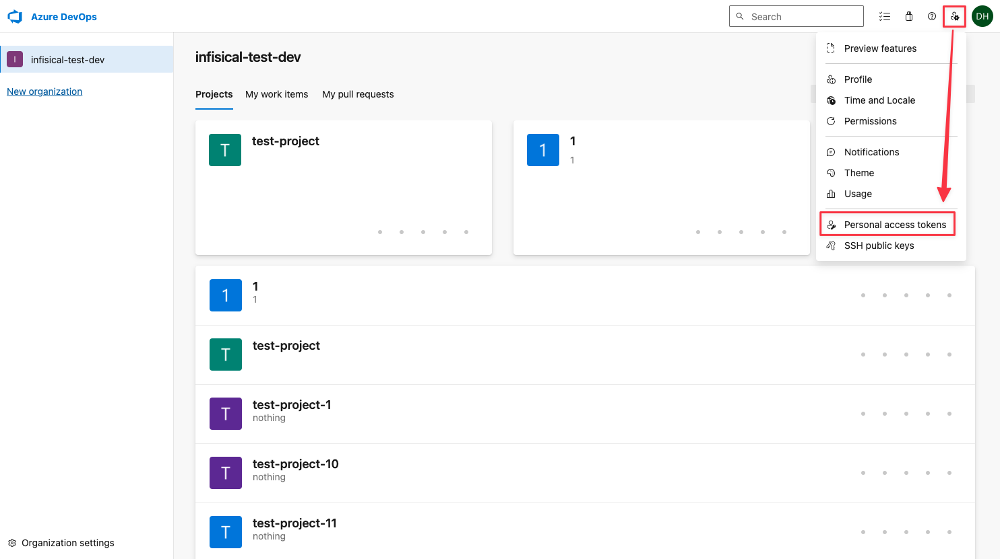
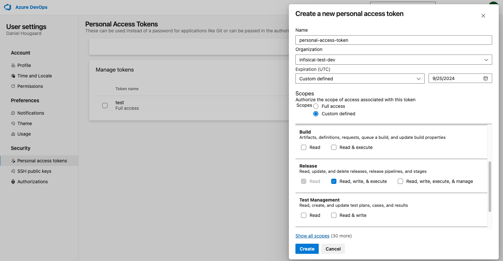
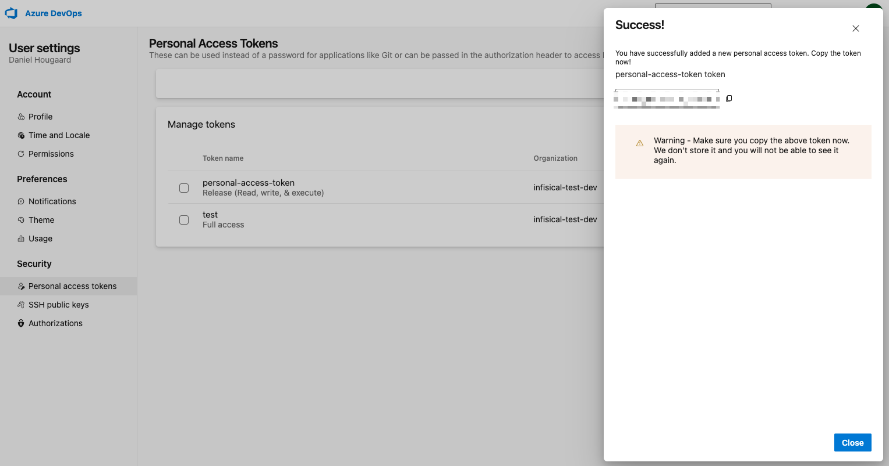

Infisical currently supports three methods for connecting to Azure DevOps, which are OAuth, Azure DevOps Personal Access Token and Client Secrets.

<Accordion title="Azure OAuth on a Self-Hosted Instance">
  Using the Azure DevOps <b>OAuth connection</b> on a self-hosted instance of Infisical requires configuring an application in Azure
  and registering your instance with it.

  **Prerequisites:**

  - Set up Azure.

  <Steps>
    <Step title="Create an application in Azure">
      Navigate to Azure Active Directory > App registrations to create a new application.

      <Info>
        Azure Active Directory is now Microsoft Entra ID.
      </Info>
      
      

      Create the application. As part of the form, set the **Redirect URI** to `https://your-domain.com/organization/app-connections/azure/oauth/callback`.
      <Tip>
        The domain you defined in the Redirect URI should be equivalent to the `SITE_URL` configured in your Infisical instance.
      </Tip>

      
    </Step>
    <Step title="Assign API permissions to the application">

      For the Azure Connection to work with DevOps Pipelines, you need to assign the following permission to the application.

      #### Azure DevOps permissions
    
      Set the API permissions of the Azure application to include the following permissions: 
        - Azure DevOps
          - `user_impersonation`
          - `vso.project_write`
          - `vso.variablegroups_manage`
          - `vso.variablegroups_write`

      

    </Step>
    <Step title="Add your application credentials to Infisical">
      Obtain the **Application (Client) ID** and **Directory (Tenant) ID** (this will be used later in the Infisical connection) in Overview and generate a **Client Secret** in Certificate & secrets for your Azure application.

      
      
      

      Back in your Infisical instance, add two new environment variables for the credentials of your Azure application.

      - `INF_APP_CONNECTION_AZURE_DEVOPS_CLIENT_ID`: The **Application (Client) ID** of your Azure application.
      - `INF_APP_CONNECTION_AZURE_DEVOPS_CLIENT_SECRET`: The **Client Secret** of your Azure application.

      <Note>
        If you can't directly access and modify environment variables, you can update them using the [Server Admin Console](/documentation/platform/admin-panel/server-admin#environment-variables-tab).
      </Note>

      Once added, restart your Infisical instance and use the Azure DevOps connection.
    </Step>
    </Steps>    

</Accordion>

<Accordion title="Azure DevOps personal access token (PAT)">
    #### Create a new Azure DevOps personal access token (PAT)
    When using the Azure DevOps <b>Access Token connection</b> you'll need to create a new personal access token (PAT) in order to authenticate Infisical with Azure DevOps.
    <Steps>
    <Step title="Navigate to Azure DevOps">
        
    </Step>
    <Step title="Create a new token">
        Make sure the newly created token has Read/Write access to the Release scope.
        

        <Note>
        Please make sure that the token has access to the following scopes: Variable Groups _(read, create, & manage)_, Release _(read/write)_, Project and Team _(read)_, Service Connections _(read & query)_
        </Note>
    </Step>
    <Step title="Copy the new access token">
        Copy the newly created token as this will be used to authenticate Infisical with Azure DevOps.
        
    </Step>
    </Steps>
</Accordion>

<Accordion title="Client Secret Authentication">
  To use client secret authentication, ensure your Azure Service Principal has the required permissions and is connected to the Azure DevOps organization and projects you want to use.

  **Prerequisites:**
  - Set up Azure and have an existing Azure DevOps organization.
  - The service principal must be connected to your target Azure DevOps organization and project(s)

  <Steps>
    <Step title="Assign API permissions to the service principal">

      Configure the required API permissions for your App Registration to interact with Azure DevOps:

      #### Azure DevOps permissions
    
      Set the API permissions of your Azure service principal to include the following Azure DevOps permissions: 
        - Azure DevOps
          - `user_impersonation`
          - `vso.project_write`
          - `vso.variablegroups_manage`
          - `vso.variablegroups_write`

      
    </Step>
  </Steps>
</Accordion>

## Setup Azure Connection in Infisical

<Steps>
	<Step title="Navigate to App Connections">
		Navigate to the **App Connections** page in the desired project. 
	</Step>
	<Step title="Add Connection">
		Select the **Azure Connection** option from the connection options modal. 
	</Step>

    <Step title="Create Connection">
        <Tabs>
            <Tab title="OAuth">
            <Steps>
                <Step title="Fill in Connection Details">
                    Fill in the **Tenant ID** field with the Directory (Tenant) ID you obtained in the previous [step](#azure-oauth-on-a-self-hosted-instance). Also fill in the organization name of the Azure DevOps organization you want to connect to.
                    

                    <Tip>
                        You can find the **Organization Name** on https://dev.azure.com/
                    </Tip>
                </Step>
                <Step title="Grant Access">
                    You will then be redirected to Azure to grant Infisical access to your Azure account. Once granted,
                    you will be redirected back to Infisical's App Connections page. 
                </Step>
            </Steps>
            </Tab>
            <Tab title="Access Token">
                <Steps>
                    <Step title="Fill in Connection Details">
                        Fill in the **Access Token** field with the Access Token you obtained in the previous step. And the organization name of the Azure DevOps organization you want to connect to.
                        

                        <Tip>
                            You can find the **Organization Name** on https://dev.azure.com/
                        </Tip>
                    </Step>
                </Steps>
            </Tab>
            <Tab title="Client Secret">
                <Steps>
                    <Step title="Create Connection">
                        Fill in the **Tenant ID**, **Client ID**, **Client Secret** and **Organization Name** fields with the Directory (Tenant) ID, Application (Client) ID, Client Secret and the organization name you obtained in the previous step.
                        <Tip>
                            You can find the **Organization Name** on https://dev.azure.com/
                        </Tip>
                        
                    </Step>
                </Steps>
            </Tab>
        </Tabs>
    </Step>
	<Step title="Connection Created">
		Your **Azure DevOps Connection** is now available for use. 
	</Step>
</Steps>
