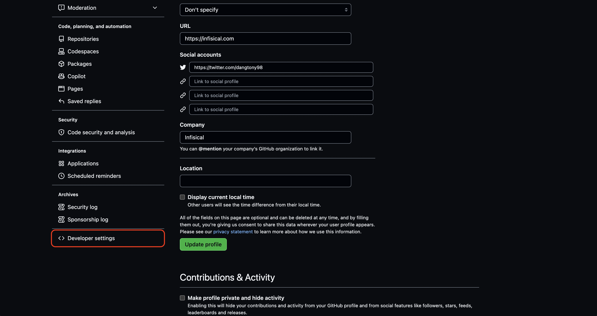
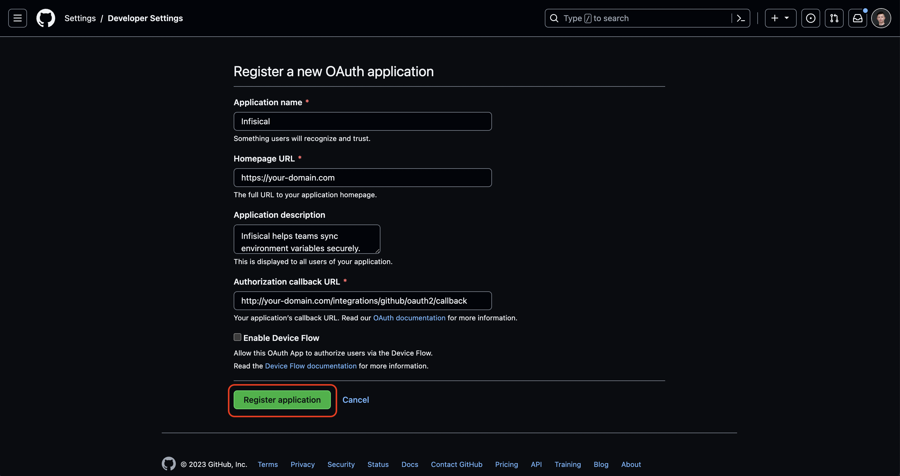

Infisical supports three methods for connecting to GitHub.

<Tabs>
    <Tab title="GitHub App (Recommended)">
        Infisical will use a GitHub App with finely grained permissions to connect to GitHub.

        <Accordion title="Self-Hosted Instance">
            Using the GitHub integration with app authentication on a self-hosted instance of Infisical requires configuring an application on GitHub
            and registering your instance with it.

            <Steps>
                <Step title="Create an application on GitHub">
                    Navigate to the GitHub app settings [here](https://github.com/settings/apps). Click **New GitHub App**.

                    

                    Give the application a name, a homepage URL (your self-hosted domain i.e. `https://your-domain.com`), and a callback URL (i.e. `https://your-domain.com/organization/app-connections/github/oauth/callback`).

                    

                    Enable request user authorization during app installation.
                    

                    Disable webhook by unchecking the Active checkbox.
                    

                    Set the repository permissions as follows: Metadata: Read-only, Secrets: Read and write, Environments: Read and write, Actions: Read.
                    

                    Similarly, set the organization permissions as follows: Secrets: Read and write.
                    

                    Create the Github application.
                    

                    <Note>
                        If you have a GitHub organization, you can create an application under it
                        in your organization Settings > Developer settings > GitHub Apps > New GitHub App.
                    </Note>
                </Step>
                <Step title="Add your application credentials to Infisical">
                    Generate a new **Client Secret** for your GitHub application.
                    

                    Generate a new **Private Key** for your Github application.
                    

                    Obtain the necessary Github application credentials. This would be the application slug, client ID, app ID, client secret, and private key.
                    

                    Back in your Infisical instance, you can configure the GitHub App credentials in one of two ways:

                    **Option 1: Server Admin Panel (Recommended)**

                    Navigate to the server admin panel > **Integrations** > **GitHub App** and enter the GitHub application credentials:
                    

                    - **Client ID**: The Client ID of your GitHub application
                    - **Client Secret**: The Client Secret of your GitHub application
                    - **App Slug**: The Slug of your GitHub application (found in the URL)
                    - **App ID**: The App ID of your GitHub application
                    - **Private Key**: The Private Key of your GitHub application

                    **Option 2: Environment Variables**

                    Alternatively, you can add the new environment variables for the credentials of your GitHub application:

                    - `INF_APP_CONNECTION_GITHUB_APP_CLIENT_ID`: The **Client ID** of your GitHub application.
                    - `INF_APP_CONNECTION_GITHUB_APP_CLIENT_SECRET`: The **Client Secret** of your GitHub application.
                    - `INF_APP_CONNECTION_GITHUB_APP_SLUG`: The **Slug** of your GitHub application. This is the one found in the URL.
                    - `INF_APP_CONNECTION_GITHUB_APP_ID`: The **App ID** of your GitHub application.
                    - `INF_APP_CONNECTION_GITHUB_APP_PRIVATE_KEY`: The **Private Key** of your GitHub application.

                    Once configured, you can use the GitHub integration via app authentication. If you configured the credentials using environment variables, restart your Infisical instance for the changes to take effect. If you configured them through the server admin panel, allow approximately 5 minutes for the changes to propagate.
                </Step>
            </Steps>
        </Accordion>

        ## Setup GitHub Connection in Infisical

        <Steps>
            <Step title="Navigate to App Connections">
                Navigate to the **Integrations** tab in the desired project, then select **App Connections**.
                
            </Step>
            <Step title="Add Connection">
                Select the **GitHub Connection** option from the connection options modal.
                
            </Step>
            <Step title="Authorize Connection">
                Select the **GitHub App** method and click **Connect to GitHub**.

                You may optionally configure GitHub Enterprise options:
                - **Gateway:** The gateway connected to your private network
                - **Hostname:** The hostname at which to access your GitHub Enterprise instance

                
            </Step>
            <Step title="Install GitHub App">
                You will then be redirected to the GitHub app installation page.

                Install and authorize the GitHub application. This will redirect you back to Infisical's App Connections page.
                
            </Step>
            <Step title="Connection Created">
                Your **GitHub Connection** is now available for use.
                
            </Step>
        </Steps>
    </Tab>
    <Tab title="OAuth">
        Infisical will use an OAuth App to connect to GitHub.

        <Accordion title="Self-Hosted Instance">
            Using the GitHub integration on a self-hosted instance of Infisical requires configuring an OAuth application in GitHub
            and registering your instance with it.
            <Steps>
                <Step title="Create an OAuth application in GitHub">
                    Navigate to your user Settings > Developer settings > OAuth Apps to create a new GitHub OAuth application.

                    
                    
                    

                    Create the OAuth application. As part of the form, set the **Homepage URL** to your self-hosted domain `https://your-domain.com`
                    and the **Authorization callback URL** to `https://your-domain.com/organization/app-connections/github/oauth/callback`.

                    

                    <Note>
                        If you have a GitHub organization, you can create an OAuth application under it
                        in your organization Settings > Developer settings > OAuth Apps > New Org OAuth App.
                    </Note>
                </Step>
                <Step title="Add your OAuth application credentials to Infisical">
                    Obtain the **Client ID** and generate a new **Client Secret** for your GitHub OAuth application.

                    

                    Back in your Infisical instance, add two new environment variables for the credentials of your GitHub OAuth application:

                    - `INF_APP_CONNECTION_GITHUB_OAUTH_CLIENT_ID`: The **Client ID** of your GitHub OAuth application.
                    - `INF_APP_CONNECTION_GITHUB_OAUTH_CLIENT_SECRET`: The **Client Secret** of your GitHub OAuth application.

                    <Note>
                        If you can't directly access and modify environment variables, you can update them using the [Server Admin Console](/documentation/platform/admin-panel/server-admin#environment-variables-tab).
                    </Note>

                    Once added, restart your Infisical instance and use the GitHub integration.
                </Step>
            </Steps>
        </Accordion>

        ## Setup GitHub Connection in Infisical

        <Steps>
            <Step title="Navigate to App Connections">
                Navigate to the **Integrations** tab in the desired project, then select **App Connections**.
                
            </Step>
            <Step title="Add Connection">
                Select the **GitHub Connection** option from the connection options modal.
                
            </Step>
            <Step title="Authorize Connection">
                Select the **OAuth** method and click **Connect to GitHub**.
                
            </Step>
            <Step title="Grant Access">
                You will then be redirected to the GitHub to grant Infisical access to your GitHub account (organization and repo privileges).
                Once granted, you will redirect you back to Infisical's App Connections page.
                
            </Step>
            <Step title="Connection Created">
                Your **GitHub Connection** is now available for use.
                
            </Step>
        </Steps>
    </Tab>
    <Tab title="Personal Access Token">
        Infisical will use a Personal Access Token to connect to GitHub.

        ## Create a Personal Access Token
            <Steps>
                <Step title="Create a Personal Access Token in GitHub">
                    Navigate to your user Settings > Developer settings > Personal Access Tokens to create a new Personal Access Token.

                    
                    
                    

                    Click **Generate new token** to create the token.
                </Step>
                <Step title="Fill in the Personal Access Token details">
                    Fill in the Personal Access Token details:
                    - **Token name:** A descriptive name for the token (e.g., "infisical-connection-token")
                    - **Repository access:** Select the repositories you want to grant access to
                        - Select `All repositories` or `Only selected repositories` to be able to manage the secrets in the selected repositories.
                    - **Select scopes:** Add the following scopes:
                        - **Metadata**: Read-only
                        - **Environments**: Read and write
                        - **Secrets**: Read and write

                    

                    Click **Generate token** to create the token.
                </Step>
                <Step title="Copy the Personal Access Token">
                    Copy the generated token immediately as it won't be shown again.

                    

                    <Warning>
                        Keep your Personal Access Token secure and do not share it. Anyone with access to this token can access your GitHub account and repositories.
                    </Warning>
                </Step>
            </Steps>

        ## Setup GitHub Connection in Infisical

        <Steps>
            <Step title="Navigate to App Connections">
                Navigate to the **Integrations** tab in the desired project, then select **App Connections**.
                
            </Step>
            <Step title="Add Connection">
                Select the **GitHub Connection** option from the connection options modal.
                
            </Step>
            <Step title="Authorize Connection">
                Select the **Personal Access Token** method and fill in the **Personal Access Token** field with your Personal Access Token.

                You may optionally configure GitHub Enterprise options:
                - **Gateway:** The gateway connected to your private network
                - **Hostname:** The hostname at which to access your GitHub Enterprise instance

                Click **Create Connection**.

                
            </Step>
            <Step title="Connection Created">
                Your **GitHub Connection** is now available for use.
                
            </Step>
        </Steps>
    </Tab>

</Tabs>
