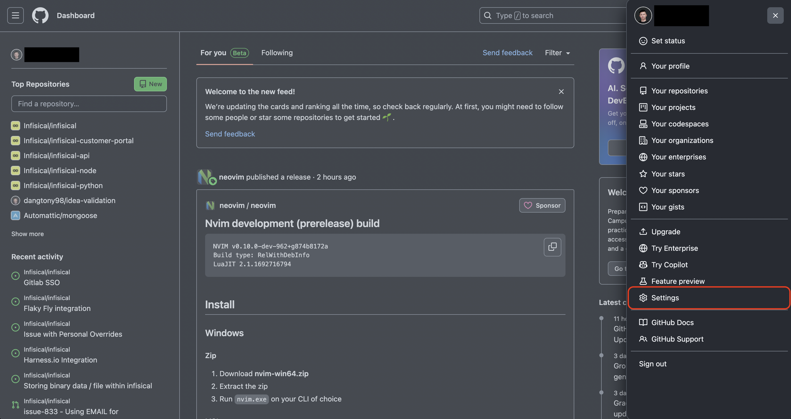
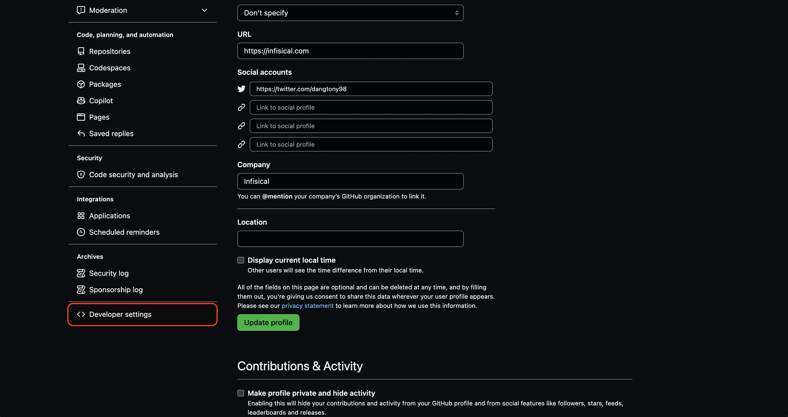
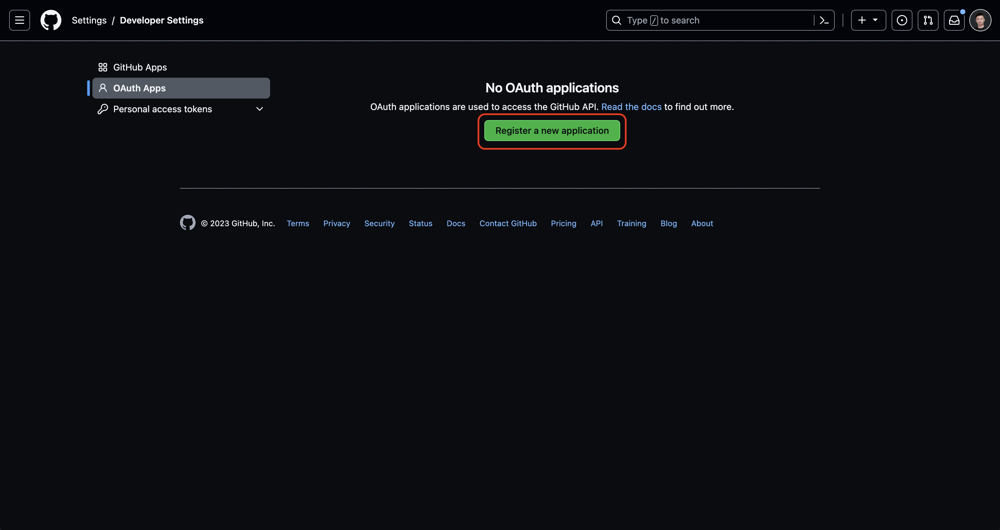
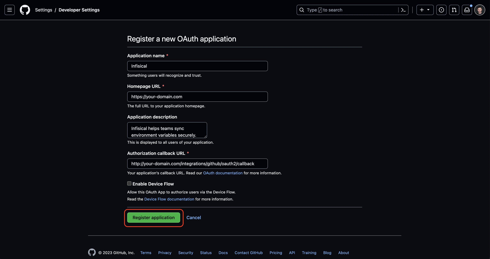
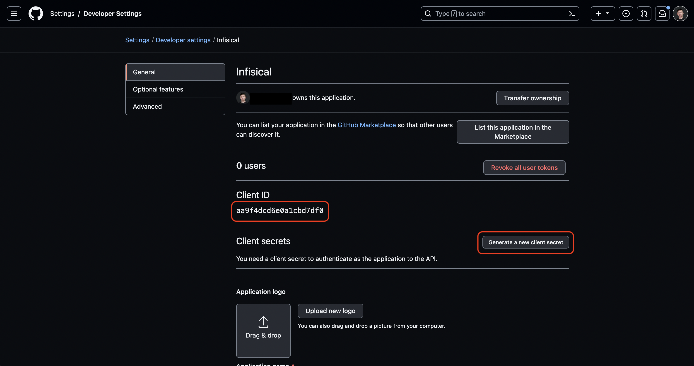

Infisical supports three methods for connecting to GitHub.

<Tabs>
    <Tab title="GitHub App (Recommended)">
        Infisical will use a GitHub App with finely grained permissions to connect to GitHub.

        <Accordion title="Self-Hosted Instance">
            On a self-hosted instance, a GitHub App can be registered in one of two ways: as a **Private** app, created directly from Infisical for a single organization or project, or as the **Instance**-wide default app, shared across your whole instance and configured via environment variables.

            <Tabs>
                <Tab title="Private App (via Infisical)">
                    This initiates registration of a GitHub App scoped to your organization or a single project directly from Infisical.

                    <Steps>
                        <Step title="Navigate to App Connections">
                            Navigate to the **Integrations** tab in the desired project (or your organization's **App Connections** page to make the app available across all projects), then select **App Connections**.
                        </Step>
                        <Step title="Add Connection">
                            Select **Add Connection**, then select **GitHub**.
                        </Step>
                        <Step title="Create a new GitHub App">
                            Select the **GitHub App** method, then select the gear icon next to **Select a GitHub App** to open **Manage GitHub Apps**.

                            Select **Create GitHub App**, give it a name, and select **Continue on GitHub**. You'll be redirected to GitHub to confirm creation using GitHub's App Manifest flow, which automatically configures the required permissions and callback URL. You'll be redirected back to Infisical once the app is created.
                        </Step>
                        <Step title="Use the connection">
                            Your new GitHub App will now appear in the **Select a GitHub App** list. Select it, then select **Connect to GitHub** to install and authorize it.
                        </Step>
                    </Steps>

                    <Note>
                        GitHub Apps are scoped to where they were created: apps created from the organization's App Connections page are available to every project, while apps created from a project's App Connections page are only available within that project.
                    </Note>
                </Tab>
                <Tab title="Instance-wide Default App (via Environment Variables)">
                    This registers one GitHub App as the shared default for your entire self-hosted instance, available to every organization and project as the **Instance** option.

                    <Steps>
                        <Step title="Create an application on GitHub">
                            Navigate to the GitHub App settings [here](https://github.com/settings/apps). Select **New GitHub App**.

                            Give the application a name, a homepage URL (your self-hosted domain i.e. `https://your-domain.com`), and a callback URL (i.e. `https://your-domain.com/organization/app-connections/github/oauth/callback`).

                            Enable request user authorization during app installation, and disable webhook by unchecking the Active checkbox.

                            Set the repository permissions as follows: Metadata: Read-only, Secrets: Read and write, Environments: Read and write, Actions: Read. Set the organization permissions as follows: Secrets: Read and write.

                            Create the GitHub application.

                            <Note>
                                If you have a GitHub organization, you can create an application under it
                                in your organization Settings > Developer settings > GitHub Apps > New GitHub App.
                            </Note>
                        </Step>
                        <Step title="Add your application credentials to Infisical">
                            Generate a new **Client Secret** and a new **Private Key** for your GitHub application, and obtain its application slug, client ID, and app ID.

                            Add the following environment variables to your Infisical instance:

                            - `INF_APP_CONNECTION_GITHUB_APP_CLIENT_ID`: The **Client ID** of your GitHub application.
                            - `INF_APP_CONNECTION_GITHUB_APP_CLIENT_SECRET`: The **Client Secret** of your GitHub application.
                            - `INF_APP_CONNECTION_GITHUB_APP_SLUG`: The **Slug** of your GitHub application. This is the one found in the URL.
                            - `INF_APP_CONNECTION_GITHUB_APP_ID`: The **App ID** of your GitHub application.
                            - `INF_APP_CONNECTION_GITHUB_APP_PRIVATE_KEY`: The **Private Key** of your GitHub application.
                            - `INF_APP_CONNECTION_GITHUB_APP_HOST` *(GitHub Enterprise Server only)*: The hostname of the GitHub instance where the shared GitHub App is registered (e.g. `github.mycompany.com`). Defaults to `github.com`.

                            <Note>
                                If your shared GitHub App is registered on a GitHub Enterprise Server instance, you must set `INF_APP_CONNECTION_GITHUB_APP_HOST` to that instance's hostname. Without it, the OAuth exchange will be directed to `github.com` instead of your GHES host.
                            </Note>

                            Restart your Infisical instance for the changes to take effect. Your app will then be available as the **Instance** option when connecting to GitHub.
                        </Step>
                    </Steps>
                </Tab>
            </Tabs>
        </Accordion>

        ## Setup GitHub connection in Infisical

        <Steps>
            <Step title="Navigate to App Connections">
                Navigate to the **Integrations** tab in the desired project, then select **App Connections**.
                
            </Step>
            <Step title="Add Connection">
                Select the **GitHub Connection** option from the connection options modal.
                
            </Step>
            <Step title="Authorize Connection">
                Select the **GitHub App** method.

                Choose which GitHub App to use for the connection:
                - **Instance** — the instance-default GitHub App configured by your Infisical server admin.
                - **Private** — a GitHub App registered under your organization. Select an existing one from the list, or click the gear to manage your private apps.

                <Note>
                    GitHub Apps are scoped to where they were created: apps created from the organization's App Connections page are available to organization-level connections and to every project, while apps created from a project's App Connections page are only available within that project. The shared instance-default app is available in both scopes.
                </Note>

                

                When managing your apps, you can inspect them on GitHub, delete existing apps, or click **Create New GitHub App** to register a new app directly from Infisical using GitHub’s App Manifest flow. New apps are automatically configured with the required permissions and callback URLs.

                

                

                You may optionally enable **GitHub Enterprise** to configure enterprise-specific options:
                - **Instance Type:** Enterprise Cloud or Enterprise Server
                - **Instance Hostname:** The hostname of your GitHub Enterprise instance (e.g. `github.mycompany.com`)
                - **Gateway:** The gateway connected to your private network (Enterprise Server only)

                Click **Connect to GitHub** when ready.

            </Step>
            <Step title="Install GitHub App">
                You will then be redirected to the GitHub App installation page.

                Install and authorize the GitHub application. This will redirect you back to Infisical's App Connections page.
                
            </Step>
            <Step title="Connection Created">
                Your **GitHub Connection** is now available for use.
            </Step>
        </Steps>
    </Tab>
    <Tab title="OAuth">
        Infisical will use an OAuth App to connect to GitHub.

        <Accordion title="Self-Hosted Instance">
            Using the GitHub integration on a self-hosted instance of Infisical requires configuring an OAuth application in GitHub
            and registering your instance with it.
            <Steps>
                <Step title="Create an OAuth application in GitHub">
                    Navigate to your user Settings > Developer settings > OAuth Apps to create a new GitHub OAuth application.

                    
                    
                    

                    Create the OAuth application. As part of the form, set the **Homepage URL** to your self-hosted domain `https://your-domain.com`
                    and the **Authorization callback URL** to `https://your-domain.com/organization/app-connections/github/oauth/callback`.

                    

                    <Note>
                        If you have a GitHub organization, you can create an OAuth application under it
                        in your organization Settings > Developer settings > OAuth Apps > New Org OAuth App.
                    </Note>
                </Step>
                <Step title="Add your OAuth application credentials to Infisical">
                    Obtain the **Client ID** and generate a new **Client Secret** for your GitHub OAuth application.

                    

                    Back in your Infisical instance, add two new environment variables for the credentials of your GitHub OAuth application:

                    - `INF_APP_CONNECTION_GITHUB_OAUTH_CLIENT_ID`: The **Client ID** of your GitHub OAuth application.
                    - `INF_APP_CONNECTION_GITHUB_OAUTH_CLIENT_SECRET`: The **Client Secret** of your GitHub OAuth application.

                    Once added, restart your Infisical instance and use the GitHub integration.
                </Step>
            </Steps>
        </Accordion>

        ## Setup GitHub connection in Infisical

        <Steps>
            <Step title="Navigate to App Connections">
                Navigate to the **Integrations** tab in the desired project, then select **App Connections**.
                
            </Step>
            <Step title="Add Connection">
                Select the **GitHub Connection** option from the connection options modal.
                
            </Step>
            <Step title="Authorize Connection">
                Select the **OAuth** method and click **Connect to GitHub**.
                
            </Step>
            <Step title="Grant Access">
                You will then be redirected to the GitHub to grant Infisical access to your GitHub account (organization and repo privileges).
                Once granted, you will redirect you back to Infisical's App Connections page.
                
            </Step>
            <Step title="Connection Created">
                Your **GitHub Connection** is now available for use.
                
            </Step>
        </Steps>
    </Tab>
    <Tab title="Personal Access Token">
        Infisical will use a Personal Access Token to connect to GitHub.

        ## Create a personal access token
            <Steps>
                <Step title="Create a Personal Access Token in GitHub">
                    Navigate to your user Settings > Developer settings > Personal Access Tokens to create a new Personal Access Token.

                    
                    
                    

                    Click **Generate new token** to create the token.
                </Step>
                <Step title="Fill in the Personal Access Token details">
                    Fill in the Personal Access Token details:
                    - **Token name:** A descriptive name for the token (e.g., "infisical-connection-token")
                    - **Repository access:** Select the repositories you want to grant access to
                        - Select `All repositories` or `Only selected repositories` to be able to manage the secrets in the selected repositories.
                    - **Select scopes:** Add the following scopes:
                        - **Metadata**: Read-only
                        - **Environments**: Read and write
                        - **Secrets**: Read and write

                    

                    Click **Generate token** to create the token.
                </Step>
                <Step title="Copy the Personal Access Token">
                    Copy the generated token immediately as it won't be shown again.

                    

                    <Warning>
                        Keep your Personal Access Token secure and do not share it. Anyone with access to this token can access your GitHub account and repositories.
                    </Warning>
                </Step>
            </Steps>

        ## Setup GitHub connection in Infisical

        <Steps>
            <Step title="Navigate to App Connections">
                Navigate to the **Integrations** tab in the desired project, then select **App Connections**.
                
            </Step>
            <Step title="Add Connection">
                Select the **GitHub Connection** option from the connection options modal.
                
            </Step>
            <Step title="Authorize Connection">
                Select the **Personal Access Token** method and fill in the **Personal Access Token** field with your Personal Access Token.

                You may optionally configure GitHub Enterprise options:
                - **Gateway:** The gateway connected to your private network
                - **Hostname:** The hostname at which to access your GitHub Enterprise instance

                Click **Create Connection**.

                
            </Step>
            <Step title="Connection Created">
                Your **GitHub Connection** is now available for use.
                
            </Step>
        </Steps>
    </Tab>

</Tabs>
