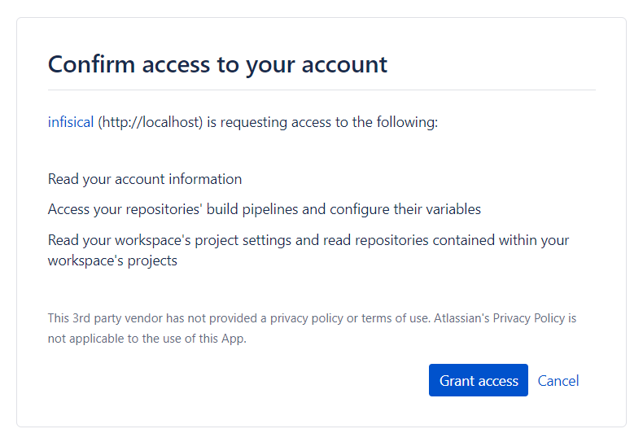
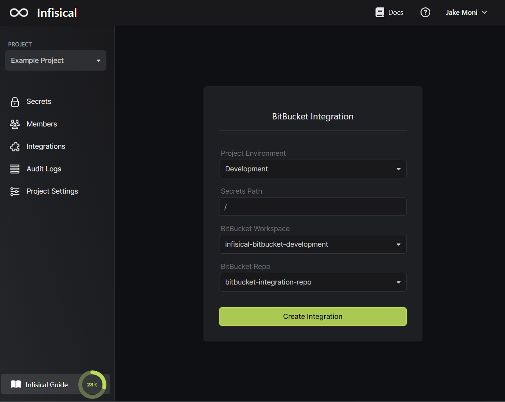

Prerequisites:

- Set up and add envars to [Infisical Cloud](https://app.infisical.com)

## Navigate to your project's integrations tab

## Authorize Infisical for BitBucket

Press on the BitBucket tile and grant Infisical access to your BitBucket account.

<Info>
  If this is your project's first cloud integration, then you'll have to grant Infisical access to your project's environment variables.
  Although this step breaks E2EE, it's necessary for Infisical to sync the environment variables to the cloud platform.
</Info>

## Start integration

Select which Infisical environment secrets you want to sync to which BitBucket repo and press start integration to start syncing secrets to the repo.

