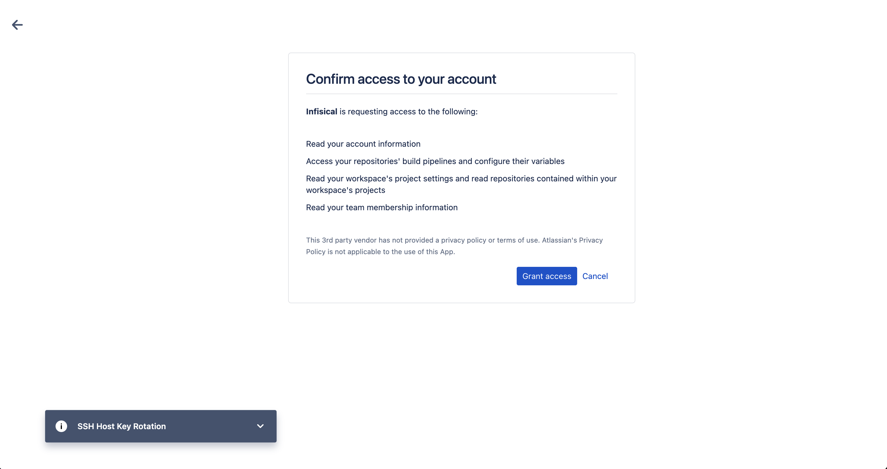
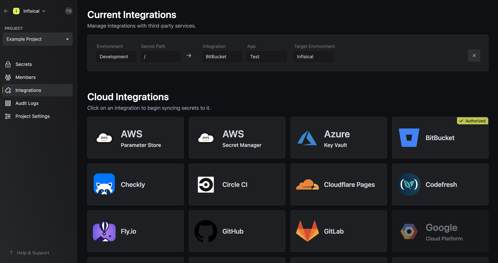

Prerequisites:

- Set up and add envars to [Infisical Cloud](https://app.infisical.com)

<Steps>
  <Step title="Authorize Infisical for Bitbucket">
    Navigate to your project's integrations tab in Infisical.

    

    Press on the Bitbucket tile and grant Infisical access to your Bitbucket account.

    

    <Info>
      If this is your project's first cloud integration, then you'll have to grant
      Infisical access to your project's environment variables. Although this step
      breaks E2EE, it's necessary for Infisical to sync the environment variables to
      the cloud platform.
    </Info>
  </Step>
  <Step title="Start integration">
    Select which Infisical environment secrets you want to sync to which Bitbucket repo and press start integration to start syncing secrets to the repo.

    
  </Step>
</Steps>