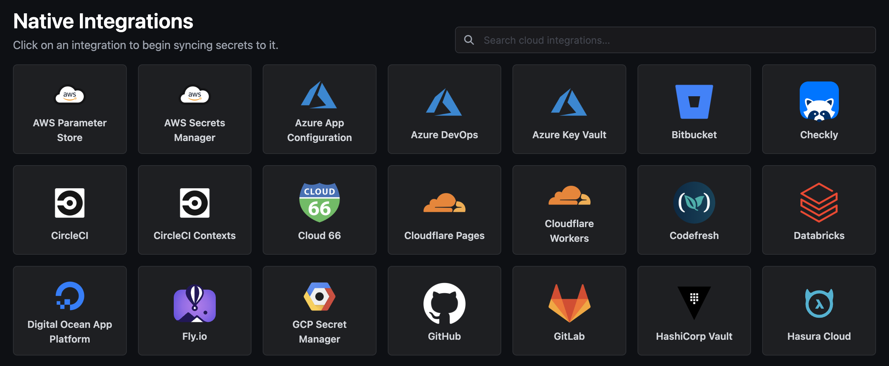
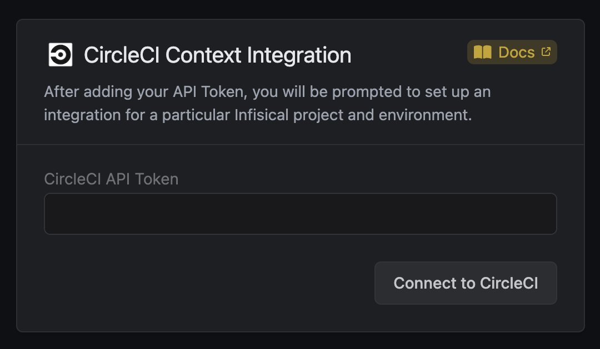
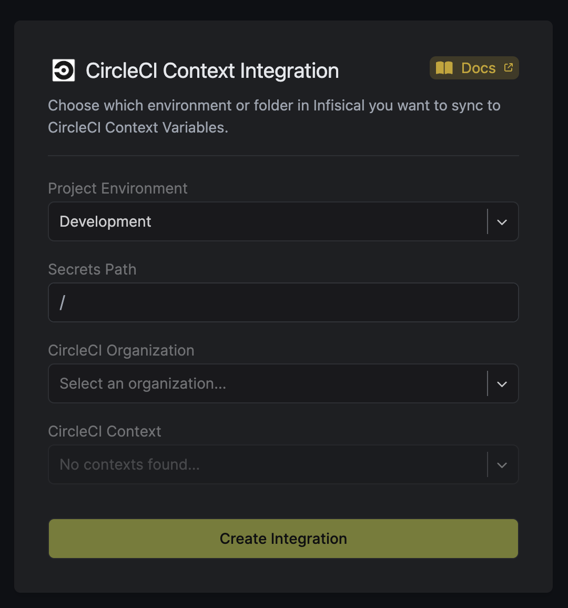
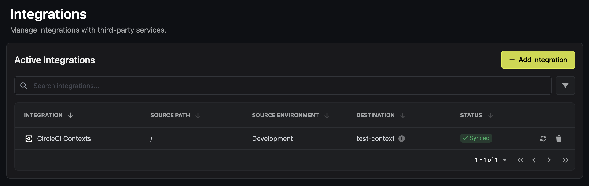

Prerequisites:

- Set up and add envars to [Infisical Cloud](https://app.infisical.com)

<Steps>
  <Step title="CircleCI API Token">
    Obtain an API token in User Settings > Personal API Tokens

    

    Navigate to your project's integrations tab in Infisical.

    
    <Tip>If you already have other integrations setup, click "Add Integration" on the top right corner to add the CircleCi Context integration.</Tip>

    Press on the CircleCI Contexts tile and input your CircleCI API token to grant Infisical access to your CircleCI account.

    

  </Step>
  <Step title="Start integration">
    Select which Infisical environment secrets you want to sync to which CircleCI Context and press create integration to start syncing secrets to CircleCI.

    
    

  </Step>
</Steps>
